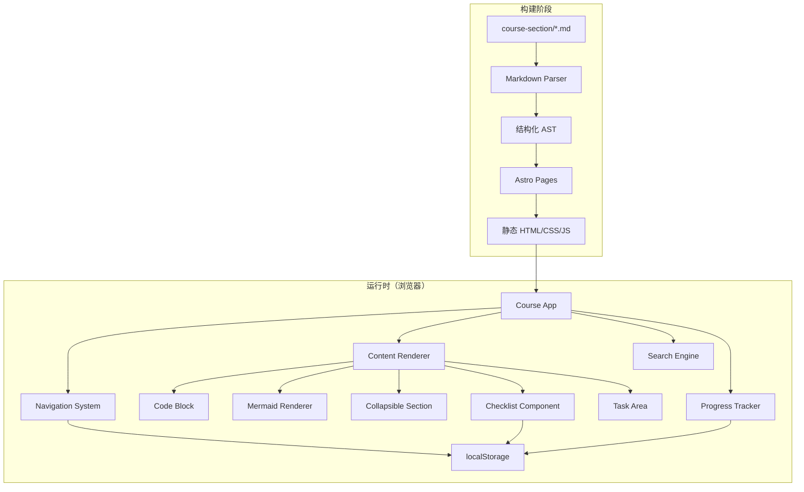

# 设计文档：OpenClaw 课程交互式网页版

## 概述

本设计将 18 个 OpenClaw 课程章节（Markdown PPT 文稿）转化为一个静态交互式网页应用。技术选型采用 **Astro** 框架，原因如下：

- 原生 Markdown/MDX 支持，内容驱动型站点的理想选择
- 静态站点生成（SSG），零运行时 JS 开销，满足性能要求
- 支持 Islands Architecture，仅在需要交互的组件中加载 JS
- 内置 Mermaid、代码高亮等生态集成
- 构建产物为纯静态文件，可部署到任意静态托管服务

辅助技术栈：
- **Tailwind CSS**：响应式布局与主题系统
- **Shiki**：代码语法高亮（Astro 内置）
- **mermaid.js**：图表渲染
- **Fuse.js**：客户端全文搜索
- **TypeScript**：类型安全

## 架构

### 整体架构图



### 构建流程

1. Astro 在构建时读取 `course-section/` 下的所有 Markdown 文件
2. 自定义 remark/rehype 插件解析特殊结构（"第 N 页"分节、可折叠区域标记、验收清单、实操任务区域）
3. 生成静态 HTML 页面，交互组件以 Astro Islands 形式注入
4. 构建搜索索引（JSON），供客户端 Fuse.js 使用

## 组件与接口

### 1. Markdown Parser（构建时）

负责将课程 Markdown 转化为结构化内容。通过自定义 remark 插件实现。

```typescript
// 章节元数据，从 Markdown 头部提取
interface ChapterMeta {
  id: string;           // e.g., "day01", "labA"
  title: string;        // e.g., "5分钟跑通你的第一个AI助手"
  duration: string;     // e.g., "1.5h"
  tier: string;         // e.g., "基础层", "选修 Lab"
  order: number;        // 排序序号
}

// "第 N 页" 对应的内容单元
interface SectionSlide {
  pageNumber: number;
  title: string;
  slug: string;         // 用于锚点导航
  content: string;      // 渲染后的 HTML
}

// 验收清单项
interface ChecklistItem {
  id: string;
  text: string;
  checked: boolean;
}

// 解析后的章节数据
interface ParsedChapter {
  meta: ChapterMeta;
  slides: SectionSlide[];
  checklist: ChecklistItem[];
  hasTaskOverview: boolean;
}
```

**Remark 插件职责：**

- `remark-section-slides`：按 `## 第 N 页` 标题拆分内容为 SectionSlide 数组
- `remark-collapsible`：识别特定标题关键词（故障排查速查、延伸阅读、进阶配置、安全提示），标记为可折叠区域
- `remark-checklist`：将 `- [ ]` 列表转换为交互式 Checklist 数据
- `remark-task-area`：识别实操任务区域和任务总览表，添加特殊样式标记
- `remark-callout`：将带 emoji 前缀的 blockquote 转换为 callout 组件

### 2. Navigation System

```typescript
// 课程结构定义
interface CourseStructure {
  tiers: Tier[];
}

interface Tier {
  name: string;         // "基础层", "进阶层", etc.
  chapters: ChapterMeta[];
}

// 导航状态
interface NavigationState {
  currentChapter: string;
  sidebarOpen: boolean;
  tocItems: TocItem[];
}

interface TocItem {
  pageNumber: number;
  title: string;
  slug: string;
}
```

**组件：**
- `Sidebar`：左侧章节列表，按层级分组，响应式折叠
- `TableOfContents`：右侧页内目录，列出当前章节的所有 Section_Slide
- `ChapterNav`：章节底部的上一章/下一章导航链接
- `MobileMenu`：移动端汉堡菜单，包含侧边栏内容

### 3. Code Block Component

```typescript
interface CodeBlockProps {
  code: string;
  language: string;
  filename?: string;
}
```

**行为：**
- 使用 Shiki 进行语法高亮（构建时渲染）
- 左上角显示语言标签
- 右上角显示复制按钮
- 点击复制后按钮文本变为"已复制"，2 秒后恢复
- 支持 dark/light 主题切换时的配色变化

### 4. Collapsible Section Component

```typescript
interface CollapsibleProps {
  title: string;
  type: 'troubleshooting' | 'extended-reading' | 'advanced-config' | 'security-tip';
  defaultOpen: boolean;  // 默认 false
}
```

**行为：**
- 默认折叠状态，仅显示标题和 chevron 图标
- 点击标题切换展开/折叠，带 CSS transition 动画
- 展开时 chevron 旋转指示状态

### 5. Progress Tracker

```typescript
// localStorage 存储结构
interface ProgressData {
  chapters: Record<string, ChapterProgress>;
  lastVisited: string;
  darkMode: boolean;
}

interface ChapterProgress {
  completed: boolean;
  checklist: Record<string, boolean>;  // checklistItemId -> checked
  lastAccessed: string;                // ISO date
}
```

**接口：**

```typescript
// Progress Tracker API
function getProgress(): ProgressData;
function setChapterCompleted(chapterId: string, completed: boolean): void;
function getChapterProgress(chapterId: string): ChapterProgress;
function getOverallCompletion(): number;  // 0-100 百分比
function toggleChecklistItem(chapterId: string, itemId: string): boolean;
function isChapterCompleted(chapterId: string): boolean;
```

**自动完成逻辑：** 当某章节的所有 checklist 项被勾选时，自动标记该章节为已完成。

### 6. Checklist Component

```typescript
interface ChecklistProps {
  chapterId: string;
  items: ChecklistItem[];
}
```

**行为：**
- 渲染为可交互的 checkbox 列表
- 勾选/取消勾选时立即写入 localStorage
- 页面加载时从 localStorage 恢复状态
- 全部勾选时显示完成提示（如 🎉 徽章）

### 7. Search Engine

```typescript
interface SearchIndex {
  entries: SearchEntry[];
}

interface SearchEntry {
  chapterId: string;
  chapterTitle: string;
  slideTitle: string;
  slug: string;
  content: string;       // 纯文本内容，用于搜索
}

interface SearchResult {
  chapterId: string;
  chapterTitle: string;
  slideTitle: string;
  slug: string;
  matchedSnippet: string;
}
```

**实现：**
- 构建时生成搜索索引 JSON 文件
- 运行时使用 Fuse.js 进行模糊搜索
- 搜索结果显示章节标题、匹配片段和跳转链接

### 8. Callout Component

```typescript
interface CalloutProps {
  type: 'tip' | 'warning' | 'info' | 'danger';
  content: string;
}
```

**映射规则：**
- `💡` → tip（蓝色）
- `⚠️` → warning（黄色）
- `🔒` / `🔥` → danger（红色）
- 其他 emoji blockquote → info（灰色）

### 9. Task Area Component

```typescript
interface TaskAreaProps {
  title: string;
  content: string;
  successCriteria?: string[];
}

interface TaskOverviewProps {
  tasks: {
    number: number;
    objective: string;
    estimatedTime: string;
  }[];
}
```

**行为：**
- 实操任务区域使用左侧彩色边框 + 浅色背景
- 成功标志渲染为高亮 checklist
- 任务总览表使用增强样式

## 数据模型

### 课程章节分组

```typescript
const COURSE_TIERS: Tier[] = [
  {
    name: '基础层',
    chapters: ['day01', 'day02', 'day03']
  },
  {
    name: '进阶层',
    chapters: ['day04', 'day05', 'day06', 'day07']
  },
  {
    name: '实战层',
    chapters: ['day08', 'day09', 'day10']
  },
  {
    name: '进阶扩展',
    chapters: ['day11', 'day12', 'day13']
  },
  {
    name: '选修 Lab',
    chapters: ['labA', 'labB', 'labC', 'labD', 'labE']
  }
];
```

### 文件名到章节 ID 映射

```typescript
// 构建时从文件名提取
// Day01-xxx.md -> { id: 'day01', order: 1 }
// LabA-xxx.md  -> { id: 'labA', order: 14 }
function parseChapterId(filename: string): { id: string; order: number };
```

### localStorage Schema

Key: `openclaw-course-progress`

```json
{
  "chapters": {
    "day01": {
      "completed": true,
      "checklist": {
        "day01-check-1": true,
        "day01-check-2": true,
        "day01-check-3": true
      },
      "lastAccessed": "2024-01-15T10:30:00Z"
    }
  },
  "lastVisited": "day03",
  "darkMode": false
}
```


## 正确性属性

*正确性属性是指在系统所有有效执行中都应成立的特征或行为——本质上是关于系统应该做什么的形式化陈述。属性是人类可读规范与机器可验证正确性保证之间的桥梁。*

### Property 1: Section Slide 解析保持结构

*For any* valid course Markdown file containing N "第 X 页" headings, the Markdown_Parser shall produce exactly N SectionSlide objects, each with the correct page number and title extracted from the heading.

**Validates: Requirements 1.6**

### Property 2: Callout 类型映射

*For any* blockquote prefixed with an emoji character, the callout mapping function shall return the correct callout type (💡→tip, ⚠️→warning, 🔒/🔥→danger, other→info), and the resulting callout shall contain the original text content without the emoji prefix.

**Validates: Requirements 1.5**

### Property 3: 可折叠区域检测

*For any* Markdown heading containing one of the collapsible keywords (故障排查速查, 延伸阅读, 进阶配置, 安全提示), the remark-collapsible plugin shall mark that section as collapsible. Headings not containing these keywords shall not be marked as collapsible.

**Validates: Requirements 4.1**

### Property 4: 页内目录生成

*For any* parsed chapter with N SectionSlide objects, the TOC generator shall produce exactly N TocItem entries, where each entry's title and slug match the corresponding SectionSlide.

**Validates: Requirements 2.3**

### Property 5: 上一章/下一章导航

*For any* chapter at position i in the ordered chapter list, the navigation generator shall produce a previous link pointing to chapter i-1 (or null if i=0) and a next link pointing to chapter i+1 (or null if i is the last chapter).

**Validates: Requirements 2.5**

### Property 6: 学习进度数据持久化往返

*For any* ProgressData object, writing it to localStorage via setChapterCompleted and then reading it back via getProgress shall produce an equivalent progress state for the affected chapter.

**Validates: Requirements 5.2, 5.3**

### Property 7: 清单状态持久化往返

*For any* chapter ID and checklist item ID, toggling the item via toggleChecklistItem and then reading the state back from localStorage shall return the toggled value.

**Validates: Requirements 6.2, 6.3**

### Property 8: 清单全部勾选触发自动完成

*For any* chapter with N checklist items (N > 0), when all N items are checked, isChapterCompleted shall return true. When fewer than N items are checked, isChapterCompleted shall return false (unless manually marked completed).

**Validates: Requirements 5.4, 6.4**

### Property 9: 总体完成百分比计算

*For any* set of chapters where K out of N chapters are completed, getOverallCompletion shall return a value equal to Math.round(K / N * 100).

**Validates: Requirements 5.1**

### Property 10: 暗色模式偏好持久化往返

*For any* dark mode preference (true or false), saving it to localStorage and reading it back shall return the same value.

**Validates: Requirements 7.6**

### Property 11: 搜索返回匹配结果且包含必要字段

*For any* search index and non-empty query string that matches at least one entry, every returned SearchResult shall contain a non-empty chapterId, chapterTitle, slideTitle, slug, and matchedSnippet, and the matchedSnippet shall contain text relevant to the query.

**Validates: Requirements 8.2**

### Property 12: 实操任务区域检测与标记

*For any* Markdown content containing sections with "实操任务" in the heading, the remark-task-area plugin shall mark those sections with the task-area class. Sections containing "成功标志" sub-headings shall have their list items marked as success criteria. Sections containing task overview tables (实操任务总览) shall have the table marked for enhanced styling.

**Validates: Requirements 9.1, 9.2, 9.3**

## 错误处理

### Markdown 解析错误

- 如果 Markdown 文件缺少 "第 N 页" 结构，将整个文件作为单个 SectionSlide 处理
- 如果 Mermaid 语法无效，显示错误提示文本替代图表
- 如果代码块未指定语言，使用纯文本渲染（无高亮）

### localStorage 错误

- 如果 localStorage 不可用（隐私模式等），Progress_Tracker 降级为内存存储，页面刷新后状态丢失
- 如果存储的 JSON 数据损坏，重置为默认空状态并在控制台输出警告
- 如果存储空间已满，捕获 QuotaExceededError 并提示用户

### 搜索错误

- 如果搜索索引加载失败，显示"搜索暂不可用"提示
- 如果搜索查询为空或纯空白，不执行搜索，显示空状态

### 构建错误

- 如果课程 Markdown 文件缺失或格式异常，构建时输出警告但不中断构建
- 如果章节元数据（时长、层级）缺失，使用默认值

## 测试策略

### 双重测试方法

本项目采用单元测试与属性测试相结合的策略：

- **单元测试**：验证具体示例、边界情况和错误条件
- **属性测试**：验证跨所有输入的通用属性

两者互补，共同提供全面的覆盖。

### 测试框架

- **单元测试**：Vitest（与 Astro 生态兼容）
- **属性测试**：fast-check（JavaScript/TypeScript 属性测试库）
- 每个属性测试至少运行 100 次迭代
- 每个属性测试必须通过注释引用设计文档中的属性编号
- 标签格式：**Feature: interactive-course-web, Property {number}: {property_text}**

### 测试范围

**属性测试覆盖（Properties 1-12）：**
- Markdown 解析逻辑（Section Slide 拆分、Callout 映射、可折叠检测、任务区域检测）
- 导航逻辑（TOC 生成、上下章链接）
- 数据持久化往返（进度、清单、暗色模式）
- 业务逻辑（自动完成、完成百分比计算）
- 搜索功能（结果匹配与字段完整性）

**单元测试覆盖：**
- Mermaid 代码块识别（示例测试）
- 复制到剪贴板功能（示例测试）
- 课程结构数据完整性（18 章节、5 层级）
- localStorage 不可用时的降级行为
- 搜索无结果时的边界情况
- 空 Markdown 文件处理
- 损坏的 localStorage 数据恢复

### 测试文件组织

```
tests/
├── unit/
│   ├── markdown-parser.test.ts
│   ├── navigation.test.ts
│   ├── progress-tracker.test.ts
│   ├── search.test.ts
│   └── components.test.ts
└── property/
    ├── section-slides.property.test.ts
    ├── callout-mapping.property.test.ts
    ├── collapsible-detection.property.test.ts
    ├── toc-generation.property.test.ts
    ├── chapter-navigation.property.test.ts
    ├── progress-roundtrip.property.test.ts
    ├── checklist-roundtrip.property.test.ts
    ├── auto-completion.property.test.ts
    ├── completion-percentage.property.test.ts
    ├── darkmode-roundtrip.property.test.ts
    ├── search-results.property.test.ts
    └── task-area-detection.property.test.ts
```
