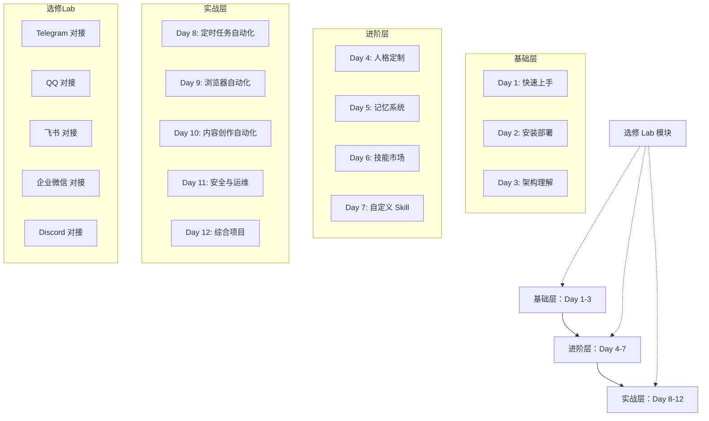
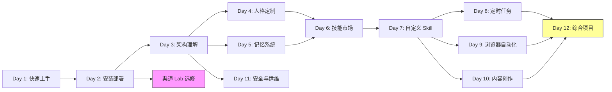

# 设计文档：OpenClaw 实战课程重新设计

## 概述

本设计文档描述一门面向零基础用户的 OpenClaw 实战课程的完整设计方案。课程采用"先体验后理论"的教学理念，模块化结构，总时长 12 天（含选修模块可扩展至 14 天）。产出物为一份可直接用于课程制作的课程设计文档。

### 设计原则

1. **先跑起来再说**：第 1 天就让学员在本地跑通 OpenClaw 并完成第一次对话，建立信心
2. **模块化选学**：渠道对接等内容设计为选修 Lab，学员按需选择
3. **螺旋式深入**：从基础使用 → 个性化定制 → 技能扩展 → 项目实战，逐步加深
4. **安全贯穿始终**：安全提示嵌入每个相关模块，而非孤立讲解
5. **故障即教学**：将常见错误作为教学素材，培养排查能力

### 与原课程的关键差异

| 维度 | 原课程 | 新课程 |
|------|--------|--------|
| 教学顺序 | 先讲架构再安装 | 先安装体验再讲架构 |
| 渠道对接 | 每渠道一节，内容重复 | 通用流程 + 选修 Lab |
| 安装部署 | 腾讯云/阿里云分两节 | 统一一节，多平台分支 |
| 安全内容 | 无 | 独立模块 + 各模块嵌入 |
| 故障排查 | 无 | 独立手册 + 各模块嵌入 |
| 高级应用 | 粗糙介绍 | 完整项目实战 |
| 课程时长 | 7 天 18 节 | 12 天核心 + 选修扩展 |

## 架构

### 课程整体架构

课程采用三层架构设计：



### 课程路线图与依赖关系



## 组件与接口

### 课程文档组件结构

课程设计文档由以下核心组件构成：

#### 1. 课程概述组件
- 课程定位与目标受众描述
- 学习路径总览
- 预期学习成果清单

#### 2. 模块详细设计组件（核心）
每个 Learning_Module 遵循统一模板：

```
模块模板结构：
├── 模块标题与编号
├── 学习目标（1-3 个，使用布鲁姆动词）
├── 前置知识要求
├── 预计学习时长
├── 教学内容大纲
│   ├── 知识点列表
│   └── 实操步骤大纲（含预期输出）
├── 验收标准（可验证的成果）
├── 安全提示（如适用）
├── 常见问题与故障排查
└── 延伸阅读
```

#### 3. 渠道 Lab 组件
每个 Channel_Lab 遵循统一模板：

```
渠道 Lab 模板结构：
├── 渠道简介
├── 前置准备
│   ├── 账号要求
│   └── 开发者配置/机器人创建步骤
├── 对接步骤大纲
│   ├── 通用流程引用
│   └── 渠道特有配置
├── 消息收发验证方法
├── 常见问题排查
└── 进阶配置（可选）
```

#### 4. 故障排查手册组件
```
排查手册结构：
├── 排查方法论（日志查看、分步定位）
├── 按场景分类的排查指南
│   ├── 启动失败
│   ├── 渠道连接断开
│   ├── Agent 无响应
│   ├── Skill 执行报错
│   └── 内存/性能问题
└── 常用诊断命令速查
```

#### 5. 附录组件
- 术语表
- 推荐资源链接
- 版本兼容性说明

### 组件间接口

- 每个 Learning_Module 通过"前置知识"字段引用其依赖模块
- 渠道 Lab 通过"通用流程引用"链接到 Day 3 架构理解中的 Gateway 概念
- 故障排查手册被各模块的"常见问题"部分引用
- 安全提示通过嵌入式标注出现在各相关模块中

## 数据模型

### 课程设计文档数据结构

由于本项目的产出物是课程设计文档（非代码），数据模型描述文档的逻辑结构：

#### CourseDocument（课程设计文档）

| 字段 | 类型 | 说明 |
|------|------|------|
| title | string | 课程标题 |
| overview | CourseOverview | 课程概述 |
| target_audience | string | 目标受众描述 |
| total_duration | string | 总时长（如"12天核心 + 选修扩展"） |
| roadmap | Mermaid Diagram | 课程路线图 |
| core_modules | LearningModule[] | 必修核心模块列表（Day 1-12） |
| elective_labs | ChannelLab[] | 选修渠道 Lab 列表 |
| troubleshooting_guide | TroubleshootingGuide | 故障排查手册 |
| appendix | Appendix | 附录 |

#### LearningModule（学习模块）

| 字段 | 类型 | 说明 |
|------|------|------|
| id | string | 模块编号（如 "day-01"） |
| title | string | 模块标题 |
| duration_hours | number | 预计学习时长（小时） |
| is_required | boolean | 是否必修 |
| learning_objectives | string[] | 学习目标列表（1-3个，布鲁姆动词） |
| prerequisites | string[] | 前置知识/模块引用 |
| content_outline | ContentSection[] | 教学内容大纲 |
| hands_on_tasks | HandsOnTask[] | 实操任务列表 |
| acceptance_checks | string[] | 验收标准 |
| security_tips | string[] | 安全提示（可选） |
| faq | FAQItem[] | 常见问题 |
| further_reading | string[] | 延伸阅读 |

#### ChannelLab（渠道对接实操模块）

| 字段 | 类型 | 说明 |
|------|------|------|
| channel_name | string | 渠道名称 |
| intro | string | 渠道简介 |
| prerequisites | PrerequisiteStep[] | 前置准备步骤 |
| setup_steps | SetupStep[] | 对接步骤大纲 |
| verification_method | string | 消息收发验证方法 |
| common_issues | FAQItem[] | 常见问题排查 |
| advanced_config | string | 进阶配置（可选） |

#### HandsOnTask（实操任务）

| 字段 | 类型 | 说明 |
|------|------|------|
| task_description | string | 任务描述 |
| steps_outline | string[] | 操作步骤大纲 |
| expected_output | string | 预期输出结果描述 |
| troubleshooting | FAQItem[] | 可能的故障排查 |

#### TroubleshootingGuide（故障排查手册）

| 字段 | 类型 | 说明 |
|------|------|------|
| methodology | string | 排查方法论 |
| scenarios | TroubleshootingScenario[] | 按场景分类的排查指南 |
| diagnostic_commands | string[] | 常用诊断命令 |

#### 模块详细设计清单

以下是 12 天核心模块 + 5 个选修 Lab 的完整清单：

**基础层（Day 1-3）**

| Day | 标题 | 时长 | 核心内容 |
|-----|------|------|----------|
| 1 | 5 分钟跑通你的第一个 AI 助手 | 1.5h | 本地快速安装、第一次对话、初步体验 |
| 2 | 把 AI 搬到云上：服务器部署全攻略 | 2h | 多平台部署、后台运行、部署验证 |
| 3 | 拆解引擎：OpenClaw 六大核心组件 | 1.5h | Gateway/Agent 架构、配置文件、渠道对接通用流程 |

**进阶层（Day 4-7）**

| Day | 标题 | 时长 | 核心内容 |
|-----|------|------|----------|
| 4 | 给 AI 一个灵魂：人格定制 soul.md | 1.5h | soul.md 语法、风格模板、实操调试 |
| 5 | 让 AI 记住你：记忆系统深度解析 | 1.5h | 短期/长期记忆、记忆管理操作 |
| 6 | 技能商店淘宝：ClawHub 技能市场 | 1.5h | 技能搜索/安装/配置/卸载、工具系统 |
| 7 | 从零写一个 Skill：自定义技能开发 | 2h | Skill 结构、编写规范、完整开发案例 |

**实战层（Day 8-12）**

| Day | 标题 | 时长 | 核心内容 |
|-----|------|------|----------|
| 8 | 项目实战①：定时任务自动化 | 2h | Cron 配置、Skill 联动、自动化工作流 |
| 9 | 项目实战②：浏览器自动化 | 2h | Browser Relay、网页操作、数据采集 |
| 10 | 项目实战③：内容创作自动化 | 2h | AI 写文章、知识库管理、内容发布 |
| 11 | 安全运维：让你的 AI 稳定又安全 | 1.5h | 安全实践、监控、故障排查手册 |
| 12 | 毕业项目：打造你的 AI 工作流 | 2.5h | 综合运用、个人项目设计与实现 |

**选修渠道 Lab**

| Lab | 渠道 | 时长 | 建议学习时机 |
|-----|------|------|-------------|
| A | Telegram 对接 | 1h | Day 3 之后 |
| B | QQ 对接 | 1.5h | Day 3 之后 |
| C | 飞书对接 | 1.5h | Day 3 之后 |
| D | 企业微信对接 | 1.5h | Day 3 之后 |
| E | Discord 对接 | 1h | Day 3 之后 |


## 正确性属性（Correctness Properties）

*正确性属性是一种在系统所有有效执行中都应成立的特征或行为——本质上是关于系统应该做什么的形式化陈述。属性充当人类可读规范与机器可验证正确性保证之间的桥梁。*

由于本项目的产出物是课程设计文档而非代码，以下正确性属性描述的是文档结构和内容的一致性规则，可通过文档审查或自动化文档校验脚本来验证。

### Property 1: 模块完整性

*For any* Learning_Module in the Course_Document, the module SHALL contain all required fields: learning_objectives (non-empty), prerequisites, hands_on_tasks, acceptance_checks (non-empty), and faq.

**Validates: Requirements 2.1**

### Property 2: 模块质量约束

*For any* Learning_Module in the Course_Document, the learning_objectives field SHALL contain 1-3 items each using a Bloom's taxonomy verb, AND the acceptance_checks field SHALL contain at least one verifiable criterion.

**Validates: Requirements 2.2, 2.3**

### Property 3: 模块时长标注

*For any* Learning_Module in the Course_Document, the duration_hours field SHALL be present and contain a positive number.

**Validates: Requirements 1.4**

### Property 4: 实操任务完整性

*For any* HandsOnTask within any Learning_Module, the task SHALL contain steps_outline (non-empty), expected_output (non-empty), AND troubleshooting guidance.

**Validates: Requirements 2.4, 2.5**

### Property 5: 渠道 Lab 完整性

*For any* Channel_Lab in the Course_Document, the lab SHALL contain all required fields: intro, prerequisites, setup_steps, verification_method, and common_issues.

**Validates: Requirements 4.3**

### Property 6: 渠道开发者前置步骤

*For any* Channel_Lab that requires a developer account or bot creation, the prerequisites field SHALL include the key steps for the application/creation process.

**Validates: Requirements 4.5**

### Property 7: 项目实战模块完整性

*For any* project module in the advanced application section, the module SHALL contain: project background, target outcome, implementation steps outline, involved OpenClaw features, and acceptance criteria.

**Validates: Requirements 7.2**

### Property 8: 安全提示跨模块嵌入

*For any* Learning_Module that involves security-sensitive operations (deployment, channel setup, API key usage, skill development, server configuration), the security_tips field SHALL be non-empty.

**Validates: Requirements 8.5**

### Property 9: 模板一致性

*For any* two Learning_Modules in the Course_Document, both SHALL follow the same template structure with the same set of top-level fields.

**Validates: Requirements 9.4**

## 错误处理

由于本项目是课程设计文档项目，"错误处理"对应的是文档质量控制中的常见问题预防：

### 文档结构错误
- **模块缺失必要字段**：使用模块模板检查清单，确保每个模块在编写时逐项填写
- **前置依赖循环**：通过课程路线图验证，确保不存在循环依赖
- **时长估算不合理**：参考原课程实际教学时长，结合内容量进行校准

### 内容质量错误
- **学习目标不可验证**：确保每个目标使用布鲁姆分类法动词（能够配置、能够解释、能够独立完成）
- **实操步骤不完整**：每个实操任务必须包含预期输出描述，便于学员自检
- **安全提示遗漏**：在文档审查阶段，逐模块检查是否需要安全提示

### 渠道对接内容错误
- **渠道信息过时**：标注文档编写日期，提醒后续更新
- **平台政策变更**：在每个 Channel_Lab 中注明"请以平台最新文档为准"
- **申请流程变化**：提供官方文档链接作为权威参考

## 测试策略

由于本项目产出物是文档而非代码，测试策略聚焦于文档质量验证：

### 文档结构验证（对应 Property-Based Testing）

使用文档校验脚本（如 Python/Node.js 脚本解析 Markdown）自动验证：

- **Property 1-3 验证**：解析每个模块，检查必要字段存在性和约束
- **Property 4 验证**：解析实操任务，检查步骤和输出描述
- **Property 5-6 验证**：解析渠道 Lab，检查字段完整性
- **Property 7 验证**：解析项目实战模块，检查必要字段
- **Property 8 验证**：识别安全相关模块，检查安全提示
- **Property 9 验证**：比较所有模块的字段结构

配置：每个属性测试覆盖文档中所有相关模块实例（即 100% 覆盖）。

测试标签格式：**Feature: openclaw-course-redesign, Property {N}: {property_text}**

### 内容质量审查（对应 Unit Testing）

人工审查清单：

1. **布鲁姆动词检查**：逐模块检查学习目标是否使用正确的动词层级
2. **验收标准可验证性**：逐模块检查验收标准是否可被学员自行验证
3. **实操步骤可执行性**：按步骤模拟执行，确认无遗漏
4. **渠道对接完整性**：每个渠道 Lab 由实际操作验证
5. **安全提示准确性**：由安全意识审查者确认建议的正确性
6. **故障排查有效性**：模拟常见故障场景，验证排查指引的有效性

### 双重验证方法

- **自动化验证**（Property Tests）：文档结构、字段完整性、模板一致性
- **人工审查**（Unit Tests）：内容质量、教学设计合理性、实操可行性
- 两者互补：自动化确保结构正确，人工确保内容优质
