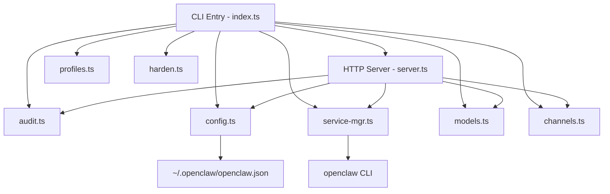
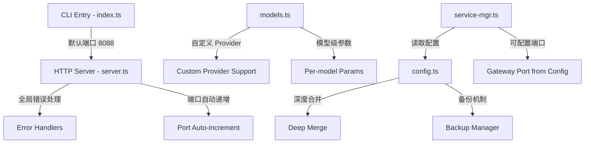

# 技术设计文档：OpenClaw Guard 综合功能增强

## 概述

本设计文档基于 openclaw-guard 项目的 6 项需求，涵盖服务器错误处理与稳定性、Web 端口配置、AI 模型配置增强、配置文件保护、Gateway 端口配置化、以及 OAuth 可行性分析文档。

当前 openclaw-guard 是一个基于 Node.js 的 CLI + HTTP 管理工具，使用 `commander` 处理命令行、原生 `http` 模块提供 Web API、文件系统直接读写 `~/.openclaw/openclaw.json` 配置。项目使用 TypeScript 编写，Vitest 作为测试框架。

### 设计目标

1. 提升 Guard_Server 的进程稳定性，避免单个错误导致服务中断
2. 使 Web 端口和 Gateway 端口均可配置，支持端口冲突自动处理
3. 增强 AI Provider 配置的灵活性，支持自定义 Provider 和模型级参数
4. 引入配置文件保护机制（深度合并 + 备份），防止配置丢失
5. 提供 OAuth 授权登录可行性分析文档

## 架构

### 当前架构



### 增强后架构

变更集中在以下模块，不引入新的外部依赖：



### 设计决策

1. **不引入新依赖**：深度合并使用自实现的递归函数，不引入 lodash 等库，保持项目轻量
2. **备份文件命名**：使用 `openclaw.json.bak.{timestamp}` 格式，存放在同目录下
3. **端口递增策略**：线性递增，最多尝试 10 次，简单可靠
4. **错误处理层次**：HTTP server error → process uncaughtException/unhandledRejection → 路由级 try-catch，三层防护

## 组件与接口

### 1. server.ts - 错误处理与端口管理

#### 新增：全局错误处理

```typescript
// server error 事件
server.on('error', (err: NodeJS.ErrnoException) => {
  if (err.code === 'EADDRINUSE') {
    // 触发端口递增逻辑
  } else {
    console.error('[Guard] 服务器错误:', err.message);
  }
});

// 进程级错误处理
process.on('uncaughtException', (err) => {
  console.error('[Guard] 未捕获异常:', err.stack || err.message);
});

process.on('unhandledRejection', (reason) => {
  console.error('[Guard] 未处理的 Promise rejection:', reason);
});
```

#### 新增：路由级错误包装

```typescript
// 在 createServer 回调中包装 try-catch
const server = http.createServer(async (req, res) => {
  try {
    await handleRequest(req, res);
  } catch (err) {
    console.error('[Guard] 路由处理异常:', err);
    jsonResponse(res, { error: '服务器内部错误', message: String(err) }, 500);
  }
});
```

#### 新增：端口自动递增

```typescript
export function startServer(port: number): void {
  const maxRetries = 10;
  let currentPort = port;
  
  function tryListen(attempt: number): void {
    const server = createHttpServer();
    server.on('error', (err: NodeJS.ErrnoException) => {
      if (err.code === 'EADDRINUSE' && attempt < maxRetries) {
        currentPort++;
        console.log(`[Guard] 端口 ${currentPort - 1} 被占用，尝试 ${currentPort}...`);
        tryListen(attempt + 1);
      } else if (err.code === 'EADDRINUSE') {
        console.error(`[Guard] 连续 ${maxRetries} 个端口均被占用，无法启动`);
        process.exit(1);
      } else {
        console.error('[Guard] 致命错误:', err.message);
        process.exit(1);
      }
    });
    server.listen(currentPort, () => {
      console.log(`\n🛡️  OpenClaw Guard Web 管理界面已启动`);
      console.log(`   地址: http://localhost:${currentPort}`);
    });
  }
  
  tryListen(0);
}
```

### 2. index.ts - CLI 默认端口变更

```typescript
// 变更：默认端口从 3000 改为 8088
program.command('web')
  .option('-p, --port <port>', '指定端口号', '8088')
  .action((opts) => { startServer(parseInt(opts.port, 10)); });
```

### 3. config.ts - 配置保护机制

#### 新增：深度合并函数

```typescript
export function deepMerge(target: Record<string, any>, source: Record<string, any>): Record<string, any> {
  const result = { ...target };
  for (const key of Object.keys(source)) {
    if (
      source[key] && typeof source[key] === 'object' && !Array.isArray(source[key]) &&
      result[key] && typeof result[key] === 'object' && !Array.isArray(result[key])
    ) {
      result[key] = deepMerge(result[key], source[key]);
    } else {
      result[key] = source[key];
    }
  }
  return result;
}
```

#### 新增：备份管理

```typescript
export function createBackup(): void {
  const configPath = getConfigPath();
  if (!fs.existsSync(configPath)) return;
  
  const timestamp = Date.now();
  const backupPath = `${configPath}.bak.${timestamp}`;
  fs.copyFileSync(configPath, backupPath);
  
  // 清理旧备份，保留最近 5 个
  const dir = path.dirname(configPath);
  const baseName = path.basename(configPath);
  const backups = fs.readdirSync(dir)
    .filter(f => f.startsWith(`${baseName}.bak.`))
    .sort()
    .reverse();
  
  for (const old of backups.slice(5)) {
    fs.unlinkSync(path.join(dir, old));
  }
}
```

#### 变更：saveConfig 增加合并与备份

```typescript
export function saveConfig(config: Record<string, any>): void {
  const p = getConfigPath();
  const dir = path.dirname(p);
  if (!fs.existsSync(dir)) fs.mkdirSync(dir, { recursive: true });
  
  // 创建备份
  createBackup();
  
  // 深度合并
  const existing = loadConfig();
  const merged = deepMerge(existing, config);
  
  fs.writeFileSync(p, JSON.stringify(merged, null, 2), 'utf-8');
}
```

### 4. models.ts - AI 模型配置增强

#### 变更：GET /api/ai/providers 返回预设 + 自定义

```typescript
// server.ts 中的路由变更
if (pathname === '/api/ai/providers' && req.method === 'GET') {
  const config = loadConfig();
  const customProviders = getNested(config, ['models', 'providers']) || {};
  jsonResponse(res, {
    presets: AI_PROVIDERS,
    custom: Object.entries(customProviders).map(([name, cfg]) => ({ name, ...cfg })),
  });
  return;
}
```

#### 变更：saveProvider 支持自定义 Provider 和模型级参数

- 接受自定义 `id`、`name`、`baseUrl`、`apiType`
- `apiType` 未提供时默认 `openai-completions`
- 空字符串 `apiKey` 不覆盖已有值（当前已部分实现，需确保逻辑完整）
- 每个模型支持独立的 `contextWindow` 和 `maxTokens`（当前已有，需确保不使用全局默认覆盖用户指定值）

### 5. service-mgr.ts - Gateway 端口配置化

#### 变更：从配置读取端口

```typescript
import { loadConfig, getNested } from './config.js';

function getGatewayPort(): number {
  const config = loadConfig();
  const port = getNested(config, ['gateway', 'port']);
  return typeof port === 'number' && port > 0 ? port : 18789;
}

export function getServiceStatus(): ServiceStatus {
  const port = getGatewayPort();
  const pid = checkPortListening(port);
  return { running: pid !== null, pid, port };
}
```

### 6. OAuth 可行性分析文档

在项目根目录创建 `docs/oauth-feasibility.md`，内容结构：

1. 当前认证机制现状（API Key 模式）
2. 各 AI Provider OAuth 支持情况分析
   - Anthropic (Claude)：无公开 OAuth API，仅 API Key
   - OpenAI (GPT)：支持 OAuth 2.0（ChatGPT Plugins），但 API 访问仍以 API Key 为主
   - Google (Gemini)：支持 OAuth 2.0 + Service Account
   - 通用 OAuth 2.0 兼容 Provider
3. 架构改造点
4. 各 Provider 授权流程参数（Authorization URL、Token URL、Scope）
5. 安全建议（Token 存储、刷新、PKCE）
6. 实施路线图

## 数据模型

### 配置文件结构 (openclaw.json)

```typescript
interface OpenClawConfig {
  gateway?: {
    port?: number;          // 新增：Gateway 端口配置
    auth?: {
      token?: string;
      mode?: string;
    };
    mode?: string;
  };
  models?: {
    providers?: Record<string, ProviderConfig>;
  };
  agents?: {
    defaults?: {
      model?: { primary?: string };
      models?: Record<string, object>;
    };
  };
  meta?: {
    lastTouchedAt?: string;
  };
  [key: string]: any;       // 保留其他未知配置节点
}

interface ProviderConfig {
  baseUrl: string;
  apiKey?: string;
  apiType?: string;         // 新增：Provider 级别 apiType
  models: ModelConfig[];
}

interface ModelConfig {
  id: string;
  name: string;
  api?: string;
  input?: string[];
  contextWindow?: number;   // 模型级别参数
  maxTokens?: number;       // 模型级别参数
  cost?: {
    input: number;
    output: number;
    cacheRead: number;
    cacheWrite: number;
  };
}
```

### 备份文件命名规则

```
~/.openclaw/openclaw.json.bak.{timestamp}
```

- `timestamp`：`Date.now()` 毫秒时间戳
- 保留最近 5 个备份，自动清理旧备份

### 服务状态响应结构

```typescript
interface ServiceStatus {
  running: boolean;
  pid: number | null;
  port: number;             // 现在反映实际配置的端口
}
```


## 正确性属性 (Correctness Properties)

*属性（Property）是指在系统所有合法执行中都应成立的特征或行为——本质上是对系统应做什么的形式化陈述。属性是人类可读规格说明与机器可验证正确性保证之间的桥梁。*

### Property 1: 路由异常统一返回 500 JSON

*For any* API 路由处理函数，当该函数抛出任意异常时，服务器应返回 HTTP 500 状态码和包含 `error` 字段的 JSON 响应体，且服务器应继续处理后续请求。

**Validates: Requirements 1.4**

### Property 2: 用户指定端口被尊重

*For any* 有效端口号（1-65535），当通过 `--port` 参数传入时，`startServer` 应尝试在该端口上监听。

**Validates: Requirements 2.2**

### Property 3: 端口占用自动递增

*For any* 起始端口 P，如果端口 P 到 P+k-1 均被占用（k < 10），则服务器应尝试监听端口 P+k。如果连续 10 个端口均被占用，服务器应停止尝试。

**Validates: Requirements 2.3, 2.4**

### Property 4: 自定义 Provider 保存/加载 round-trip

*For any* 合法的自定义 Provider 定义（包含自定义 id、name、baseUrl、apiType 和模型列表，其中每个模型有独立的 contextWindow 和 maxTokens），通过 `saveProvider` 保存后再通过 `getAIConfig` 加载，应能获取到相同的 Provider 配置和每个模型的独立参数。

**Validates: Requirements 3.1, 3.5**

### Property 5: 缺省 apiType 默认值

*For any* 通过 API 保存的 Provider 配置，若未提供 `apiType` 字段，保存后该 Provider 的 apiType 应为 `openai-completions`。

**Validates: Requirements 3.2**

### Property 6: 空 apiKey 不覆盖已有值

*For any* 已存在 apiKey 的 Provider，当以空字符串作为 apiKey 重新保存时，保存后该 Provider 的 apiKey 应与保存前相同。

**Validates: Requirements 3.4**

### Property 7: 配置深度合并保留已有字段

*For any* 两个配置对象 A（已存在）和 B（新传入），执行 `saveConfig(B)` 后，结果配置应包含 A 中所有未被 B 覆盖的字段，且 B 中的嵌套对象应与 A 中对应的嵌套对象递归合并而非替换。

**Validates: Requirements 4.1, 4.2**

### Property 8: 备份文件数量上限

*For any* 连续 N 次（N > 5）`saveConfig` 调用，配置目录中的备份文件数量应始终不超过 5 个，且保留的是最近 5 次的备份。

**Validates: Requirements 4.3**

### Property 9: I/O 错误时配置文件不变

*For any* 配置文件写入过程中发生的 I/O 错误，原有配置文件的内容应保持不变。

**Validates: Requirements 4.4**

### Property 10: saveProvider 不影响其他配置节点

*For any* 包含多个 Provider 和其他配置节点的 OpenClaw_Config，调用 `saveProvider` 保存某个 Provider 后，其他 Provider 的配置和非 Provider 配置节点应保持不变。

**Validates: Requirements 4.5**

### Property 11: Gateway 端口从配置读取并反映在状态中

*For any* 在 `gateway.port` 中配置的有效端口号，`getServiceStatus()` 返回的 `port` 字段应等于该配置值。当未配置时，应返回默认值 18789。

**Validates: Requirements 5.1, 5.2, 5.3**

## 错误处理

### 服务器层错误处理

| 错误类型 | 处理方式 | 恢复策略 |
|---------|---------|---------|
| HTTP server `error` 事件 | 记录日志，继续运行 | 自动恢复 |
| `EADDRINUSE` | 端口递增重试（最多 10 次） | 自动恢复或退出 |
| `uncaughtException` | 记录完整堆栈，继续运行 | 自动恢复 |
| `unhandledRejection` | 记录 rejection 详情，继续运行 | 自动恢复 |
| 路由处理异常 | 返回 500 + JSON 错误信息 | 自动恢复 |
| 致命启动错误 | 输出错误原因，`process.exit(1)` | 需人工干预 |

### 配置层错误处理

| 错误类型 | 处理方式 | 恢复策略 |
|---------|---------|---------|
| 配置文件不存在 | 返回空对象 `{}` | 自动创建 |
| 配置文件 JSON 解析失败 | 返回空对象 `{}` | 保留原文件 |
| 写入 I/O 错误 | 保留原文件，返回错误结果 | 可从备份恢复 |
| 备份清理失败 | 记录警告，不影响主流程 | 忽略 |

### API 层错误处理

| 错误类型 | HTTP 状态码 | 响应格式 |
|---------|------------|---------|
| 请求体 JSON 解析失败 | 400 | `{ success: false, message: '请求格式错误' }` |
| 路由处理异常 | 500 | `{ error: '服务器内部错误', message: '<错误详情>' }` |
| 资源未找到 | 404 | `{ error: 'Not Found' }` |

## 测试策略

### 测试框架

- **单元测试 + 属性测试**：Vitest（已配置）
- **属性测试库**：[fast-check](https://github.com/dubzzz/fast-check)（需添加为 devDependency）
- 每个属性测试至少运行 100 次迭代

### 属性测试 (Property-Based Tests)

每个正确性属性对应一个属性测试，使用 `fast-check` 生成随机输入：

| Property | 测试描述 | 生成器 |
|----------|---------|--------|
| Property 1 | 路由异常返回 500 JSON | 随机 API 路径 + 随机异常类型 |
| Property 2 | 用户指定端口 | `fc.integer({ min: 1, max: 65535 })` |
| Property 4 | Provider round-trip | 随机 Provider 配置（含模型级参数） |
| Property 5 | 缺省 apiType | 随机 Provider 配置（不含 apiType） |
| Property 6 | 空 apiKey 保留 | 随机已有 apiKey + 空字符串覆盖 |
| Property 7 | 深度合并 | 两个随机嵌套对象 |
| Property 8 | 备份数量上限 | `fc.integer({ min: 6, max: 20 })` 次保存 |
| Property 9 | I/O 错误保留原文件 | 随机配置 + 模拟写入失败 |
| Property 10 | saveProvider 隔离性 | 随机多 Provider 配置 + 随机目标 Provider |
| Property 11 | Gateway 端口配置 | `fc.integer({ min: 1, max: 65535 })` 或 undefined |

### 单元测试 (Unit Tests)

单元测试聚焦于具体示例和边界情况：

- **需求 1**：验证 `uncaughtException` 和 `unhandledRejection` handler 注册；验证致命错误时 `process.exit(1)` 被调用
- **需求 2**：验证默认端口为 8088；验证连续 10 个端口占用后停止；验证成功监听后控制台输出实际端口
- **需求 3**：验证 `GET /api/ai/providers` 返回 presets + custom 结构
- **需求 5**：验证未配置 `gateway.port` 时默认 18789
- **需求 6**：验证 OAuth 文档文件存在且包含必要章节

### 测试标签格式

每个属性测试必须包含注释标签：

```typescript
// Feature: openclaw-guard-enhancement, Property 1: 路由异常统一返回 500 JSON
it.prop('路由异常统一返回 500 JSON', [fc.string()], (route) => {
  // ...
});
```

### 测试文件组织

```
openclaw-guard/
  src/
    __tests__/
      server.test.ts          # 需求 1, 2 的单元测试和属性测试
      config.test.ts           # 需求 4 的单元测试和属性测试
      models.test.ts           # 需求 3 的单元测试和属性测试
      service-mgr.test.ts      # 需求 5 的单元测试和属性测试
```
