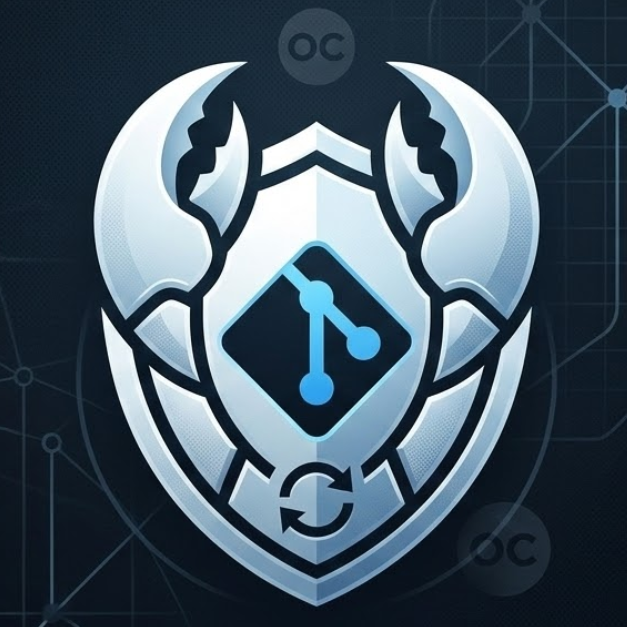
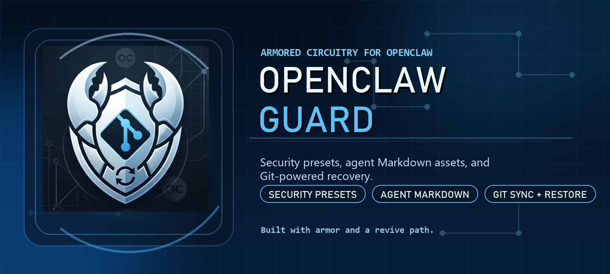

<p align="center">
  
  
</p>

<p align="center"><strong>The OpenClaw console with built-in armor and recovery.</strong></p>
<p align="center">Security presets reduce overreach risk, Markdown assets such as memory and role files stay organized, and backup & recovery keeps experimentation reversible.</p>

<p align="center"><a href="./README.md">中文</a> · <a href="./README.en.md">English</a></p>

<p align="center">
  <a href="https://github.com/qingmiao-tech/openclaw-guard/actions/workflows/ci.yml"></a>
  <a href="https://github.com/qingmiao-tech/openclaw-guard/releases"></a>
  <a href="https://github.com/qingmiao-tech/openclaw-guard/blob/main/package.json"></a>
  <a href="https://github.com/qingmiao-tech/openclaw-guard/blob/main/LICENSE"></a>
</p>

<p align="center">
  
</p>

<p align="center"><a href="https://qingmiao-tech.github.io/openclaw-guard/">Open the documentation</a></p>

## What It Is

OpenClaw Guard is an operations and security console built around OpenClaw. Instead of exposing every subsystem upfront, it focuses on three promises first:

- Get it running: inspect the machine, install or repair OpenClaw, and bring up Guard Web.
- Keep it protected: guide users through backup & recovery for memory, roles, workspaces, and key assets.
- Help it self-recover: provide safer defaults, runtime diagnostics, logs, repair actions, and rollback paths.

If you do not want to think about Git, Cron, OAuth, or plugin architecture on day one, Guard's home page walks you through the few steps that matter most.

## Good Fits

- You are setting up a new machine and want a guided path from OpenClaw installation to a working console.
- You want one place to manage OpenClaw, Gateway, models, built-in channels, security presets, and recovery points.
- You want the freedom to experiment without losing the option to return to a known-good state.

## 3-Minute Start

### 1. Install and start Guard

```bash
npm install -g @qingmiao-tech/openclaw-guard@0.9.1
openclaw-guard init-machine --install-openclaw --start-web --port 18088
```

If you prefer not to keep a global install, you can run it directly with `npx`:

```bash
npx -y @qingmiao-tech/openclaw-guard@0.9.1 init-machine --install-openclaw --start-web --port 18088
```

If you prefer to pin a specific GitHub Release asset, you can also install:

```bash
npm install -g https://github.com/qingmiao-tech/openclaw-guard/releases/download/v0.9.1/qingmiao-tech-openclaw-guard-0.9.1.tgz
```

Current install methods, `npm / npx` update paths, and release notes are documented in [Version & Releases](./docs/releases.md).

### 2. Open the workbench

- Main entry: `http://127.0.0.1:18088/workbench`
- The root route also lands in the Guard workbench: `http://127.0.0.1:18088/`

### 3. Check the initial password before the first login

- On the first startup, Guard prints a randomly generated initial password in the local terminal.
- If you missed it, run this command again on the same machine:

```bash
openclaw-guard auth show-password
```

- This command only reveals the password in the local CLI. The password is never returned through the web UI.
- If you already changed the password, use the current password you set yourself.

### 4. Follow the 4 main paths from the home page

- Install / Repair OpenClaw
- Configure Models
- Connect Channels
- Turn On Backup & Recovery

The home page is designed to answer three questions first:

- Can the system work right now?
- What is the most recommended next action?
- Are there any risks or blockers that need attention?

## Core Launch Features

- Guided home page: a path-first console instead of a flat wall of metrics.
- OpenClaw lifecycle management: install, repair, update, rollback, uninstall, and diagnostics.
- Backup & Recovery: presented first as "save now", "go back to a point", and "continue forward after restore".
- Security center: security checks, permission modes, and host-hardening guidance in one place.
- Workspace tools: roles, files, search, and core memory assets under a calmer structure.
- Redacted diagnostics export: safe to attach in GitHub issues or remote support sessions.

## Platform Matrix

| Platform | Status | Notes |
| --- | --- | --- |
| Windows | Supported | Managed install, launcher scripts, the workbench, and diagnostics export are all supported. |
| macOS | Supported | Launcher scripts, the workbench, security guidance, and recovery flows are supported. |
| Linux | Supported | Current focus is Debian/Ubuntu, Fedora/RHEL, and Arch-based distributions. |

## Common Entry Points

### CLI

```bash
# Start Guard Web
openclaw-guard web --port 18088

# Show the normalized Guard Web report
openclaw-guard web-status --port 18088 --lang zh
openclaw-guard web-status --port 18088 --lang en --json

# Show the locally recoverable initial password
openclaw-guard auth status
openclaw-guard auth show-password

# Update the global install to the latest release
npm install -g @qingmiao-tech/openclaw-guard@latest

# Run the latest release directly with npx
npx -y @qingmiao-tech/openclaw-guard@latest web-status --port 18088 --lang zh

# Initialize a machine (supports dry-run)
openclaw-guard init-machine --install-openclaw --start-web --port 18088 --dry-run --json

# OpenClaw lifecycle management
openclaw-guard openclaw status
openclaw-guard openclaw update
openclaw-guard openclaw rollback --history-id <id>
```

### Launcher Scripts

Convenience launchers live in [`launchers/`](./launchers):

- Windows: `launchers\start-web.bat` / `launchers\stop-web.bat` / `launchers\status-web.bat`
- macOS / Linux: `bash ./launchers/start-web.sh`
- macOS double-click entry: `launchers/start-web.command`

## Docs

- [Getting Started](./docs/getting-started.md)
- [Console Overview](./docs/console-overview.md)
- [OpenClaw Lifecycle](./docs/openclaw-lifecycle.md)
- [Backup & Recovery](./docs/backup-and-recovery.md)
- [Security & Guardrails](./docs/security.md)
- [Troubleshooting & Diagnostics](./docs/troubleshooting.md)

Full site: <https://qingmiao-tech.github.io/openclaw-guard/>

## Diagnostics and Support

Before opening an issue or asking for remote help, export the redacted diagnostics bundle first:

- Download it directly from the home page in the workbench
- Or call `GET /api/support/diagnostics?download=1`

The diagnostics bundle includes:

- version and runtime status
- Guard Web / Gateway / OpenClaw status
- backup & recovery overview
- recent logs and alerts
- security check summaries

It does not directly include:

- raw API keys, tokens, secrets, cookies, or passwords
- raw local usernames
- raw sensitive paths such as home directories

## Known Limits

- The cost capability is still an estimate and is intentionally not positioned as a billing source of truth.
- Custom channel plugins are not part of the public launch surface yet; the initial release focuses on official channels and stable extension points.
- Advanced Git remains available for technical users, while the default recovery experience stays Git-light.
- Linux machine initialization currently targets mainstream distro paths rather than every downstream variant.

## License

MIT
