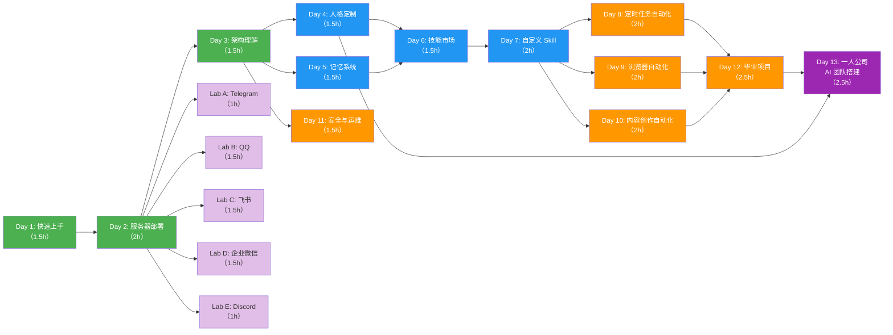

# OpenClaw 实战训练营：从零打造你的 AI 智能助手

> **课程设计文档** | 版本 1.0
>
> 本文档为课程设计的完整指引，涵盖课程定位、教学设计、模块详情及配套资源，可直接用于课程制作。

---

## 目录

1. [课程概述](#1-课程概述)
2. [目标受众](#2-目标受众)
3. [课程路线图](#3-课程路线图)
4. [模块详细设计](#4-模块详细设计)
5. [故障排查手册](#5-故障排查手册)
6. [附录](#6-附录)

---

## 1. 课程概述

### 1.1 课程定位

"OpenClaw 实战训练营"是一门面向零基础用户的 AI 智能助手实战课程。课程围绕开源自托管 AI Agent 框架 **OpenClaw**，带领学员从零开始搭建、定制并运营属于自己的 AI 智能助手。

课程核心理念：**"先体验后理论"** —— 先让学员跑起来，再讲原理。第 1 天就让学员在本地跑通 OpenClaw 并完成第一次 AI 对话，建立信心和兴趣，随后再逐步深入架构原理、个性化定制和高级应用。

课程采用模块化设计，包含 **12 天核心必修模块**、**1 个进阶选修模块** 和 **5 个选修渠道 Lab**，总学习时长可灵活扩展至 14 天。学员可根据自身需求选择学习路径，既适合从头到尾系统学习，也支持按需跳选特定模块。

### 1.2 学习目标

完成本课程后，学员将能够：

1. **独立部署**：在本地或云服务器上完成 OpenClaw 的安装与部署，并保持稳定运行
2. **个性化定制**：通过 soul.md 人格定制和记忆系统，打造具有独特性格和记忆能力的 AI 助手
3. **技能扩展**：使用 ClawHub 技能市场安装社区技能，并能从零编写自定义 Skill
4. **项目实战**：运用定时任务、浏览器自动化、内容创作等能力，构建实际可用的 AI 工作流
5. **安全运维**：掌握 API Key 管理、服务器安全、权限控制等安全实践，确保 AI 助手稳定安全运行
6. **渠道对接**：将 AI 助手接入 Telegram、QQ、飞书、企业微信、Discord 等主流消息平台（选修）

### 1.3 课程时长与形式

| 项目 | 说明 |
|------|------|
| 核心模块 | 12 天，共约 21.5 小时 |
| 进阶选修 | 1 个模块，约 2.5 小时 |
| 选修渠道 Lab | 5 个 Lab，共约 6.5 小时 |
| 总时长 | 可扩展至 14 天（含选修） |
| 教学形式 | 图文教程 + 实操任务 + 验收检查 |
| 学习节奏 | 建议每天 1 个模块，每模块 1.5-2.5 小时 |

### 1.4 预期学习成果

学员完成课程后将获得以下可验证的成果：

- 一个在本地或云端稳定运行的 OpenClaw AI 助手实例
- 一份自定义的 soul.md 人格配置文件，赋予 AI 独特的性格风格
- 至少一个自行编写的自定义 Skill
- 一个完整的 AI 自动化工作流项目（毕业项目）
- 至少一个消息渠道的成功对接（选修）
- 具备独立排查 OpenClaw 常见问题的能力

---

## 2. 目标受众

### 2.1 受众画像

本课程面向 **零基础用户** —— 对 AI 感兴趣但没有编程经验的普通人。

**典型学员特征：**

- **技术背景**：无编程经验，但会基本的电脑操作（安装软件、使用浏览器、文件管理）
- **学习动机**：对 AI 充满好奇，希望拥有一个属于自己的 AI 助手，而非仅使用现成的 AI 产品
- **时间投入**：每天可投入 1.5-2.5 小时用于学习和实操
- **设备条件**：拥有一台 macOS、Windows 或 Linux 电脑，有稳定的网络连接

**典型学员角色：**

| 角色 | 描述 | 核心诉求 |
|------|------|----------|
| 好奇探索者 | 听说过 ChatGPT，想了解 AI 能做什么，想自己动手试试 | 快速上手，看到效果 |
| 效率追求者 | 希望用 AI 自动化日常重复工作（如定时提醒、信息收集） | 实用的自动化方案 |
| 社群运营者 | 管理 QQ 群/飞书群/Discord 服务器，想用 AI 辅助运营 | 渠道对接，智能回复 |
| 内容创作者 | 希望 AI 辅助写文章、管理知识库、自动发布内容 | 内容创作自动化 |
| 技术爱好者 | 有一定技术兴趣，想深入了解 AI Agent 的工作原理 | 架构理解，技能开发 |

### 2.2 前置要求

- **必须**：会使用电脑进行基本操作（安装软件、浏览网页、管理文件）
- **必须**：有稳定的网络连接
- **推荐**：了解命令行的基本概念（课程 Day 1 会从零教起）
- **不需要**：编程经验、AI/机器学习知识、服务器运维经验

### 2.3 学习路径建议

根据不同学员的目标，推荐以下学习路径：

- **最小可用路径**（约 5 小时）：Day 1 → Day 2 → 选一个渠道 Lab → 完成
- **个性化定制路径**（约 10 小时）：Day 1-5 → 选一个渠道 Lab → 完成
- **完整学习路径**（约 21.5 小时）：Day 1-12 全部完成
- **进阶路径**（约 24 小时）：Day 1-12 + Day 13 进阶模块
- **全栈路径**（约 30.5 小时）：Day 1-13 + 全部渠道 Lab

---

## 3. 课程路线图

### 3.1 课程结构总览

课程采用 **三层递进架构**，从基础体验到进阶定制再到项目实战，层层深入。同时提供 5 个选修渠道 Lab，学员可在完成基础层后按需选学。

**三层架构说明：**

- **基础层（Day 1-3）**：以"先体验后理论"为核心，让学员快速上手 OpenClaw，完成本地安装、云端部署和架构理解。这一层是所有后续学习的基石。
- **进阶层（Day 4-7）**：深入 OpenClaw 的个性化能力，包括人格定制、记忆系统、技能市场使用和自定义 Skill 开发。学员将掌握让 AI 助手变得独特且强大的核心技能。
- **实战层（Day 8-12）**：将所学知识综合运用到真实项目中，涵盖定时任务自动化、浏览器自动化、内容创作自动化，以及安全运维和毕业项目。

**完整模块清单：**

| 编号 | 标题 | 所属层级 | 预计时长 | 必修/选修 |
|------|------|----------|----------|-----------|
| Day 1 | 5 分钟跑通你的第一个 AI 助手 | 基础层 | 1.5h | 必修 |
| Day 2 | 把 AI 搬到云上：服务器部署全攻略 | 基础层 | 2h | 必修 |
| Day 3 | 拆解引擎：OpenClaw 六大核心组件 | 基础层 | 1.5h | 必修 |
| Day 4 | 给 AI 一个灵魂：人格定制 soul.md | 进阶层 | 1.5h | 必修 |
| Day 5 | 让 AI 记住你：记忆系统深度解析 | 进阶层 | 1.5h | 必修 |
| Day 6 | 技能商店淘宝：ClawHub 技能市场 | 进阶层 | 1.5h | 必修 |
| Day 7 | 从零写一个 Skill：自定义技能开发 | 进阶层 | 2h | 必修 |
| Day 8 | 项目实战①：定时任务自动化 | 实战层 | 2h | 必修 |
| Day 9 | 项目实战②：浏览器自动化 | 实战层 | 2h | 必修 |
| Day 10 | 项目实战③：内容创作自动化 | 实战层 | 2h | 必修 |
| Day 11 | 安全运维：让你的 AI 稳定又安全 | 实战层 | 1.5h | 必修 |
| Day 12 | 毕业项目：打造你的 AI 工作流 | 实战层 | 2.5h | 必修 |
| Day 13 | 进阶：一人公司 AI 团队搭建 | 进阶实战层 | 2.5h | 选修（进阶） |
| Lab A | Telegram 对接 | 选修 Lab | 1h | 选修 |
| Lab B | QQ 对接 | 选修 Lab | 1.5h | 选修 |
| Lab C | 飞书对接 | 选修 Lab | 1.5h | 选修 |
| Lab D | 企业微信对接 | 选修 Lab | 1.5h | 选修 |
| Lab E | Discord 对接 | 选修 Lab | 1h | 选修 |

> **时长汇总**：12 天核心必修模块共计约 **21.5 小时**；1 个进阶选修模块约 **2.5 小时**；5 个选修渠道 Lab 共计约 **6.5 小时**；全部完成约 **30.5 小时**。

### 3.2 模块依赖关系图

以下 Mermaid 图展示了所有模块之间的前置依赖关系。箭头方向表示"学完 A 才能学 B"。



**图例说明：**

- 🟩 绿色 = 基础层（Day 1-3）
- 🟦 蓝色 = 进阶层（Day 4-7）
- 🟧 橙色 = 实战层（Day 8-12）
- 🟪 紫色 = 进阶实战层（Day 13）
- 💜 浅紫色 = 选修渠道 Lab（Lab A-E）

**关键依赖路径：**

1. **主线路径**：Day 1 → Day 2 → Day 3 → Day 4/5 → Day 6 → Day 7 → Day 8/9/10 → Day 12
2. **进阶路径**：Day 12 + Day 4 → Day 13（一人公司 AI 团队搭建）
3. **安全运维分支**：Day 3 → Day 11（可在完成架构理解后独立学习）
4. **渠道 Lab 分支**：Day 2 → 任意渠道 Lab（完成部署后即可选学）
5. **毕业项目汇聚**：Day 8、Day 9、Day 10 三个实战项目均汇入 Day 12 毕业项目

### 3.3 必修与选修模块分类

#### 必修核心模块（Day 1-12）

所有 12 天核心模块均为 **必修**，构成课程的完整学习主线。学员应按照依赖关系顺序完成，以确保知识的连贯性和递进性。

| 层级 | 模块 | 核心能力培养 |
|------|------|-------------|
| 基础层 | Day 1-3 | 安装部署、基本使用、架构认知 |
| 进阶层 | Day 4-7 | 个性化定制、技能扩展、开发能力 |
| 实战层 | Day 8-12 | 项目实战、安全运维、综合应用 |

> 必修模块之间存在明确的前置依赖关系（见 3.2 依赖关系图），建议严格按顺序学习。Day 4 和 Day 5 之间无依赖关系，可并行或调换顺序。

#### 选修扩展模块（Lab A-E）

5 个渠道对接 Lab 均为 **选修**，学员可根据自身实际需求选择一个或多个渠道进行学习。

| Lab | 渠道 | 适用场景 | 前置要求 |
|-----|------|----------|----------|
| Lab A | Telegram | 海外用户社群、个人助手 | Day 2 完成 |
| Lab B | QQ | 国内社群运营、好友互动 | Day 2 完成 |
| Lab C | 飞书 | 企业内部协作、团队助手 | Day 2 完成 |
| Lab D | 企业微信 | 企业客户服务、内部办公 | Day 2 完成 |
| Lab E | Discord | 游戏社区、海外开发者社群 | Day 2 完成 |

**选修模块学习建议：**

- 所有渠道 Lab 的前置要求为完成 **Day 2（服务器部署）**，确保 OpenClaw 已在可访问的环境中运行
- 建议至少选择 **1 个渠道 Lab** 完成，以获得完整的"AI 助手 + 消息渠道"体验
- 如果时间充裕，可在学习主线的间隙穿插完成渠道 Lab，例如在 Day 3 之后、Day 4 之前
- 每个渠道 Lab 都遵循"通用流程 + 渠道特有配置"的结构，学完一个后再学其他渠道会更快上手
- 渠道 Lab 之间互相独立，无先后顺序要求

---

## 4. 模块详细设计

> *每个模块将在后续任务中按照统一模板逐步填充详细内容。*

### 基础层（Day 1-3）

#### Day 1：5 分钟跑通你的第一个 AI 助手（1.5h）

> **所属层级**：基础层
> **必修/选修**：必修

##### 学习目标

完成本模块后，学员将能够：

1. **能够安装** OpenClaw 到本地电脑上，并通过命令行验证安装成功
2. **能够配置** OpenClaw 的初始设置，包括选择 AI 模型和配置 API Key
3. **能够使用** OpenClaw 的 TUI 界面与 AI 助手进行对话，并让 AI 执行简单任务

##### 前置知识

- 会基本的电脑操作（安装软件、使用浏览器、管理文件）
- 有稳定的网络连接

> 本模块为课程第一个模块，无需任何编程经验或 AI 相关知识。课程会从零开始引导你完成所有操作。

##### 教学内容大纲

###### 1. OpenClaw 是什么？

- **一句话定义**：OpenClaw 是一个运行在你自己电脑上的 AI 助手框架，开源、免费、数据完全由你掌控
- **它能做什么**：智能聊天、执行任务（如创建文件、搜索信息）、自动化日常工作
- **为什么选择 OpenClaw**：
  - 数据本地化：你的对话和数据不会被第三方平台收集
  - 可定制：可以给 AI 设定性格、安装技能插件、对接各种消息渠道
  - 开源免费：社区驱动，持续更新，无需付费订阅

> 本节只做简短介绍，帮助学员建立初步认知。架构原理将在 Day 3 深入讲解。

###### 2. 环境准备

- 检查电脑是否已安装 Node.js（在终端输入 `node -v` 查看版本）
- 如果没有安装 Node.js，前往 Node.js 官网下载 LTS 版本并安装
- 确认 npm 可用（在终端输入 `npm -v` 查看版本）
- Node.js 版本要求：建议 18.x 或以上

###### 3. 安装 OpenClaw

- 使用 npm 全局安装：`npm install -g openclaw@latest`
- 验证安装成功：`openclaw --version`
- 确认终端输出版本号，说明安装完成

###### 4. 初始配置（openclaw onboard）

- 运行 `openclaw onboard` 启动初始化向导
- 选择 AI 模型（推荐 Claude 或 GPT，根据个人偏好选择）
- 配置 API Key（从对应的 AI 服务商获取）
- 按向导提示完成剩余配置项
- 向导完成后，OpenClaw 即可使用

###### 5. 第一次对话

- 启动 TUI 界面：运行 `openclaw tui`
- 在对话框中输入第一条消息（如"你好，请介绍一下你自己"）
- 观察 AI 的回复，体验对话交互
- 尝试多轮对话，感受 AI 的上下文理解能力

###### 6. 初步探索：感受 AI Agent 的能力

- 让 AI 帮你做一件简单的事，例如：
  - "帮我在桌面创建一个名为 test.txt 的文件，内容写上 Hello OpenClaw"
  - "帮我查一下今天的天气"
  - "帮我列出当前目录下的所有文件"
- 观察 AI 不仅能"聊天"，还能"动手做事"——这就是 AI Agent 与普通聊天机器人的核心区别
- 普通聊天机器人只能回复文字，而 AI Agent 可以调用工具、执行操作、完成任务

##### 实操任务

###### 任务 1：安装 OpenClaw 并完成初始配置

**任务描述**：在本地电脑上安装 OpenClaw，并通过 onboard 向导完成初始配置，让 OpenClaw 准备就绪。

**操作步骤**：

1. 打开终端（macOS/Linux）或命令提示符/PowerShell（Windows）
2. 输入 `node -v` 确认 Node.js 已安装（如未安装，先前往 https://nodejs.org 下载安装 LTS 版本）
3. 输入 `npm -v` 确认 npm 可用
4. 输入 `npm install -g openclaw@latest` 安装 OpenClaw
5. 输入 `openclaw --version` 验证安装成功
6. 输入 `openclaw onboard` 启动初始化向导
7. 按向导提示选择 AI 模型（推荐 Claude 或 GPT）
8. 输入你的 API Key（从 AI 服务商官网获取）
9. 完成向导的其余配置步骤

**预期输出**：

- `openclaw --version` 输出类似 `openclaw v1.x.x` 的版本号
- `openclaw onboard` 向导完成后，终端显示配置成功的提示信息

**故障排查**：

- 问题：`npm install -g` 报权限错误（EACCES）
  解决：macOS/Linux 用户在命令前加 `sudo`，即 `sudo npm install -g openclaw@latest`；或配置 npm 全局目录到用户目录下
- 问题：`node -v` 提示"命令未找到"
  解决：说明 Node.js 未安装或未添加到系统 PATH，请重新安装 Node.js 并确保勾选"Add to PATH"选项
- 问题：`openclaw onboard` 报网络连接错误
  解决：检查网络连接是否正常；如果使用代理，需配置终端代理环境变量（如 `export https_proxy=http://你的代理地址:端口`）

###### 任务 2：与 AI 助手完成第一次对话

**任务描述**：启动 OpenClaw 的 TUI 界面，与 AI 助手进行第一次对话，体验智能聊天的效果。

**操作步骤**：

1. 在终端输入 `openclaw tui` 启动对话界面
2. 等待界面加载完成，出现输入框
3. 输入"你好，请介绍一下你自己"并按回车发送
4. 等待 AI 回复，阅读回复内容
5. 继续输入一个问题（如"OpenClaw 能帮我做什么？"），体验多轮对话

**预期输出**：

- TUI 界面正常启动，显示对话窗口
- 发送消息后，AI 在几秒内返回一段自然语言回复
- 多轮对话中，AI 能理解上下文并给出连贯的回答

**故障排查**：

- 问题：`openclaw tui` 启动后报 API Key 无效
  解决：重新运行 `openclaw onboard` 检查 API Key 是否正确输入；确认 API Key 在服务商官网处于激活状态
- 问题：发送消息后长时间无回复
  解决：检查网络连接；确认 API Key 对应的服务商账户有足够的额度/余额

###### 任务 3：让 AI 执行一个简单任务

**任务描述**：在 TUI 对话中，让 AI 助手执行一个实际操作（如创建文件），感受 AI Agent 的"动手能力"。

**操作步骤**：

1. 在 TUI 对话界面中，输入"帮我在当前目录创建一个文件叫 hello.txt，内容写上：我的第一个 AI 助手已就绪！"
2. 观察 AI 的回复，它会告诉你它正在执行操作
3. AI 完成后，打开文件管理器或在终端输入 `cat hello.txt`（macOS/Linux）或 `type hello.txt`（Windows）查看文件内容
4. 确认文件已创建且内容正确

**预期输出**：

- AI 回复确认已创建文件
- 在对应目录下能找到 `hello.txt` 文件
- 文件内容为"我的第一个 AI 助手已就绪！"

**故障排查**：

- 问题：AI 回复说没有权限创建文件
  解决：检查当前目录的写入权限；尝试切换到一个有写入权限的目录（如用户主目录）后重试
- 问题：AI 表示不理解你的请求
  解决：尝试用更明确的语言描述，如"请使用文件操作工具，在当前目录下创建一个名为 hello.txt 的文件"

##### 验收标准

- [ ] 学员能在终端运行 `openclaw --version` 并看到版本号输出，确认安装成功
- [ ] 学员能通过 `openclaw tui` 启动对话界面，发送消息并收到 AI 的回复
- [ ] 学员能让 AI 成功执行一个简单任务（如创建文件），并验证任务结果

##### 🔒 安全提示

- **API Key 是你的"钥匙"**：不要将 API Key 分享给他人，不要上传到公开的代码仓库或社交平台
- **API Key 的费用**：使用 AI 模型的 API 会产生费用，请关注你的服务商账户余额，避免意外扣费
- **本地数据安全**：OpenClaw 的对话数据存储在你的本地电脑上，注意保护好你的电脑安全

##### 常见问题（FAQ）

**Q：npm 安装 OpenClaw 时报错怎么办？**
A：最常见的原因是 Node.js 版本过低或权限不足。请确保 Node.js 版本 ≥ 18.x（运行 `node -v` 查看），如果是权限问题，macOS/Linux 用户可尝试 `sudo npm install -g openclaw@latest`。如果仍然报错，尝试清除 npm 缓存：`npm cache clean --force` 后重试。

**Q：没有 API Key 怎么获取？**
A：API Key 需要从 AI 模型服务商处获取。以 OpenAI 为例：访问 https://platform.openai.com，注册账号后在 API Keys 页面创建新的 Key。Claude 的 API Key 可在 https://console.anthropic.com 获取。大多数服务商提供免费试用额度，足够完成本课程的学习。

**Q：安装后运行 `openclaw tui` 启动失败怎么办？**
A：首先确认 `openclaw --version` 能正常输出版本号。如果版本号正常但 TUI 启动失败，可能是初始配置未完成，请运行 `openclaw onboard` 重新完成配置。如果仍然失败，检查终端是否支持 TUI 界面（建议使用系统自带终端或 iTerm2/Windows Terminal 等现代终端）。

**Q：API Key 配置错误了，怎么重新配置？**
A：重新运行 `openclaw onboard` 即可重新进行初始配置，包括重新输入 API Key。

##### 延伸阅读

- [OpenClaw 官方文档](https://openclaw.io/docs) —— OpenClaw 的完整使用文档，遇到问题时的权威参考
- [Node.js 官方下载页](https://nodejs.org) —— 下载和安装 Node.js 的官方渠道
- [什么是 AI Agent？](https://openclaw.io/blog/what-is-ai-agent) —— 了解 AI Agent 与传统聊天机器人的区别

#### Day 2：把 AI 搬到云上：服务器部署全攻略（2h）

> **所属层级**：基础层
> **必修/选修**：必修

##### 学习目标

完成本模块后，学员将能够：

1. **能够安装** OpenClaw 到云服务器（Linux VPS）上，并完成初始配置与模型对接
2. **能够配置** OpenClaw 以后台守护进程方式运行，实现 7×24 小时在线
3. **能够使用** 部署验证清单确认部署成功，并排查常见安装问题

##### 前置知识

- Day 1：5 分钟跑通你的第一个 AI 助手（已在本地成功运行 OpenClaw）
- 了解基本的命令行操作（Day 1 已涉及）

> 本模块会从零引导你完成云服务器的连接和部署，无需服务器运维经验。

##### 教学内容大纲

###### 1. 为什么要部署到云服务器？

- **本地 vs 云端对比**：
  - 本地运行：关机就断，仅自己可用，适合体验和开发调试
  - 云端运行：7×24 小时在线，可从任何设备访问，适合长期使用和对接消息渠道
- **7×24 小时在线的价值**：消息渠道（如 Telegram、QQ）需要 AI 随时在线才能及时回复；定时任务需要服务器持续运行
- **云服务器选择建议**：
  - 国内推荐：腾讯云轻量应用服务器、阿里云 ECS（新用户有优惠活动）
  - 海外推荐：AWS Lightsail、DigitalOcean Droplets、Vultr
  - 最低配置建议：1 核 CPU、1GB 内存、20GB 硬盘、Ubuntu 22.04 LTS
  - 预算参考：国内约 30-50 元/月，海外约 $4-6/月

###### 2. 云服务器准备（公共步骤）

- **购买/获取一台 Linux VPS**：
  - 选择一家云服务商，注册账号并完成实名认证（国内服务商需要）
  - 创建一台云服务器实例，选择 Ubuntu 22.04 LTS 系统镜像
  - 记录服务器的公网 IP 地址和登录密码（或 SSH 密钥）
- **SSH 连接到服务器**：
  - macOS/Linux：打开终端，输入 `ssh root@你的服务器IP`
  - Windows：使用 Windows Terminal 或 PowerShell，输入 `ssh root@你的服务器IP`；也可使用 PuTTY 等 SSH 客户端
  - 首次连接会提示确认指纹，输入 `yes` 继续
- **基础环境检查**：
  - 确认系统版本：`cat /etc/os-release`
  - 更新系统软件包：`apt update && apt upgrade -y`
  - 确认磁盘空间充足：`df -h`

###### 3. 安装 OpenClaw（按平台分支）

- **公共步骤：安装 Node.js**
  - 推荐使用 NodeSource 官方脚本安装 Node.js 18.x LTS：
    ```bash
    curl -fsSL https://deb.nodesource.com/setup_18.x | sudo bash -
    sudo apt install -y nodejs
    ```
  - 验证安装：`node -v` 和 `npm -v`
- **公共步骤：安装 OpenClaw**
  - `npm install -g openclaw@latest`
  - 验证安装：`openclaw --version`

- **macOS 特有注意事项**：
  - 如果在 macOS 本地部署（非云服务器场景），可使用 Homebrew 安装 Node.js：`brew install node`
  - 全局安装 npm 包可能需要 `sudo` 或配置 npm prefix
  - macOS 防火墙默认阻止传入连接，如需外部访问需在"系统设置 → 防火墙"中放行

- **Windows 特有注意事项（推荐使用 WSL）**：
  - 强烈推荐使用 WSL（Windows Subsystem for Linux）进行部署，体验与 Linux 一致
  - 安装 WSL：在 PowerShell 中运行 `wsl --install`，默认安装 Ubuntu
  - WSL 安装完成后，后续步骤与 Linux 完全相同
  - 如果不使用 WSL，可直接在 Windows 上安装 Node.js（从 nodejs.org 下载），但部分功能可能存在兼容性差异

- **Linux / 云服务器特有注意事项**：
  - 不建议使用 `root` 用户运行 OpenClaw，建议创建专用用户：
    ```bash
    adduser openclaw
    usermod -aG sudo openclaw
    su - openclaw
    ```
  - 如果服务器内存较小（1GB），建议配置 swap 分区防止内存不足：
    ```bash
    sudo fallocate -l 1G /swapfile
    sudo chmod 600 /swapfile
    sudo mkswap /swapfile
    sudo swapon /swapfile
    ```
  - 确保服务器安全组/防火墙已放行 SSH 端口（22）和 OpenClaw Gateway 端口

###### 4. 初始配置与模型对接

- 运行 `openclaw onboard` 启动初始化向导（与 Day 1 本地配置流程一致）
- 选择 AI 模型（推荐 Claude 或 GPT）
- 配置 API Key：建议使用环境变量方式管理，而非直接写入配置文件
  - 将 API Key 写入环境变量文件：`echo 'export OPENAI_API_KEY=你的Key' >> ~/.bashrc && source ~/.bashrc`
  - 在 onboard 向导中引用环境变量
- 完成向导后，使用 `openclaw tui` 快速测试一次对话，确认模型对接成功

###### 5. 后台运行配置

- **为什么需要后台运行**：直接在终端运行 OpenClaw，关闭 SSH 连接后进程就会停止。需要配置守护进程让 OpenClaw 在后台持续运行
- **启动 Gateway**：`openclaw gateway` 启动网关进程，管理所有渠道连接
- **方案一：使用 pm2（推荐新手）**
  - 安装 pm2：`npm install -g pm2`
  - 启动 OpenClaw Gateway：`pm2 start "openclaw gateway" --name openclaw-gw`
  - 查看运行状态：`pm2 status`
  - 查看日志：`pm2 logs openclaw-gw`
  - 配置开机自启：`pm2 startup && pm2 save`
- **方案二：使用 systemd（适合有 Linux 经验的学员）**
  - 创建 systemd 服务文件：`sudo nano /etc/systemd/system/openclaw.service`
  - 服务文件内容要点：指定 ExecStart 为 openclaw gateway 的完整路径，设置 Restart=always
  - 启用并启动服务：`sudo systemctl enable openclaw && sudo systemctl start openclaw`
  - 查看状态：`sudo systemctl status openclaw`

###### 6. 部署验证清单

- **Gateway 状态检查**：确认 Gateway 进程正在运行（`pm2 status` 或 `systemctl status openclaw`）
- **模型连接测试**：通过 TUI 发送一条消息，确认 AI 能正常回复（`openclaw tui`）
- **日志检查**：查看日志中无报错信息（`pm2 logs openclaw-gw --lines 50` 或 `journalctl -u openclaw --no-pager -n 50`）
- **端口检查**：确认 Gateway 端口正在监听（`ss -tlnp | grep openclaw` 或 `netstat -tlnp | grep openclaw`）
- **持久性测试**：断开 SSH 连接，等待 1 分钟后重新连接，确认 OpenClaw 仍在运行

##### 实操任务

###### 任务 1：在云服务器上安装 OpenClaw

**任务描述**：连接到云服务器，安装 Node.js 和 OpenClaw，完成初始配置并验证 AI 对话功能正常。

**操作步骤**：

1. 打开本地终端，通过 SSH 连接到云服务器：`ssh root@你的服务器IP`（首次连接输入 `yes` 确认指纹）
2. 更新系统软件包：`apt update && apt upgrade -y`
3. 安装 Node.js：
   ```bash
   curl -fsSL https://deb.nodesource.com/setup_18.x | sudo bash -
   sudo apt install -y nodejs
   ```
4. 验证 Node.js 安装：`node -v`（应输出 v18.x.x）
5. 安装 OpenClaw：`npm install -g openclaw@latest`
6. 验证 OpenClaw 安装：`openclaw --version`（应输出版本号）
7. 运行初始化向导：`openclaw onboard`
8. 按向导提示选择 AI 模型并配置 API Key
9. 测试对话：`openclaw tui`，发送一条消息确认 AI 正常回复
10. 按 `Ctrl+C` 退出 TUI

**预期输出**：

- `node -v` 输出 `v18.x.x` 或更高版本
- `openclaw --version` 输出类似 `openclaw v1.x.x` 的版本号
- `openclaw tui` 中发送消息后，AI 在几秒内返回回复

**故障排查**：

- 问题：`curl` 命令报错 "command not found"
  解决：先安装 curl：`apt install -y curl`，然后重试
- 问题：`npm install -g` 报权限错误
  解决：如果使用非 root 用户，在命令前加 `sudo`；或使用 root 用户执行
- 问题：`openclaw onboard` 报网络超时
  解决：检查服务器是否能访问外网（`ping google.com`）；国内服务器访问海外 API 可能需要配置代理

###### 任务 2：配置后台运行并验证部署

**任务描述**：使用 pm2 将 OpenClaw Gateway 配置为后台守护进程，设置开机自启，并通过部署验证清单确认部署成功。

**操作步骤**：

1. 安装 pm2：`npm install -g pm2`
2. 使用 pm2 启动 OpenClaw Gateway：`pm2 start "openclaw gateway" --name openclaw-gw`
3. 查看运行状态：`pm2 status`（确认 openclaw-gw 状态为 online）
4. 查看日志确认无报错：`pm2 logs openclaw-gw --lines 20`
5. 配置开机自启：
   ```bash
   pm2 startup
   pm2 save
   ```
6. 运行部署验证清单：
   - 检查 Gateway 状态：`pm2 status`（状态应为 online）
   - 测试 AI 对话：`openclaw tui`，发送一条消息确认正常回复
   - 检查日志：`pm2 logs openclaw-gw --lines 50`（无 ERROR 级别日志）
   - 检查端口：`ss -tlnp | grep openclaw`（确认端口在监听）
7. 断开 SSH 连接（输入 `exit`），等待约 1 分钟
8. 重新 SSH 连接到服务器，运行 `pm2 status` 确认 OpenClaw 仍在运行

**预期输出**：

- `pm2 status` 显示 openclaw-gw 进程状态为 `online`
- `openclaw tui` 对话正常
- 断开 SSH 后重连，进程仍在运行
- `pm2 startup` 输出配置成功的提示

**故障排查**：

- 问题：`pm2 status` 显示状态为 `errored`
  解决：运行 `pm2 logs openclaw-gw --lines 50` 查看错误日志；常见原因是 API Key 未配置或端口被占用
- 问题：`pm2 startup` 报错
  解决：确保使用 `sudo` 执行 pm2 startup 输出的命令；如果使用非 root 用户，需要按照 pm2 提示的完整命令执行
- 问题：断开 SSH 后进程停止
  解决：确认已执行 `pm2 save`；检查是否使用了 `pm2 startup` 配置开机自启

##### 验收标准

- [ ] OpenClaw 已在云服务器上安装成功，`openclaw --version` 输出版本号
- [ ] `openclaw onboard` 配置完成，通过 `openclaw tui` 能正常与 AI 对话
- [ ] OpenClaw Gateway 通过 pm2（或 systemd）以后台守护进程方式运行，`pm2 status` 显示 online
- [ ] 断开 SSH 连接后重新连接，OpenClaw 仍在正常运行
- [ ] 部署验证清单全部通过（Gateway 状态、模型连接、日志检查、端口检查）

##### 🔒 安全提示

- **SSH 密钥登录，禁用密码登录**：密码登录容易被暴力破解。建议生成 SSH 密钥对（`ssh-keygen`），将公钥上传到服务器，然后在 `/etc/ssh/sshd_config` 中设置 `PasswordAuthentication no` 禁用密码登录
- **防火墙配置，仅开放必要端口**：使用 `ufw`（Ubuntu 自带防火墙）仅开放 SSH（22）和 OpenClaw Gateway 所需端口，关闭其他所有端口：
  ```bash
  sudo ufw allow 22/tcp
  sudo ufw allow <Gateway端口>/tcp
  sudo ufw enable
  ```
- **API Key 使用环境变量管理，不硬编码**：将 API Key 存储在环境变量或 `.env` 文件中，不要直接写在配置文件里，更不要提交到 Git 仓库
- **定期更新系统和 OpenClaw**：定期运行 `apt update && apt upgrade -y` 更新系统补丁，运行 `npm update -g openclaw` 更新 OpenClaw 到最新版本
- **修改默认 SSH 端口（可选）**：将 SSH 端口从默认的 22 改为其他端口（如 2222），可减少被自动扫描攻击的风险

##### 常见问题（FAQ）

**Q：没有云服务器，可以用本地电脑代替吗？**
A：可以。如果你只是想体验 OpenClaw 的功能，Day 1 的本地安装已经足够。但如果你需要 7×24 小时在线（比如对接消息渠道让 AI 随时回复），就需要一台云服务器。很多云服务商对新用户有优惠活动，一台入门级服务器每月只需几十元。

**Q：服务器选 Linux 还是 Windows？**
A：强烈推荐 Linux（Ubuntu 22.04 LTS）。OpenClaw 在 Linux 上运行最稳定，社区文档和教程也以 Linux 为主。Windows Server 虽然也能运行，但配置更复杂且可能遇到兼容性问题。

**Q：国内服务器访问海外 AI API（如 OpenAI）很慢怎么办？**
A：国内服务器直连海外 API 可能存在网络延迟或不稳定的情况。解决方案：① 选择支持国内直连的 AI 模型（如国内大模型服务商）；② 使用海外服务器（如 AWS、DigitalOcean）部署 OpenClaw；③ 配置合规的网络代理。

**Q：pm2 和 systemd 选哪个？**
A：如果你是新手，推荐 pm2——安装简单、命令直观、日志管理方便。如果你有 Linux 运维经验，systemd 是更"原生"的选择，与系统集成更紧密。两者效果相同，都能实现后台运行和开机自启。

##### 故障排查

以下是云服务器部署 OpenClaw 时最常见的 5 个问题及排查方案：

**问题 1：SSH 连接服务器超时或被拒绝**

- 症状：`ssh root@IP` 后长时间无响应，或提示 "Connection refused"
- 排查步骤：
  1. 确认服务器 IP 地址是否正确
  2. 确认服务器已开机运行（在云服务商控制台查看状态）
  3. 确认安全组/防火墙规则已放行 22 端口（TCP）
  4. 如果使用密钥登录，确认密钥文件权限为 600：`chmod 600 ~/.ssh/id_rsa`
- 解决：在云服务商控制台检查安全组规则，添加入站规则允许 22 端口

**问题 2：Node.js 安装失败或版本过低**

- 症状：`node -v` 输出版本低于 18.x，或安装脚本报错
- 排查步骤：
  1. 确认系统为受支持的 Linux 发行版（Ubuntu 20.04+、Debian 10+、CentOS 7+）
  2. 检查 curl 是否可用：`which curl`
  3. 如果已有旧版本 Node.js，先卸载：`apt remove -y nodejs`
- 解决：使用 NodeSource 官方脚本重新安装，或使用 nvm 管理 Node.js 版本：
  ```bash
  curl -o- https://raw.githubusercontent.com/nvm-sh/nvm/v0.39.0/install.sh | bash
  source ~/.bashrc
  nvm install 18
  ```

**问题 3：OpenClaw 安装成功但 `openclaw` 命令找不到**

- 症状：`npm install -g openclaw@latest` 成功，但 `openclaw --version` 提示 "command not found"
- 排查步骤：
  1. 检查 npm 全局安装路径：`npm config get prefix`
  2. 确认该路径下的 `bin` 目录在系统 PATH 中：`echo $PATH`
  3. 如果使用 nvm，确认已 source 配置文件：`source ~/.bashrc`
- 解决：将 npm 全局 bin 目录添加到 PATH：
  ```bash
  echo 'export PATH=$(npm config get prefix)/bin:$PATH' >> ~/.bashrc
  source ~/.bashrc
  ```

**问题 4：Gateway 启动后立即崩溃（pm2 状态显示 errored）**

- 症状：`pm2 start` 后，`pm2 status` 显示状态为 `errored` 或不断重启
- 排查步骤：
  1. 查看详细错误日志：`pm2 logs openclaw-gw --lines 100`
  2. 常见原因：API Key 未配置或无效、端口被其他程序占用、内存不足
  3. 检查端口占用：`ss -tlnp | grep <端口号>`
  4. 检查内存使用：`free -h`
- 解决：根据日志中的具体错误信息处理。如果是端口占用，停止占用端口的程序或更换端口；如果是内存不足，配置 swap 分区（见教学内容第 3 节）

**问题 5：服务器重启后 OpenClaw 没有自动启动**

- 症状：服务器重启后，`pm2 status` 无进程或 OpenClaw 未运行
- 排查步骤：
  1. 确认是否执行过 `pm2 startup` 和 `pm2 save`
  2. 检查 pm2 startup 生成的系统服务是否启用：`systemctl status pm2-<用户名>`
  3. 如果使用 systemd 方案，检查服务是否 enabled：`systemctl is-enabled openclaw`
- 解决：重新执行 `pm2 startup`，按照输出提示执行 sudo 命令，然后 `pm2 start "openclaw gateway" --name openclaw-gw && pm2 save`

##### 延伸阅读

- [OpenClaw 部署文档](https://openclaw.io/docs/deployment) —— 官方部署指南，包含更多高级配置选项
- [pm2 官方文档](https://pm2.keymetrics.io/docs/usage/quick-start/) —— pm2 进程管理器的完整使用指南
- [Ubuntu 服务器安全加固指南](https://ubuntu.com/server/docs/security-introduction) —— Ubuntu 官方的服务器安全最佳实践
- [SSH 密钥认证配置教程](https://www.ssh.com/academy/ssh/keygen) —— SSH 密钥生成与配置的详细教程

#### Day 3：拆解引擎：OpenClaw 六大核心组件（1.5h）

> **所属层级**：基础层
> **必修/选修**：必修

##### 学习目标

完成本模块后，学员将能够：

1. **能够解释** OpenClaw 的核心架构，包括 Gateway、Agent、Channel、Skill、Memory 等组件的作用和相互关系
2. **能够识别** 并修改 OpenClaw 的关键配置文件（openclaw.json），理解工作目录结构
3. **能够描述** 渠道对接的通用四步流程，为后续选修渠道 Lab 做好知识准备

##### 前置知识

- Day 2：把 AI 搬到云上——服务器部署全攻略（已完成 OpenClaw 的安装部署，Gateway 已在运行）
- 了解基本的命令行操作（Day 1-2 已涉及）

> 本模块以理论讲解为主、实操验证为辅。学员无需编程经验，只需能在终端中执行简单命令即可。

##### 教学内容大纲

###### 1. OpenClaw 架构全景图

- **"人体"类比法**——用一个直观的比喻帮助理解各组件的角色：
  - **Gateway = 身体**：7×24 小时值班的"躯干"，负责接收外界消息、保持在线
  - **Agent = 大脑**：思考和决策中枢，读取上下文、判断意图、决定下一步行动
  - **Skill = 技能证书**：Agent 掌握的各种专业能力，可以从社区安装或自己编写
  - **Tools = 双手**：底层执行器，真正"动手干活"的部分（文件读写、命令执行、Web 搜索等）
  - **Memory = 记忆**：让 AI 记住你说过的话、你的偏好和重要信息
  - **Channel = 感官**：连接外界的"眼睛和耳朵"，对接 Telegram、QQ、飞书等消息渠道

- **Mermaid 架构图**：

```mermaid
graph TB
    subgraph 外部世界
        U1["👤 用户 (Telegram)"]
        U2["👤 用户 (QQ)"]
        U3["👤 用户 (飞书)"]
        U4["⏰ 定时任务 (Cron)"]
    end

    subgraph OpenClaw 系统
        subgraph Gateway 网关
            CH1["Channel: Telegram"]
            CH2["Channel: QQ"]
            CH3["Channel: 飞书"]
            CR["Cron 调度器"]
        end

        subgraph Agent 智能体
            CTX["上下文理解"]
            INT["意图判断"]
            DEC["决策引擎"]
        end

        subgraph 能力层
            SK["Skill 技能插件"]
            TL["Tools 工具集"]
        end

        MEM["Memory 记忆系统"]
        SOUL["soul.md 人格文件"]
        CFG["openclaw.json 配置"]
    end

    U1 --> CH1
    U2 --> CH2
    U3 --> CH3
    U4 --> CR

    CH1 --> CTX
    CH2 --> CTX
    CH3 --> CTX
    CR --> CTX

    CTX --> INT
    INT --> DEC
    SOUL --> DEC
    MEM <--> DEC

    DEC --> SK
    DEC --> TL
    SK --> TL

    CFG -.-> Gateway 网关
    CFG -.-> Agent 智能体

    style Gateway 网关 fill:#4CAF50,color:#fff
    style Agent 智能体 fill:#2196F3,color:#fff
    style 能力层 fill:#FF9800,color:#fff
    style MEM fill:#9C27B0,color:#fff
    style SOUL fill:#E91E63,color:#fff
    style CFG fill:#607D8B,color:#fff
```

- **一句话总结**：用户通过 Channel 发消息 → Gateway 接收并路由 → Agent 理解意图并决策 → 调用 Skill/Tools 执行 → 返回结果给用户

###### 2. 各组件详解

- **Gateway（网关）**：
  - 常驻在线的守护进程，是 OpenClaw 的"入口大门"
  - 核心职责：消息路由（将不同渠道的消息统一转发给 Agent）、任务调度（管理定时任务触发）、连接管理（维护与各渠道的长连接）
  - 类比：就像一个 7×24 小时值班的前台，负责接待所有来访者并转交给对应的处理人

- **Agent（智能体）**：
  - OpenClaw 的"大脑"，负责所有智能决策
  - 核心职责：读取上下文（对话历史、用户信息）、判断用户意图、选择合适的 Skill 或 Tool 来完成任务、调用 AI 模型生成回复
  - Agent 会参考 soul.md 中定义的人格来调整回复风格
  - Agent 会读写 Memory 来维持对话的连贯性和个性化

- **Channel（渠道）**：
  - 连接外部消息平台的"感官接口"
  - 每个 Channel 对应一个消息平台（Telegram、QQ、飞书、企业微信、Discord 等）
  - Channel 的作用：将不同平台的消息格式统一转换为 OpenClaw 内部格式，屏蔽平台差异
  - 一个 OpenClaw 实例可以同时连接多个 Channel，实现"一个 AI，多个入口"

- **Skill（技能插件）**：
  - Agent 可以调用的"专业能力模块"
  - 来源：从 ClawHub 技能市场安装社区开发的 Skill，或自行编写
  - 示例：天气查询 Skill、日程管理 Skill、代码执行 Skill 等
  - Skill 与 Tools 的关系：Skill 是高层的业务逻辑封装，内部可能调用一个或多个 Tools 来完成具体操作

- **Tools（工具集）**：
  - 底层执行器，是 AI "动手干活"的基础能力
  - 内置工具包括：文件读写、命令执行、Web 搜索、浏览器操作等
  - Tools 由 Agent 或 Skill 调用，不直接面向用户
  - 类比：如果 Skill 是"厨师的菜谱"，那 Tools 就是"锅碗瓢盆"

- **Memory（记忆系统）**：
  - 让 AI 拥有"记忆力"的核心组件
  - 三层记忆架构：
    - **核心记忆（Core Memory）**：存储用户的关键信息（姓名、偏好、重要事项），始终可用
    - **长期记忆（Archival Memory）**：存储大量历史信息，按需检索
    - **短期记忆（Conversation Memory）**：当前对话的上下文，对话结束后可归档
  - 记忆让 AI 能"记住你"，提供个性化的服务体验

###### 3. 数据流示例

- **场景一：用户发消息的处理流程**
  1. 用户在 Telegram 中发送一条消息："帮我查一下明天北京的天气"
  2. Telegram Channel 接收消息，转换为 OpenClaw 内部格式，转发给 Gateway
  3. Gateway 将消息路由给 Agent
  4. Agent 读取对话上下文和用户记忆，理解用户意图："查询天气"
  5. Agent 决定调用"天气查询 Skill"
  6. 天气查询 Skill 内部调用 Web 搜索 Tool，获取天气数据
  7. Agent 根据 soul.md 中定义的人格风格，组织回复语言
  8. 回复通过 Gateway → Telegram Channel → 用户看到结果

- **场景二：定时任务触发的处理流程**
  1. Cron 调度器在设定的时间点触发任务（如每天早上 8:00）
  2. Gateway 将定时任务事件传递给 Agent
  3. Agent 执行预设的任务逻辑（如"获取今日新闻摘要"）
  4. Agent 调用相关 Skill/Tools 完成任务
  5. 结果通过指定的 Channel 推送给用户（如发送到 Telegram）

###### 4. 配置文件结构

- **openclaw.json 主配置文件**：
  - OpenClaw 的核心配置文件，控制系统的整体行为
  - 常用配置项说明：
    - `model`：指定使用的 AI 模型（如 claude-3-sonnet、gpt-4 等）
    - `apiKey` / `apiBase`：AI 模型的 API 密钥和接口地址
    - `channels`：已启用的渠道列表及各渠道的配置信息
    - `skills`：已安装的技能列表及配置
    - `memory`：记忆系统的配置（存储方式、容量限制等）
    - `cron`：定时任务配置

- **工作目录结构**：
  - OpenClaw 的工作目录包含以下关键文件和文件夹：
    ```
    openclaw 工作目录/
    ├── openclaw.json      # 主配置文件
    ├── soul.md            # 人格定制文件（定义 AI 的性格和行为风格）
    ├── memory/            # 记忆存储目录
    │   ├── core/          # 核心记忆
    │   └── archival/      # 长期记忆
    ├── skills/            # 已安装的技能目录
    │   ├── skill-a/
    │   └── skill-b/
    └── logs/              # 运行日志目录
    ```

- **常用配置项修改场景**：
  - 切换 AI 模型：修改 `model` 字段
  - 更换 API Key：修改 `apiKey` 字段（建议使用环境变量）
  - 启用/禁用某个渠道：修改 `channels` 中对应渠道的 `enabled` 字段
  - 调整记忆容量：修改 `memory` 中的相关参数

###### 5. 渠道对接通用流程（为选修 Lab 铺垫）

- **通用四步流程**——无论对接哪个消息渠道，都遵循以下标准流程：
  1. **获取渠道凭证**：在目标平台（Telegram / QQ / 飞书等）创建机器人或应用，获取 Token、App ID、Secret 等凭证信息
  2. **配置 OpenClaw**：将获取的凭证信息填入 openclaw.json 的 `channels` 配置中，指定渠道类型和连接参数
  3. **重启 Gateway**：修改配置后需要重启 Gateway 使新配置生效（`pm2 restart openclaw-gw` 或 `systemctl restart openclaw`）
  4. **验证消息收发**：在目标平台上向机器人发送一条测试消息，确认 AI 能正常接收并回复

- **各渠道的差异点概述**：
  - **Telegram**：流程最简单，通过 BotFather 创建机器人即可获取 Token，无需审核
  - **QQ**：需要申请 QQ 机器人资格，审核流程相对复杂，配置项较多
  - **飞书**：需要在飞书开放平台创建应用，配置事件订阅和权限
  - **企业微信**：需要企业微信管理员权限，创建自建应用并配置回调地址
  - **Discord**：在 Discord Developer Portal 创建 Bot，流程与 Telegram 类似，较为简单

- **如何选择适合自己的渠道**：
  - 如果你主要在海外或使用 Telegram：选 Lab A（Telegram）
  - 如果你在国内，朋友都用 QQ：选 Lab B（QQ）
  - 如果你在企业环境中使用飞书：选 Lab C（飞书）
  - 如果你的公司使用企业微信：选 Lab D（企业微信）
  - 如果你活跃在 Discord 社区：选 Lab E（Discord）
  - 建议先完成一个最简单的渠道（Telegram 或 Discord），熟悉流程后再尝试其他渠道

##### 实操任务

###### 任务 1：查看并理解 OpenClaw 配置文件

**任务描述**：找到 OpenClaw 的主配置文件 openclaw.json，阅读其内容，理解各配置项的含义。

**操作步骤**：

1. SSH 连接到你的服务器（或在本地终端操作）
2. 进入 OpenClaw 的工作目录（通常在用户主目录下，如 `~/.openclaw` 或 `~/openclaw`）
3. 查看配置文件内容：`cat openclaw.json`
4. 逐项阅读配置内容，对照教学内容中的"常用配置项说明"，理解每个字段的作用
5. 查看工作目录结构：`ls -la` 确认 soul.md、memory/、skills/ 等文件和目录存在
6. 查看 soul.md 内容：`cat soul.md`，了解当前 AI 的人格设定

**预期输出**：

- `cat openclaw.json` 输出一段 JSON 格式的配置内容，包含 model、channels、skills 等字段
- `ls -la` 显示工作目录下的文件和文件夹列表
- `cat soul.md` 输出当前的人格定义文本

**故障排查**：

- 问题：找不到 openclaw.json 文件
  解决：运行 `find ~ -name "openclaw.json" 2>/dev/null` 搜索文件位置；如果从未运行过 `openclaw onboard`，需要先完成初始配置
- 问题：配置文件内容为空或格式异常
  解决：可能是初始化未完成，重新运行 `openclaw onboard` 生成默认配置

###### 任务 2：修改一个配置项并验证生效

**任务描述**：修改 openclaw.json 中的一个配置项（如 AI 模型名称），重启 Gateway 后验证修改已生效。

**操作步骤**：

1. 先备份当前配置：`cp openclaw.json openclaw.json.bak`
2. 使用文本编辑器打开配置文件：`nano openclaw.json`（或使用 `vi`）
3. 找到 `model` 字段，记录当前值
4. 将 `model` 字段修改为另一个可用的模型名称（如从 `gpt-4` 改为 `gpt-3.5-turbo`，或反之）
5. 保存文件并退出编辑器（nano 中按 `Ctrl+O` 保存，`Ctrl+X` 退出）
6. 重启 Gateway 使配置生效：`pm2 restart openclaw-gw`
7. 等待几秒后检查 Gateway 状态：`pm2 status`（确认状态为 online）
8. 启动 TUI 测试对话：`openclaw tui`，发送一条消息确认 AI 正常回复
9. （可选）验证完成后，恢复原配置：`cp openclaw.json.bak openclaw.json && pm2 restart openclaw-gw`

**预期输出**：

- 修改配置后，`pm2 restart openclaw-gw` 成功重启，状态为 online
- `openclaw tui` 中发送消息后 AI 正常回复（如果切换了模型，回复风格可能略有不同）
- 整个过程无报错

**故障排查**：

- 问题：修改配置后 Gateway 启动失败（pm2 状态为 errored）
  解决：可能是 JSON 格式错误（如缺少逗号、引号不匹配）。运行 `pm2 logs openclaw-gw --lines 20` 查看错误信息；使用备份恢复：`cp openclaw.json.bak openclaw.json && pm2 restart openclaw-gw`
- 问题：修改后 AI 不回复或报模型不可用
  解决：确认填写的模型名称正确且你的 API Key 有权限使用该模型；恢复备份配置后重试

##### 验收标准

- [ ] 学员能画出或口头描述 OpenClaw 的核心架构，说出 Gateway、Agent、Channel、Skill、Tools、Memory 各自的作用
- [ ] 学员能找到 openclaw.json 配置文件，并读懂其中的关键配置项（model、channels、skills 等）
- [ ] 学员能说出渠道对接的通用四步流程：获取凭证 → 配置 OpenClaw → 重启 Gateway → 验证收发

##### 🔒 安全提示

本模块无特殊安全注意事项。

> 提醒：在查看和修改配置文件时，注意不要将包含 API Key 的配置文件内容截图分享到公开场合。

##### 常见问题（FAQ）

**Q：Gateway 和 Agent 是同一个进程吗？**
A：在 OpenClaw 中，运行 `openclaw gateway` 会启动 Gateway 进程，Gateway 内部会管理 Agent 的生命周期。你可以把它理解为：Gateway 是"外壳"，Agent 是"内核"，它们协同工作但职责不同。Gateway 负责对外连接和消息路由，Agent 负责理解和决策。

**Q：一个 OpenClaw 实例可以同时连接多个渠道吗？**
A：可以。你可以在 openclaw.json 的 `channels` 中配置多个渠道，Gateway 会同时维护所有渠道的连接。这意味着你可以用同一个 AI 助手同时服务 Telegram、QQ、飞书等多个平台的用户。

**Q：修改配置文件后一定要重启 Gateway 吗？**
A：是的。目前 OpenClaw 的配置在 Gateway 启动时加载，修改配置文件后需要重启 Gateway 才能使新配置生效。使用 `pm2 restart openclaw-gw` 即可快速重启。

**Q：Skill 和 Tools 有什么区别？我容易搞混。**
A：简单来说——Tools 是"基础能力"（如读文件、执行命令、搜索网页），是 OpenClaw 内置的底层工具；Skill 是"业务能力"（如查天气、管日程、写代码），是基于 Tools 封装的高层插件。Skill 可以从社区安装或自己编写，而 Tools 是系统自带的。打个比方：Tools 是"锤子、螺丝刀"，Skill 是"组装家具的说明书"。

##### 延伸阅读

- [OpenClaw 架构文档](https://openclaw.io/docs/architecture) —— 官方架构设计说明，深入了解各组件的技术细节
- [OpenClaw 配置参考](https://openclaw.io/docs/configuration) —— openclaw.json 的完整配置项参考文档
- [ClawHub 技能市场](https://clawhub.io) —— 浏览和安装社区开发的 Skill 插件（Day 6 会详细讲解）


### 进阶层（Day 4-7）

#### Day 4：给 AI 一个灵魂：人格定制 soul.md（1.5h）

> **所属层级**：进阶层
> **必修/选修**：必修

##### 学习目标

完成本模块后，学员将能够：

1. **能够解释** soul.md 的作用和语法结构，理解人格定制对 AI 助手行为的影响
2. **能够编写** 自定义的 soul.md 文件，定义 AI 助手的性格、说话风格和行为边界
3. **能够应用** 并调试 soul.md，让 AI 助手展现出期望的人格特征

##### 前置知识

- Day 3：拆解引擎——OpenClaw 六大核心组件（了解配置文件结构和工作目录）

##### 教学内容大纲

###### 1. 什么是 soul.md？为什么需要人格定制？

- **soul.md 的定位**：AI 的"性格说明书"，一个 Markdown 文件，告诉 AI "你是谁、你怎么说话、你能做什么、你不能做什么"
- **有人格 vs 无人格的对比**：
  - 无人格：AI 回复千篇一律，像一个冷冰冰的工具
  - 有人格：AI 有自己的说话风格、做事原则，像一个有性格的助手
- **人格定制的价值**：让 AI 更贴合你的使用场景和个人偏好，提升交互体验

###### 2. soul.md 语法详解

- **文件格式**：标准 Markdown 文件，放在 OpenClaw 工作目录下
- **核心字段说明**：
  - **身份定义**：你是谁？叫什么名字？扮演什么角色？
  - **性格特征**：性格关键词（如"耐心、幽默、严谨"）
  - **说话风格**：语气、用词习惯、回复长度偏好
  - **行为边界**：能做什么、不能做什么
  - **禁止事项**：明确列出 AI 不应该做的事情
- **编写技巧**：
  - 用具体的描述代替模糊的形容词
  - 给出正面示例和反面示例
  - 保持简洁，避免过长导致 AI 忽略部分内容

###### 3. 三个风格示例模板

- **风格一：专业助手**
  - 定位：高效、严谨、条理清晰的工作助手
  - 特征：回复结构化、善用列表和要点、语气正式但不生硬
  - 适用场景：工作任务管理、文档撰写、信息整理
  - 示例描述：回复时先给结论再展开，使用编号列表，避免闲聊

- **风格二：幽默伙伴**
  - 定位：轻松、有趣、偶尔开玩笑的聊天伙伴
  - 特征：语气随意、善用比喻和类比、适当使用表情符号
  - 适用场景：日常聊天、创意头脑风暴、轻松的信息查询
  - 示例描述：回复时加入适当的幽默元素，用生活化的语言解释复杂概念

- **风格三：严肃导师**
  - 定位：权威、耐心、循循善诱的学习导师
  - 特征：回复详细、善于引导思考、会追问确认理解
  - 适用场景：学习辅导、技能培训、知识问答
  - 示例描述：回复时先确认学员的理解程度，再逐步深入讲解，鼓励提问

###### 4. user.md 用户画像文件

- **user.md 的作用**：定义"用户是谁"，包括姓名、称呼、时区、所在地、工作、兴趣、背景等
- **soul.md + user.md 配合**：soul.md 定义 AI 的性格，user.md 定义用户的画像，二者配合让 AI 更了解你
- **编写 user.md 的要点**：提供你希望 AI 记住的关键信息，不需要事无巨细

###### 5. 调试与迭代

- **如何测试人格效果**：修改 soul.md 后重启 Gateway，通过对话测试 AI 的回复风格
- **迭代方法**：先写一个初版，通过多轮对话观察效果，逐步微调
- **常见调试场景**：AI 太啰嗦→加入"简洁回复"指令；AI 太严肃→加入"适当幽默"指令

##### 实操任务

###### 任务 1：查看并理解默认 soul.md

**任务描述**：查看 OpenClaw 自带的默认 soul.md 文件，理解其结构和内容。

**操作步骤**：

1. SSH 连接到服务器（或在本地终端操作）
2. 进入 OpenClaw 工作目录
3. 查看 soul.md 内容：`cat soul.md`
4. 阅读文件内容，识别身份定义、性格特征、行为边界等字段
5. 通过 `openclaw tui` 与 AI 对话，感受默认人格的回复风格

**预期输出**：能看到 soul.md 的完整内容，并通过对话感受到默认人格的特点

**故障排查**：
- 问题：找不到 soul.md 文件
  解决：运行 `find ~ -name "soul.md" 2>/dev/null` 搜索；如果不存在，可手动创建一个

###### 任务 2：编写自定义 soul.md 并应用

**任务描述**：从三个示例模板中选择一个风格，编写自己的 soul.md 文件并应用到 OpenClaw。

**操作步骤**：

1. 备份原始 soul.md：`cp soul.md soul.md.bak`
2. 选择一个你喜欢的风格（专业助手/幽默伙伴/严肃导师）
3. 使用编辑器编写新的 soul.md：`nano soul.md`
4. 按照教学内容中的模板结构，填写身份定义、性格特征、说话风格、行为边界
5. 保存文件并退出
6. 重启 Gateway：`pm2 restart openclaw-gw`
7. 通过 `openclaw tui` 测试新人格效果，发送几条消息观察回复风格

**预期输出**：AI 的回复风格明显变化，符合你在 soul.md 中定义的人格特征

**故障排查**：
- 问题：修改 soul.md 后 AI 回复风格没有变化
  解决：确认已重启 Gateway；检查 soul.md 文件路径是否正确；确认文件内容已保存

###### 任务 3：对比不同风格的 AI 回复效果

**任务描述**：分别应用两种不同风格的 soul.md，用相同的问题测试，对比 AI 的回复差异。

**操作步骤**：

1. 准备 3 个测试问题（如"介绍一下你自己"、"帮我写一封邮件"、"今天心情不好怎么办"）
2. 使用当前 soul.md 风格，依次发送 3 个问题，记录 AI 的回复
3. 切换到另一个风格的 soul.md，重启 Gateway
4. 用相同的 3 个问题再次测试，记录回复
5. 对比两组回复，感受人格定制的效果

**预期输出**：两种风格下，AI 对相同问题的回复在语气、用词、结构上有明显差异

**故障排查**：
- 问题：两种风格的回复差异不明显
  解决：检查 soul.md 中的风格描述是否足够具体和差异化；尝试加入更明确的指令

##### 验收标准

- [ ] 学员能说出 soul.md 的作用和核心字段（身份定义、性格特征、说话风格、行为边界）
- [ ] 学员成功编写并应用了自定义 soul.md，AI 回复风格发生了明显变化
- [ ] 学员对比了至少两种不同风格的 AI 回复效果

##### 🔒 安全提示

本模块无特殊安全注意事项。

> 提醒：在 soul.md 中不要包含敏感个人信息（如身份证号、银行卡号等），因为 soul.md 的内容会作为系统提示词发送给 AI 模型。

##### 常见问题（FAQ）

**Q：soul.md 写得越长越好吗？**
A：不是。过长的 soul.md 可能导致 AI 忽略部分内容，建议控制在 500 字以内，突出最重要的性格特征和行为规则。

**Q：修改 soul.md 后需要重启吗？**
A：是的，修改 soul.md 后需要重启 Gateway（`pm2 restart openclaw-gw`）才能生效。

**Q：可以让 AI 自己帮我写 soul.md 吗？**
A：可以。你可以在对话中告诉 AI 你想要的风格，让它帮你生成一份 soul.md 草稿，然后你再微调。

##### 延伸阅读

- [OpenClaw soul.md 文档](https://openclaw.io/docs/soul) —— 官方人格定制指南
- [Prompt Engineering 最佳实践](https://platform.openai.com/docs/guides/prompt-engineering) —— 提示词工程技巧，对编写 soul.md 有参考价值

#### Day 5：让 AI 记住你：记忆系统深度解析（1.5h）

> **所属层级**：进阶层
> **必修/选修**：必修

##### 学习目标

完成本模块后，学员将能够：

1. **能够解释** OpenClaw 记忆系统的三层架构（核心记忆、长期记忆、短期记忆）及各层的作用
2. **能够使用** 命令行查看、编辑和清除 AI 助手的记忆内容
3. **能够配置** 记忆系统参数，让 AI 助手更好地记住重要信息

##### 前置知识

- Day 3：拆解引擎——OpenClaw 六大核心组件（了解 Memory 组件的基本概念）
- Day 4：给 AI 一个灵魂——人格定制 soul.md（了解 user.md 用户画像）

##### 教学内容大纲

###### 1. 为什么 AI 需要记忆？

- **没有记忆的 AI**：每次对话都从零开始，不知道你是谁、之前聊过什么
- **有记忆的 AI**：记住你的偏好、项目进展、重要事项，越用越懂你
- **记忆让 AI 从"工具"变成"助手"**：就像一个跟你共事多年的同事，了解你的习惯和需求

###### 2. 三层记忆架构

- **核心记忆（Core Memory）**：
  - 存储最重要的用户信息和关键事实
  - 始终可用，每次对话都会被 Agent 读取
  - 类比：你的名片和个人简介
  - 示例：用户姓名、职业、时区、核心偏好
- **长期记忆（Archival Memory）**：
  - 存储大量历史信息，按需检索
  - 不会每次都全部加载，Agent 需要时主动搜索
  - 类比：你的笔记本和档案柜
  - 示例：项目记录、会议纪要、学习笔记、重要事件
- **短期记忆（Conversation Memory）**：
  - 当前对话的上下文
  - 对话结束后可归档到长期记忆
  - 类比：你的工作台上正在处理的文件
  - 示例：当前对话中提到的任务、临时信息

###### 3. 记忆文件存储结构

- 记忆文件存储在 OpenClaw 工作目录的 `memory/` 文件夹下
- 目录结构：
  ```
  memory/
  ├── core/          # 核心记忆文件
  ├── archival/      # 长期记忆文件
  └── conversations/ # 对话记录
  ```
- 记忆文件格式：Markdown 或 JSON，可直接查看和编辑

###### 4. 记忆的查看、编辑和清除操作

- **查看记忆**：
  - 查看核心记忆：`cat memory/core/*.md`
  - 查看长期记忆列表：`ls memory/archival/`
  - 通过对话查看：直接问 AI "你记得我是谁吗？"
- **编辑记忆**：
  - 直接编辑记忆文件：`nano memory/core/user-info.md`
  - 通过对话让 AI 记住：告诉 AI "请记住我的邮箱是 xxx@example.com"
  - AI 会自动将重要信息写入记忆
- **清除记忆**：
  - 清除特定记忆文件：删除对应文件
  - 清除所有记忆：`rm -rf memory/*`（谨慎操作）
  - 通过对话让 AI 忘记：告诉 AI "请忘记我之前说的 xxx"

###### 5. 记忆系统配置

- 在 openclaw.json 中配置记忆相关参数
- 可配置项：记忆存储方式、容量限制、自动归档策略
- 心跳机制（Heartbeat）：OpenClaw 定期执行记忆整理，频率可在配置中调整

##### 实操任务

###### 任务 1：探索 AI 的记忆能力

**任务描述**：通过对话测试 AI 的记忆功能，让 AI 记住一些信息，然后验证它是否真的记住了。

**操作步骤**：

1. 启动 `openclaw tui`
2. 告诉 AI 一些个人信息："我叫小明，我是一名产品经理，我喜欢喝咖啡"
3. 继续聊几句其他话题
4. 然后问 AI："你还记得我叫什么吗？我的职业是什么？"
5. 退出 TUI，重新启动一个新会话
6. 在新会话中问 AI："你知道我是谁吗？"
7. 观察 AI 是否能跨会话记住你的信息

**预期输出**：AI 能在当前会话中记住你的信息；跨会话后，如果信息被写入核心/长期记忆，AI 仍能记住

**故障排查**：
- 问题：AI 在新会话中不记得之前的信息
  解决：检查 memory/ 目录下是否有记忆文件生成；AI 可能没有将信息判定为"值得记住"，尝试明确说"请记住这个信息"

###### 任务 2：查看和编辑记忆文件

**任务描述**：直接查看 OpenClaw 的记忆文件，了解记忆的存储方式，并手动编辑一条记忆。

**操作步骤**：

1. 进入 OpenClaw 工作目录
2. 查看记忆目录结构：`ls -la memory/`
3. 查看核心记忆内容：`cat memory/core/*.md`（如果有文件的话）
4. 查看长期记忆列表：`ls memory/archival/`
5. 手动添加一条核心记忆：`echo "- 用户最喜欢的编程语言是 Python" >> memory/core/preferences.md`
6. 重启 Gateway：`pm2 restart openclaw-gw`
7. 启动 TUI，问 AI："你知道我喜欢什么编程语言吗？"

**预期输出**：AI 能读取你手动添加的记忆内容，回答出"Python"

**故障排查**：
- 问题：memory/ 目录为空
  解决：这是正常的，说明 AI 还没有主动写入记忆。先通过任务 1 让 AI 记住一些信息后再查看
- 问题：手动添加的记忆 AI 读不到
  解决：确认文件路径和格式正确；确认已重启 Gateway

##### 验收标准

- [ ] 学员能说出三层记忆架构的名称和各自的作用
- [ ] 学员能通过命令行查看 memory/ 目录下的记忆文件内容
- [ ] 学员成功让 AI 记住了一条信息，并在新会话中验证 AI 仍然记得

##### 🔒 安全提示

本模块无特殊安全注意事项。

> 提醒：记忆文件中可能包含你的个人信息，注意保护好服务器的访问权限，不要将记忆文件分享到公开场合。

##### 常见问题（FAQ）

**Q：AI 会自动记住所有对话内容吗？**
A：不会。AI 会根据自己的判断，将它认为重要的信息写入记忆。你也可以明确告诉 AI "请记住这个"来引导它记忆。

**Q：记忆文件会越来越大吗？需要手动清理吗？**
A：长期记忆文件会随着使用逐渐增长，但通常不会占用太多空间。如果你觉得某些记忆已经过时，可以手动删除对应文件。

**Q：清除记忆后 AI 还能恢复吗？**
A：删除记忆文件后无法恢复（除非你有备份）。建议在清除前先备份：`cp -r memory/ memory-backup/`。

##### 延伸阅读

- [OpenClaw 记忆系统文档](https://openclaw.io/docs/memory) —— 官方记忆系统详细说明
- [AI Agent 记忆架构设计](https://openclaw.io/blog/memory-architecture) —— 深入了解记忆系统的设计理念

#### Day 6：技能商店淘宝：ClawHub 技能市场（1.5h）

> **所属层级**：进阶层
> **必修/选修**：必修

##### 学习目标

完成本模块后，学员将能够：

1. **能够使用** ClawHub 技能市场搜索、安装、配置和卸载社区技能
2. **能够解释** Skill 与 OpenClaw 工具系统（Tools）的关系和区别
3. **能够评估** 社区技能的质量和安全性，选择适合自己的技能

##### 前置知识

- Day 4：给 AI 一个灵魂——人格定制 soul.md
- Day 5：让 AI 记住你——记忆系统深度解析

##### 教学内容大纲

###### 1. Skill 技能系统概述

- **Skill 是什么**：OpenClaw 的能力扩展插件，让 AI 助手获得新的"专业技能"
- **Skill 的来源**：ClawHub 社区技能市场（类似手机的应用商店）、自行编写（Day 7 讲解）
- **Skill 能做什么**：天气查询、PDF 处理、邮件管理、日程安排、代码执行等

###### 2. Skill 与 Tools 的关系

- **Tools（工具）**：OpenClaw 内置的底层能力，如文件读写（group:fs）、命令执行（group:runtime）、Web 搜索（group:web）、浏览器操作（group:ui）
- **Skill（技能）**：基于 Tools 封装的高层业务逻辑
- **类比**：Tools 是"原材料和工具"，Skill 是"菜谱"——Skill 告诉 AI 如何组合使用 Tools 来完成特定任务
- **工具组（Tool Groups）**：group:fs、group:runtime、group:sessions、group:memory、group:web、group:ui、group:automation 等

###### 3. ClawHub 技能市场使用

- **访问 ClawHub**：通过 ClawHub 官网浏览可用技能
- **搜索技能**：按关键词、分类、下载量排序
- **评估技能质量**：
  - 查看下载量和社区评价
  - 检查更新频率（活跃维护的技能更可靠）
  - 查看安全扫描报告（确认无恶意代码）
- **安装技能**：使用命令行安装 `openclaw skill install <技能名>`
- **配置技能**：部分技能需要额外配置（如 API Key、参数设置）
- **卸载技能**：`openclaw skill remove <技能名>`
- **查看已安装技能**：`openclaw skill list`

###### 4. 实用技能推荐

- **天气查询**：获取实时天气信息
- **PDF 处理**：提取 PDF 文本、合并文档
- **邮件管理**：读取和发送邮件
- **Web 搜索增强**：更强大的网页搜索和信息提取
- **日程管理**：与日历集成，管理日程安排

###### 5. 让 AI 帮你安装技能

- 对于非技术用户，可以直接在对话中让 AI 帮忙安装技能
- 示例："帮我安装一个天气查询的技能"
- AI 会自动搜索、安装并配置技能

##### 实操任务

###### 任务 1：浏览 ClawHub 并安装一个技能

**任务描述**：在 ClawHub 技能市场中找到一个实用技能，安装并测试使用。

**操作步骤**：

1. 查看当前已安装的技能：`openclaw skill list`
2. 搜索可用技能（如天气查询）：`openclaw skill search weather`
3. 查看技能详情，确认下载量和安全扫描状态
4. 安装技能：`openclaw skill install <技能名>`
5. 重启 Gateway：`pm2 restart openclaw-gw`
6. 启动 TUI，测试新技能："帮我查一下北京今天的天气"
7. 确认技能正常工作

**预期输出**：技能安装成功，AI 能调用新技能完成对应任务

**故障排查**：
- 问题：技能安装后 AI 不使用它
  解决：重启 Gateway 后重试；检查技能是否需要额外配置（如 API Key）
- 问题：安装命令报错
  解决：检查网络连接；确认技能名称拼写正确

###### 任务 2：管理已安装的技能

**任务描述**：查看、配置和卸载已安装的技能，掌握技能的完整生命周期管理。

**操作步骤**：

1. 查看已安装技能列表：`openclaw skill list`
2. 查看某个技能的详细信息和配置
3. 如果技能需要配置，按文档说明进行配置
4. 测试技能功能是否正常
5. 卸载一个不需要的技能：`openclaw skill remove <技能名>`
6. 确认卸载成功：`openclaw skill list`

**预期输出**：能完整执行技能的安装、配置、使用、卸载全流程

**故障排查**：
- 问题：卸载技能后 AI 仍然尝试调用它
  解决：重启 Gateway 使变更生效

##### 验收标准

- [ ] 学员成功从 ClawHub 安装了至少一个社区技能，并通过对话验证技能正常工作
- [ ] 学员能说出 Skill 和 Tools 的区别和关系
- [ ] 学员能执行技能的完整生命周期操作（搜索、安装、使用、卸载）

##### 🔒 安全提示

- **安装前检查安全扫描报告**：优先选择经过安全扫描的技能，避免安装含恶意代码的技能
- **注意技能权限**：部分技能可能需要文件读写、命令执行等权限，安装前了解技能的权限需求
- **优先选择高下载量、活跃维护的技能**：社区认可度高的技能通常更安全可靠

##### 常见问题（FAQ）

**Q：安装的技能会自动更新吗？**
A：目前不会自动更新。你可以定期运行 `openclaw skill update <技能名>` 手动更新，或重新安装最新版本。

**Q：可以同时安装多少个技能？**
A：没有硬性限制，但安装过多技能可能增加 AI 的决策复杂度。建议只安装你真正需要的技能。

**Q：技能之间会冲突吗？**
A：一般不会。但如果两个技能功能重叠（如两个天气查询技能），AI 可能会困惑该用哪个。建议同类技能只保留一个。

##### 延伸阅读

- [ClawHub 技能市场](https://clawhub.io) —— 浏览和安装社区技能
- [OpenClaw Skill 文档](https://openclaw.io/docs/skills) —— 技能系统的完整文档
- [OpenClaw Tools 文档](https://openclaw.io/docs/tools) —— 内置工具系统的详细说明

#### Day 7：从零写一个 Skill：自定义技能开发（2h）

> **所属层级**：进阶层
> **必修/选修**：必修

##### 学习目标

完成本模块后，学员将能够：

1. **能够解释** OpenClaw Skill 的文件结构和编写规范
2. **能够独立完成** 一个自定义 Skill 的开发，从需求分析到编写到测试
3. **能够调试** Skill 执行中的常见问题

##### 前置知识

- Day 6：技能商店淘宝——ClawHub 技能市场（了解 Skill 的概念和使用方式）

##### 教学内容大纲

###### 1. 为什么要自己写 Skill？

- 社区技能无法满足所有个性化需求
- 将自己的工作经验和流程沉淀为可复用的技能
- 三种沉淀方式：流程型（SOP）、工具型（自动化脚本）、判断型（决策规则）
- 建议从流程型起步，最容易上手

###### 2. Skill 文件结构

- Skill 存放在 OpenClaw 工作目录的 `skills/` 文件夹下
- 每个 Skill 是一个独立的文件夹或 Markdown 文件
- 基本结构：
  ```
  skills/
  └── my-skill/
      ├── skill.md       # 技能定义文件（核心）
      └── README.md      # 技能说明（可选）
  ```
- skill.md 核心内容：技能名称、描述、触发条件、执行步骤、输入输出定义

###### 3. Skill 编写规范

- **技能名称**：简洁明了，说明技能的用途
- **技能描述**：告诉 Agent 这个技能能做什么、什么时候该用它
- **执行步骤**：用自然语言描述 AI 应该执行的步骤流程
- **输入参数**：技能需要的输入信息
- **输出格式**：技能执行后的输出格式要求
- **编写技巧**：步骤要具体、可执行；避免模糊描述；考虑异常情况处理

###### 4. 完整开发案例：每日新闻摘要 Skill

- **需求分析**：每天自动获取 AI 领域的热点新闻，生成中文摘要
- **设计思路**：
  1. 使用 Web 搜索工具获取最新新闻
  2. 筛选 AI 相关的热点内容
  3. 生成结构化的中文摘要
  4. 输出为固定格式
- **编写 skill.md**：按规范编写技能定义
- **测试验证**：安装技能后通过对话触发测试
- **迭代优化**：根据输出效果调整技能描述

###### 5. 调试方法

- **查看 Agent 日志**：观察 AI 是否正确识别和调用了你的 Skill
- **逐步测试**：先测试单个步骤，再测试完整流程
- **常见问题**：AI 不调用你的 Skill（描述不够明确）、执行结果不符合预期（步骤描述不够具体）

##### 实操任务

###### 任务 1：创建你的第一个自定义 Skill

**任务描述**：按照教学案例，创建一个"每日新闻摘要"Skill（或选择自己感兴趣的主题）。

**操作步骤**：

1. 进入 OpenClaw 工作目录的 skills 文件夹：`cd skills/`
2. 创建技能目录：`mkdir daily-news && cd daily-news`
3. 创建技能定义文件：`nano skill.md`
4. 按照编写规范，填写技能名称、描述、执行步骤、输入输出
5. 保存文件
6. 重启 Gateway：`pm2 restart openclaw-gw`
7. 启动 TUI，测试技能："帮我生成今天的 AI 新闻摘要"
8. 观察 AI 是否按照你定义的步骤执行

**预期输出**：AI 识别并调用你的自定义 Skill，按照定义的步骤生成新闻摘要

**故障排查**：
- 问题：AI 没有调用你的 Skill
  解决：检查 skill.md 的描述是否足够明确；确认文件路径正确（在 skills/ 目录下）；重启 Gateway
- 问题：Skill 执行结果不符合预期
  解决：检查步骤描述是否足够具体；尝试在步骤中加入更明确的指令

###### 任务 2：迭代优化你的 Skill

**任务描述**：根据第一次测试的结果，优化 Skill 的定义，提升输出质量。

**操作步骤**：

1. 分析第一次测试的输出，找出不满意的地方
2. 编辑 skill.md，调整步骤描述或输出格式要求
3. 重启 Gateway 并重新测试
4. 重复 2-3 次迭代，直到输出满意

**预期输出**：经过迭代后，Skill 的输出质量明显提升

**故障排查**：
- 问题：多次迭代后效果仍不理想
  解决：尝试将复杂的 Skill 拆分为多个简单步骤；参考社区优秀 Skill 的写法

##### 验收标准

- [ ] 学员能说出 Skill 的文件结构和核心字段
- [ ] 学员成功创建了一个自定义 Skill，并通过对话验证 AI 能正确调用
- [ ] 学员至少进行了一次 Skill 的迭代优化

##### 🔒 安全提示

- **Skill 权限控制**：自定义 Skill 可能调用文件操作、命令执行等工具，编写时注意限制 Skill 的操作范围
- **避免在 Skill 中硬编码敏感信息**：如 API Key、密码等，应通过环境变量引用
- **测试环境隔离**：开发新 Skill 时，建议先在测试环境中验证，避免影响正式运行的 AI 助手

##### 常见问题（FAQ）

**Q：不会编程也能写 Skill 吗？**
A：可以。OpenClaw 的 Skill 本质上是用自然语言描述的"操作指南"，不需要编写代码。你只需要用清晰的语言告诉 AI 该做什么、怎么做。

**Q：我的 Skill 可以发布到 ClawHub 吗？**
A：可以。如果你觉得自己的 Skill 对其他人也有用，可以按照 ClawHub 的发布指南将其提交到社区。

**Q：Skill 可以调用外部 API 吗？**
A：可以，通过 OpenClaw 的 Web 搜索和 HTTP 请求工具，Skill 可以与外部 API 交互。

##### 延伸阅读

- [OpenClaw Skill 开发指南](https://openclaw.io/docs/skills/development) —— 官方 Skill 开发文档
- [ClawHub 发布指南](https://clawhub.io/docs/publish) —— 如何将 Skill 发布到社区
- [优秀 Skill 案例集](https://clawhub.io/featured) —— 社区精选 Skill，学习优秀的编写方式

### 实战层（Day 8-12）

#### Day 8：项目实战①：定时任务自动化（2h）

> **所属层级**：实战层
> **必修/选修**：必修

##### 学习目标

完成本模块后，学员将能够：

1. **能够配置** OpenClaw 的 Cron 定时任务，实现按时自动执行指定操作
2. **能够设计** 定时任务与 Skill 的联动工作流，构建实用的自动化场景
3. **能够排查** 定时任务未按预期执行的常见问题

##### 前置知识

- Day 7：从零写一个 Skill——自定义技能开发

##### 教学内容大纲

###### 1. 定时任务的价值与场景

- 什么是定时任务：让 AI 在指定时间自动执行某件事，无需人工触发
- 典型场景：每天早上推送新闻摘要、定时检查邮箱、每周生成工作周报、定时监控服务器状态
- Cron 表达式基础：`分 时 日 月 周` 的格式说明和常用示例

###### 2. OpenClaw Cron 配置

- 添加定时任务：`openclaw cron add "<cron表达式>" "<任务描述>"`
- 查看已有任务：`openclaw cron list`
- 删除定时任务：`openclaw cron remove <任务ID>`
- 也可以通过对话让 AI 帮你设置："帮我设置一个每天早上 8 点的提醒"

###### 3. 心跳机制（Heartbeat）

- 心跳任务：OpenClaw 定期自动执行的后台任务
- 心跳配置文件：heartbeat.md，定义心跳时要做的事情
- 运行频率配置：在 openclaw.json 中设置，默认每 30 分钟一次
- 心跳 vs Cron：心跳是周期性巡检，Cron 是精确定时触发

###### 4. 项目实战：每日 AI 热点日报

- **项目背景**：每天自动收集 AI 领域的热点新闻，生成结构化日报
- **目标成果**：每天早上 10 点自动生成 AI 热点日报并推送
- **实现步骤**：
  1. 编写一个"AI 热点收集"Skill（或使用 Day 7 创建的新闻摘要 Skill）
  2. 配置 Cron 定时任务：`openclaw cron add "0 10 * * *" "执行 AI 热点日报任务"`
  3. 测试任务执行效果
  4. 优化输出格式和内容质量
- **涉及功能点**：Cron 定时任务、Skill 调用、Web 搜索工具、消息推送

##### 实操任务

###### 任务 1：配置你的第一个定时任务

**任务描述**：设置一个简单的定时任务（如每天早上 8 点发送问候），验证定时任务机制正常工作。

**操作步骤**：

1. 添加定时任务：`openclaw cron add "0 8 * * *" "给我发送一条早安问候，包含今天的日期和一句励志名言"`
2. 查看任务列表确认添加成功：`openclaw cron list`
3. 为了快速测试，可以设置一个几分钟后触发的任务
4. 等待任务触发，检查是否收到 AI 的消息
5. 确认任务正常执行后，根据需要调整时间

**预期输出**：在设定的时间点，AI 自动发送问候消息

**故障排查**：
- 问题：定时任务没有触发
  解决：确认 Gateway 正在运行；检查 Cron 表达式是否正确；查看日志排查错误
- 问题：任务触发了但没有输出
  解决：检查任务描述是否足够明确；查看 Agent 日志确认任务是否被正确处理

###### 任务 2：构建每日 AI 热点日报工作流

**任务描述**：将 Skill 与 Cron 结合，构建一个每日自动生成 AI 热点日报的完整工作流。

**操作步骤**：

1. 确认 Day 7 创建的新闻摘要 Skill 可用（或创建一个新的）
2. 配置定时任务：`openclaw cron add "0 10 * * *" "执行每日 AI 热点日报任务，搜索最新 AI 新闻并生成中文摘要"`
3. 手动触发一次测试，检查输出质量
4. 根据输出效果优化 Skill 和任务描述
5. 确认自动化工作流稳定运行

**预期输出**：每天 10 点自动生成结构化的 AI 热点日报

**故障排查**：
- 问题：日报内容质量不高
  解决：优化 Skill 中的步骤描述，加入更具体的筛选和格式要求

##### 验收标准

- [ ] 学员成功配置了至少一个 Cron 定时任务，并验证其按时触发
- [ ] 学员构建了一个 Skill + Cron 联动的自动化工作流
- [ ] 学员能解释 Cron 表达式的基本语法

##### 🔒 安全提示

- **定时任务的资源消耗**：频繁触发的定时任务会消耗 API 额度和服务器资源，合理设置触发频率
- **任务内容审查**：确保定时任务不会执行危险操作（如删除文件、修改系统配置）

##### 常见问题（FAQ）

**Q：Cron 表达式怎么写？有没有简单的参考？**
A：常用示例：`0 8 * * *`（每天 8 点）、`0 */2 * * *`（每 2 小时）、`0 9 * * 1`（每周一 9 点）。推荐使用 crontab.guru 网站在线生成和验证 Cron 表达式。

**Q：定时任务可以推送到消息渠道吗？**
A：可以。如果你已经对接了消息渠道（如 Telegram），定时任务的输出可以自动推送到对应渠道。

##### 延伸阅读

- [OpenClaw Cron 文档](https://openclaw.io/docs/cron) —— 定时任务的完整配置指南
- [Crontab Guru](https://crontab.guru) —— 在线 Cron 表达式生成器

#### Day 9：项目实战②：浏览器自动化（2h）

> **所属层级**：实战层
> **必修/选修**：必修

##### 学习目标

完成本模块后，学员将能够：

1. **能够安装** 并配置 OpenClaw Browser Relay 扩展，实现 AI 对浏览器的远程控制
2. **能够使用** AI 助手执行网页操作任务（如打开页面、填写表单、提取信息）
3. **能够设计** 基于浏览器自动化的实际应用场景

##### 前置知识

- Day 7：从零写一个 Skill——自定义技能开发

##### 教学内容大纲

###### 1. 浏览器自动化的价值

- AI 不仅能聊天，还能"上网干活"
- 典型场景：自动填写表单、网页数据采集、自动化测试、在线操作代替手动
- OpenClaw 的浏览器控制方式：通过 Browser Relay 插件，基于代码执行而非视觉识别

###### 2. Browser Relay 架构

- 三层桥接：OpenClaw Gateway → Node 节点 → Chrome Browser Relay 扩展
- 工作原理：Gateway 发送指令 → Node 中转 → Chrome 扩展执行操作
- 支持的操作：打开页面、点击元素、输入文本、提取内容、截图等

###### 3. 安装与配置

- **Windows 上安装 OpenClaw Node**：
  1. 安装 OpenClaw Node 服务：`openclaw node install`
  2. 启动 Node 节点：`openclaw node restart`
- **安装 Browser Relay Chrome 扩展**：
  1. 获取扩展文件：`openclaw browser extension install`
  2. 打开 Chrome 扩展管理页面（chrome://extensions）
  3. 开启"开发者模式"，加载未打包的扩展
  4. 确认扩展状态为绿色 Ready
- **连接测试**：确认 Node 节点在线，扩展已连接

###### 4. 项目实战：网页信息自动采集

- **项目背景**：自动访问指定网站，提取关键信息并整理
- **目标成果**：让 AI 自动打开网页、提取内容、生成结构化报告
- **实现步骤**：
  1. 确认 Browser Relay 已配置并连接
  2. 通过对话指令让 AI 打开目标网页
  3. 让 AI 提取页面中的关键信息
  4. 让 AI 将信息整理为结构化格式
- **涉及功能点**：Browser Relay、页面操作工具、文件写入工具

##### 实操任务

###### 任务 1：安装并测试 Browser Relay

**任务描述**：完成 Browser Relay 的安装配置，验证 AI 能控制浏览器。

**操作步骤**：

1. 在本地电脑（Windows/macOS）上安装 OpenClaw Node
2. 安装 Browser Relay Chrome 扩展
3. 确认扩展状态为 Ready（绿色）
4. 通过对话测试："帮我打开 google.com"
5. 观察浏览器是否自动打开了 Google 页面

**预期输出**：AI 成功控制浏览器打开指定网页

**故障排查**：
- 问题：扩展状态不是 Ready
  解决：确认 Node 节点已启动；检查扩展是否正确加载；刷新扩展页面
- 问题：AI 说无法访问浏览器
  解决：确认 Node 节点在线；检查 Gateway 与 Node 的连接状态

###### 任务 2：执行网页信息采集任务

**任务描述**：让 AI 自动访问一个网页，提取关键信息并生成报告。

**操作步骤**：

1. 在浏览器中打开一个目标网页
2. 固定 Browser Relay 扩展，确保状态为 On
3. 告诉 AI："请访问当前页面，提取页面标题和主要内容，生成一份摘要"
4. 观察 AI 的操作过程和输出结果
5. 尝试更复杂的任务，如"帮我在这个页面上搜索关键词 xxx"

**预期输出**：AI 成功提取网页内容并生成结构化摘要

**故障排查**：
- 问题：AI 无法读取页面内容
  解决：确认扩展已 attach 到当前页面；尝试刷新页面后重试

##### 验收标准

- [ ] Browser Relay 扩展安装成功，状态为 Ready
- [ ] 学员成功让 AI 控制浏览器打开指定网页
- [ ] 学员完成了一次网页信息采集任务

##### 🔒 安全提示

- **浏览器控制权限**：Browser Relay 赋予 AI 操控浏览器的能力，注意不要在包含敏感信息（如网银页面）的标签页上启用
- **避免自动登录敏感账户**：不要让 AI 自动操作涉及资金、密码的页面

##### 常见问题（FAQ）

**Q：Browser Relay 支持哪些浏览器？**
A：目前主要支持 Chrome 和基于 Chromium 的浏览器（如 Edge）。

**Q：可以在服务器上使用浏览器自动化吗？**
A：Browser Relay 需要图形界面环境。服务器上通常没有图形界面，需要在本地电脑上运行浏览器，通过 Node 节点与服务器上的 Gateway 通信。

##### 延伸阅读

- [OpenClaw Browser 文档](https://openclaw.io/docs/browser) —— 浏览器自动化的完整指南
- [Browser Relay 安装指南](https://openclaw.io/docs/browser/relay) —— 扩展安装的详细步骤

#### Day 10：项目实战③：内容创作自动化（2h）

> **所属层级**：实战层
> **必修/选修**：必修

##### 学习目标

完成本模块后，学员将能够：

1. **能够设计** AI 辅助内容创作的完整工作流（从选题到写作到发布）
2. **能够配置** AI 助手自动生成文章并写入文档平台（如飞书文档）
3. **能够使用** Skill + Cron + 记忆系统的组合，构建持续运行的内容创作管线

##### 前置知识

- Day 7：从零写一个 Skill——自定义技能开发
- Day 8：项目实战①——定时任务自动化（了解 Cron 配置）

##### 教学内容大纲

###### 1. AI 内容创作的可能性

- AI 能做什么：选题建议、大纲生成、初稿撰写、内容润色、格式排版
- AI 不能替代什么：原创观点、个人经验、情感表达、最终审核
- 正确的定位：AI 是"写作助手"而非"写作替代"

###### 2. 内容创作工作流设计

- **完整工作流**：热点收集 → 选题筛选 → 大纲生成 → 初稿撰写 → 润色优化 → 格式排版 → 发布
- **AI 可自动化的环节**：热点收集、初稿撰写、格式排版
- **需要人工参与的环节**：选题决策、内容审核、最终发布

###### 3. 项目实战：AI 自动写文章

- **项目背景**：让 AI 助手每天自动收集热点、生成文章初稿
- **目标成果**：一个可持续运行的内容创作自动化管线
- **实现步骤**：
  1. 让 AI 分析你的写作风格（提供几篇参考文章）
  2. AI 将写作风格沉淀到记忆中
  3. 编写"内容创作"Skill，定义写作流程
  4. 配置 Cron 定时任务，每天自动执行选题推送
  5. 根据推送的选题，让 AI 生成文章初稿
  6. 人工审核和修改后发布
- **涉及功能点**：Skill、Cron、Memory、Web 搜索、文件操作

###### 4. 知识库管理

- 让 AI 帮你管理知识库：整理笔记、分类归档、生成摘要
- 与飞书/Notion 等平台的集成思路
- 定时自动整理和更新知识库

##### 实操任务

###### 任务 1：让 AI 学习你的写作风格

**任务描述**：提供几篇你写过的文章（或你喜欢的文章风格），让 AI 分析并记住你的写作特征。

**操作步骤**：

1. 准备 2-3 篇参考文章（可以是你自己写的，或你喜欢的风格）
2. 将文章内容发送给 AI："请分析以下文章的写作风格特征，包括标题风格、段落结构、语气、用词习惯"
3. 让 AI 将分析结果沉淀到记忆中："请记住这些写作风格特征"
4. 验证：让 AI 按照学到的风格写一段短文，检查是否符合预期

**预期输出**：AI 能分析出写作风格特征，并在后续写作中应用

**故障排查**：
- 问题：AI 分析的风格特征不准确
  解决：提供更多参考文章；给出更具体的分析维度指引

###### 任务 2：构建内容创作自动化管线

**任务描述**：将选题、写作、输出整合为一个自动化工作流。

**操作步骤**：

1. 编写一个"每日选题推送"Skill
2. 配置 Cron 定时任务：每天下午 2 点执行选题推送
3. 测试选题推送效果
4. 选择一个选题，让 AI 按照学到的写作风格生成文章初稿
5. 审核初稿，提出修改意见让 AI 优化
6. 将最终稿件保存为文件

**预期输出**：每天自动推送选题建议，可按需生成文章初稿

**故障排查**：
- 问题：文章质量不高
  解决：优化 Skill 中的写作指令；提供更详细的写作要求和格式模板

##### 验收标准

- [ ] 学员成功让 AI 分析并记住了写作风格特征
- [ ] 学员构建了一个包含选题推送的内容创作自动化工作流
- [ ] 学员通过 AI 生成了至少一篇文章初稿

##### 🔒 安全提示

- **内容版权**：AI 生成的内容可能包含与已有文章相似的表述，发布前请人工审核确保原创性
- **信息准确性**：AI 生成的内容可能包含不准确的信息，发布前务必核实关键事实

##### 常见问题（FAQ）

**Q：AI 写的文章可以直接发布吗？**
A：不建议。AI 生成的是初稿，需要人工审核事实准确性、调整个人观点、优化表达后再发布。

**Q：可以让 AI 直接发布到公众号/博客吗？**
A：技术上可以通过 API 集成实现，但建议保留人工审核环节。内容质量和准确性是你的品牌信誉。

##### 延伸阅读

- [OpenClaw 内容创作案例](https://openclaw.io/blog/content-automation) —— 社区用户的内容创作自动化实践
- [AI 写作最佳实践](https://openclaw.io/guides/ai-writing) —— 如何高效利用 AI 辅助写作

#### Day 11：安全运维：让你的 AI 稳定又安全（1.5h）

> **所属层级**：实战层
> **必修/选修**：必修

##### 学习目标

完成本模块后，学员将能够：

1. **能够配置** API Key 安全管理、服务器访问控制和 Agent 权限边界
2. **能够解释** OpenClaw 使用中的主要安全风险和防护措施
3. **能够使用** 系统化的故障排查流程定位和解决常见问题

##### 前置知识

- Day 3：拆解引擎——OpenClaw 六大核心组件（了解系统架构）

##### 教学内容大纲

###### 1. API Key 安全管理

- **风险**：API Key 泄露可能导致他人盗用你的 AI 额度，产生高额费用
- **最佳实践**：
  - 使用环境变量存储 API Key，不硬编码在配置文件中
  - 使用 .env 文件管理敏感信息，并将 .env 加入 .gitignore
  - 定期轮换 API Key
  - 在服务商后台设置用量限额和告警

###### 2. 服务器访问控制

- SSH 密钥登录，禁用密码登录
- 防火墙配置（ufw），仅开放必要端口
- 修改默认 SSH 端口
- 定期更新系统补丁
- 使用非 root 用户运行 OpenClaw

###### 3. Agent 权限边界

- **工具权限控制**：通过 openclaw.json 的 `tools.allow` / `tools.deny` 限制 Agent 可用的工具
- **工具配置文件（Tool Profiles）**：minimal、coding、messaging、full 四种预设
- **按场景限制**：例如只允许文件读取不允许写入，只允许 Web 搜索不允许命令执行
- **多 Agent 权限隔离**：不同 Agent 可配置不同的工具权限

###### 4. 数据隐私保护

- OpenClaw 的数据存储在本地，但对话内容会发送给 AI 模型服务商
- 敏感信息不要通过 AI 对话传输
- 了解你使用的 AI 模型服务商的数据政策
- 本地模型方案：使用 Ollama 等本地模型，数据完全不出本机

###### 5. 监控与日志

- 查看 Gateway 日志：`pm2 logs openclaw-gw`
- 查看系统资源使用：`htop`、`free -h`、`df -h`
- 设置日志轮转，避免日志文件过大
- 监控 API 用量和费用

##### 实操任务

###### 任务 1：安全加固你的 OpenClaw 部署

**任务描述**：按照安全最佳实践，对你的 OpenClaw 部署进行安全加固。

**操作步骤**：

1. 将 API Key 迁移到环境变量：创建 .env 文件，将 API Key 从 openclaw.json 移到 .env
2. 配置防火墙：`sudo ufw allow 22/tcp && sudo ufw enable`
3. 检查是否使用非 root 用户运行 OpenClaw
4. 配置工具权限：在 openclaw.json 中设置 `tools.deny` 禁用不需要的危险工具
5. 重启 Gateway 验证配置生效

**预期输出**：安全加固完成，OpenClaw 正常运行，不必要的权限已被限制

**故障排查**：
- 问题：配置权限后 AI 无法执行某些操作
  解决：检查 tools.allow/deny 配置是否过于严格；根据需要调整权限

###### 任务 2：练习故障排查流程

**任务描述**：模拟一个常见故障场景，使用系统化的排查流程定位问题。

**操作步骤**：

1. 查看 Gateway 当前状态：`pm2 status`
2. 查看最近的日志：`pm2 logs openclaw-gw --lines 50`
3. 检查系统资源：`free -h`（内存）、`df -h`（磁盘）
4. 检查网络连接：`ping google.com`
5. 如果发现问题，按照故障排查手册（第 5 章）的指引进行处理

**预期输出**：学员熟悉故障排查的基本流程和常用命令

**故障排查**：
- 问题：不确定从哪里开始排查
  解决：按照"日志 → 资源 → 网络 → 配置"的顺序逐步检查

##### 验收标准

- [ ] 学员完成了 API Key 的环境变量迁移
- [ ] 学员配置了防火墙和工具权限限制
- [ ] 学员能说出至少 3 个 OpenClaw 安全最佳实践

##### 🔒 安全提示

本模块本身就是安全主题，所有内容均为安全提示。

##### 常见问题（FAQ）

**Q：使用本地模型是否更安全？**
A：从数据隐私角度是的，本地模型的对话数据完全不出本机。但本地模型的能力通常不如云端大模型，需要权衡。

**Q：tools.deny 配置错误导致 AI 完全无法工作怎么办？**
A：编辑 openclaw.json，移除或调整 tools.deny 配置，然后重启 Gateway。建议修改前先备份配置文件。

##### 延伸阅读

- [OpenClaw 安全指南](https://openclaw.io/docs/security) —— 官方安全最佳实践
- [OpenClaw Tools 权限配置](https://openclaw.io/docs/tools) —— 工具权限的详细配置说明

#### Day 12：毕业项目：打造你的 AI 工作流（2.5h）

> **所属层级**：实战层
> **必修/选修**：必修

##### 学习目标

完成本模块后，学员将能够：

1. **能够设计** 一个综合运用 OpenClaw 各项能力的个人 AI 工作流项目
2. **能够独立完成** 从需求分析、方案设计到实现部署的完整项目开发流程
3. **能够评估** 自己的 AI 工作流效果，并制定持续优化计划

##### 前置知识

- Day 8：项目实战①——定时任务自动化
- Day 9：项目实战②——浏览器自动化
- Day 10：项目实战③——内容创作自动化
- Day 11：安全运维——让你的 AI 稳定又安全

> 本模块是课程的综合实战环节，需要综合运用前面所学的所有知识。
> 本模块聚焦"单 Agent 单工作流"——用一个 AI 助手串联多种能力完成一条自动化管线。如果你想搭建多个 AI 角色各司其职的"AI 团队"，请看 Day 13 进阶课程。

##### 教学内容大纲

###### 1. 什么是 AI 工作流？

- **定义**：将多个 AI 能力（Skill、定时任务、浏览器操作、记忆等）串联起来，形成一个自动化的工作管线
- **工作流 vs 单一任务 vs AI 团队**：
  - 单一任务：让 AI 做一件事（Day 1-7 已掌握）
  - 工作流：让一个 AI 自动完成一系列相关的事（本节重点）
  - AI 团队：多个 AI 各司其职、互相协作（Day 13 进阶内容）
- **好的工作流特征**：解决真实痛点、流程清晰、容错性强、可持续运行

###### 2. 项目选题指南

- **选题原则**：从自己的日常工作/生活中找痛点，选择重复性高、规则明确的任务
- **推荐选题方向**：

| 选题方向 | 示例项目 | 涉及能力 | 难度 |
|----------|----------|----------|------|
| 信息聚合 | 每日行业资讯聚合与推送 | Cron + Web搜索 + Skill + 渠道推送 | ⭐⭐ |
| 个人助理 | 智能日程管理与提醒 | Cron + Memory + 渠道推送 | ⭐⭐ |
| 内容运营 | 自动化内容创作与发布管线 | Skill + Cron + Memory + Browser | ⭐⭐⭐ |
| 数据监控 | 网站变更监控与告警 | Cron + Browser + 渠道推送 | ⭐⭐⭐ |
| 学习助手 | 每日英语学习推送与复习 | Cron + Memory + Skill | ⭐⭐ |
| 知识管理 | 自动整理笔记与生成周报 | Memory + Skill + 文件操作 | ⭐⭐ |

- **选题自检**：这个任务是否重复性高？是否有明确的输入输出？是否能用 OpenClaw 现有能力实现？

###### 3. 项目设计方法论

- **第一步：需求分析**
  - 明确项目要解决的问题
  - 定义输入（触发条件）和输出（期望结果）
  - 列出需要用到的 OpenClaw 能力
- **第二步：流程设计**
  - 画出工作流流程图（可以用文字描述或 Mermaid 图）
  - 确定每个步骤使用的工具/技能
  - 设计异常处理方案（某个步骤失败了怎么办）
- **第三步：分步实现**
  - 先实现核心流程，确保主路径跑通
  - 再添加异常处理和优化
  - 最后配置定时任务实现自动化
- **第四步：测试验证**
  - 手动触发测试，检查每个步骤的输出
  - 端到端测试，验证完整流程
  - 异常场景测试（如网络断开、API 超时）

###### 4. 项目实战示例：每日行业资讯聚合推送

- **需求**：每天早上 9 点自动收集 AI 行业热点新闻，生成中文摘要，推送到 Telegram
- **流程设计**：
  1. Cron 定时触发（每天 9:00）
  2. 调用"新闻收集"Skill，使用 Web 搜索获取最新资讯
  3. AI 筛选和摘要，生成结构化日报
  4. 将日报保存为本地文件（备份）
  5. 通过 Telegram Channel 推送给用户
- **实现要点**：
  - 复用 Day 7 的新闻摘要 Skill，根据需要优化
  - 复用 Day 8 的 Cron 配置经验
  - 利用 Memory 记住用户关注的领域偏好
  - 配置错误重试机制

###### 5. 项目展示与评估

- **项目文档**：用一段文字描述你的项目（做什么、怎么做、效果如何）
- **自评维度**：
  - 实用性：是否真正解决了一个实际问题？
  - 完整性：工作流是否端到端跑通？
  - 稳定性：能否持续稳定运行？
  - 可扩展性：是否容易添加新功能？

##### 实操任务

###### 任务 1：选题与方案设计

**任务描述**：从推荐选题中选择一个（或自定义选题），完成需求分析和流程设计。

**操作步骤**：

1. 回顾推荐选题列表，选择一个你最感兴趣且与日常需求相关的方向
2. 写下项目的一句话描述："我要做一个 ___，它能自动 ___"
3. 列出项目需要的 OpenClaw 能力（Skill、Cron、Memory、Browser 等）
4. 画出工作流流程（可以用文字列表描述步骤）
5. 确定每个步骤的输入和输出
6. 可以让 AI 帮你完善方案："我想做一个 xxx 的自动化工作流，请帮我设计实现方案"

**预期输出**：一份清晰的项目方案，包含目标、流程步骤、所需能力

**故障排查**：
- 问题：不知道选什么题目
  解决：想想你每天花时间最多的重复性工作是什么；或者直接问 AI "根据我的使用习惯，推荐一个适合我的自动化项目"

###### 任务 2：分步实现与测试

**任务描述**：按照设计方案，分步实现你的 AI 工作流项目。

**操作步骤**：

1. **实现核心 Skill**：如果项目需要新的 Skill，先编写并测试
2. **配置基础设施**：设置 Cron 定时任务、配置渠道推送（如需要）
3. **串联工作流**：将各个步骤串联起来，手动触发测试完整流程
4. **逐步调试**：
   - 先测试每个步骤是否独立正常工作
   - 再测试步骤之间的衔接是否顺畅
   - 最后测试完整的端到端流程
5. **配置自动化**：确认手动测试通过后，配置 Cron 实现自动触发
6. **观察运行**：让工作流自动运行 1-2 次，检查输出是否符合预期

**预期输出**：一个可自动运行的 AI 工作流项目

**故障排查**：
- 问题：某个步骤执行失败导致整个流程中断
  解决：在 Skill 中加入错误处理指令；检查日志定位失败的具体步骤
- 问题：工作流输出质量不稳定
  解决：优化 Skill 中的指令描述，使其更具体；利用 Memory 积累经验提升质量

###### 任务 3：项目总结与展望

**任务描述**：总结你的毕业项目，评估效果，制定后续优化计划。

**操作步骤**：

1. 让 AI 帮你生成项目总结："请总结我这个 AI 工作流项目的设计和实现过程"
2. 按照自评维度（实用性、完整性、稳定性、可扩展性）给自己打分
3. 列出 2-3 个后续可以优化的方向
4. （可选）将项目中的 Skill 发布到 ClawHub 社区分享

**预期输出**：一份项目总结文档，包含项目描述、实现方案、效果评估和优化计划

**故障排查**：
- 问题：不知道如何评估项目效果
  解决：从"是否真的减少了我的重复工作"这个角度出发评估

##### 验收标准

- [ ] 学员完成了项目选题和方案设计，有清晰的流程描述
- [ ] 学员实现了一个可运行的 AI 工作流项目，至少包含 2 个 OpenClaw 能力的组合
- [ ] 学员的工作流项目能自动触发并产出预期结果

##### 🔒 安全提示

- **工作流权限最小化**：只给工作流中的 Skill 和 Tools 必要的权限，避免过度授权
- **定时任务频率控制**：避免设置过于频繁的定时任务，浪费 API 额度和服务器资源
- **敏感数据处理**：如果工作流涉及敏感数据（如邮件内容、客户信息），确保数据不会被意外泄露

##### 常见问题（FAQ）

**Q：毕业项目一定要很复杂吗？**
A：不需要。一个简单但实用的工作流比一个复杂但用不上的项目更有价值。关键是解决你的真实需求。

**Q：项目做完后还能继续优化吗？**
A：当然可以。好的工作流是不断迭代的。随着你对 OpenClaw 的理解加深，可以持续添加新功能和优化现有流程。

**Q：可以参考别人的项目吗？**
A：可以。ClawHub 社区和 OpenClaw 论坛上有很多用户分享的项目案例，可以作为参考和灵感来源。

##### 延伸阅读

- [OpenClaw 社区项目展示](https://openclaw.io/showcase) —— 社区用户的优秀项目案例
- [AI 自动化工作流设计模式](https://openclaw.io/guides/workflow-patterns) —— 常见的工作流设计模式和最佳实践
- [ClawHub 发布指南](https://clawhub.io/docs/publish) —— 将你的 Skill 分享到社区

### 进阶实战层（Day 13）

#### Day 13：进阶：一人公司 AI 团队搭建（2.5h）

> **所属层级**：进阶实战层（选修进阶模块）
>
> **前置要求**：完成 Day 4（人格定制）和 Day 12（毕业项目）

##### 模块概述

本模块是课程的进阶选修内容，面向已完成核心课程、希望进一步提升的学员。模块围绕"一人公司"场景，教学员如何在一台服务器上搭建多个不同角色的 AI 助手，形成一个 AI 团队。

这是 Day 12 的自然进化——Day 12 聚焦"一个 Agent 串联多种能力完成一条工作流"，Day 13 则升级为"多个 Agent 各司其职，独立工作甚至互相协作"。

模块以课程作者南柯的真实需求为案例：作为 AI 应用架构师、中医爱好者和四只猫的铲屎官，他需要高级程序员助理（代码审查、架构设计）、中医养生顾问（体质分析、养生方案）、猫管家（健康管理、视频素材整理、摄像头状态分析）和内容创作助手四个角色。学员可以参考这个案例，设计自己的 AI 团队。

模块涵盖两种技术方案：
- **方案 A：单实例多角色** —— 在一个 OpenClaw Gateway 内配置多个隔离 Agent，共享资源但各自独立（推荐方案）
- **方案 B：多实例单角色** —— 在同一台服务器上运行多个 OpenClaw Gateway 实例，实现完全进程级隔离

##### 学习目标

1. 理解 OpenClaw Multi-Agent Routing 架构，掌握 Agent、Binding、Account 三个核心概念
2. 能够在一个 Gateway 内创建多个 Agent，每个 Agent 拥有独立的人格（SOUL.md）、记忆、技能和渠道绑定
3. 能够使用 Profile 或 Docker 方式在同一台服务器上部署多个 OpenClaw 实例
4. 理解两种方案的优劣，能根据实际需求做出合理选择
5. 完成"一人公司 AI 团队"实战项目，包含程序员助理、中医顾问、猫管家、内容创作四个角色

##### 教学内容

**第一部分：从单工作流到多 Agent 团队（15 分钟）**

- Day 12 → Day 13 的进化：从"一个 Agent 多能力"到"多个 Agent 各司其职"
- 为什么一个 Agent 不够用：人格冲突、模型选择、渠道管理
- 南柯的一人公司案例：程序员助理、中医顾问、猫管家、内容创作

**第二部分：方案 A —— 单实例多角色（60 分钟）**

- OpenClaw Multi-Agent Routing 核心概念
  - Agent：一个完整的"大脑"，拥有独立的 Workspace、Session Store、Auth Profiles
  - Binding：路由规则，决定哪个渠道/联系人的消息发给哪个 Agent
  - Account：渠道账号实例，一个渠道可以有多个账号
- 实操：使用 `openclaw agents add` 创建多个 Agent 工作区
- 实操：为每个 Agent 编写独立的 SOUL.md 人格文件（程序员阿码、中医岐伯、猫管家喵管）
- 实操：配置 `openclaw.json` 中的 `agents.list`、`bindings`、`channels.accounts`
- 实操：配置 Agent 间通信（`tools.agentToAgent`）
- 路由规则详解：最具体的规则优先匹配

**第三部分：方案 B —— 多实例单角色（30 分钟）**

- 适用场景：强隔离需求、独立升级维护、多客户服务
- 方法 1：使用 `--profile` 参数（推荐）
- 方法 2：使用 Docker Compose 部署多实例
- 端口规划：每个实例间隔至少 20 个端口

**第四部分：方案对比与选择指南（15 分钟）**

- 详细对比：资源占用、配置复杂度、隔离程度、Agent 间通信、故障影响
- 选择决策树：根据场景选择最合适的方案
- 混合方案：方案 A + Sandbox 兼顾便利性和安全性

**第五部分：综合实战与特色功能（30 分钟）**

- 实战目标：搭建包含 4 个角色的 AI 团队
  - 程序员阿码（code-architect）：Telegram Bot，Opus 模型，代码审查和架构设计
  - 中医岐伯（tcm-advisor）：Telegram Bot，Sonnet 模型，体质分析和养生建议
  - 猫管家喵管（cat-butler）：Telegram Bot，Sonnet 模型，健康管理和素材整理
  - 创作墨墨（content-writer）：Discord 频道，Opus 模型，文章和选题
- 特色功能：猫管家摄像头集成、视频脚本生成 Skill、定时健康日报
- 进阶技巧：不同模型配置、Sandbox 隔离、Cron 主动工作、Agent 间协作

##### 实操任务

| 任务 | 描述 | 预计时间 |
|------|------|----------|
| 创建 Agent 工作区 | 使用 CLI 创建至少 2 个 Agent | 10 分钟 |
| 编写人格文件 | 为每个 Agent 编写 SOUL.md（参考阿码、岐伯、喵管模板） | 15 分钟 |
| 配置路由规则 | 编写 openclaw.json 配置 agents + bindings | 20 分钟 |
| 功能验证 | 测试每个 Agent 的独立响应和角色隔离 | 15 分钟 |
| Agent 间通信 | 配置并测试 sessions_send | 10 分钟 |

##### 验收标准

- [ ] 学员理解单实例多角色与多实例单角色两种方案的区别和适用场景
- [ ] 学员成功创建至少 2 个 Agent 工作区，每个 Agent 有独立的 SOUL.md
- [ ] 学员配置了 agents.list 和 bindings 路由规则，消息能正确路由到对应 Agent
- [ ] 每个 Agent 通过对应渠道能正常回复，且回复风格符合人格设定

##### 🔒 安全提示

- **最小权限原则**：每个 Agent 只开放必要的工具权限，使用 `tools.allow` 和 `tools.deny` 精确控制
- **Sandbox 隔离**：对面向外部用户的 Agent 启用 Sandbox，限制文件系统和网络访问
- **认证隔离**：每个 Agent 使用独立的 Auth Profile，不要在 Agent 之间共享 API Key
- **数据隔离**：每个 Agent 的 workspace 目录独立，敏感数据 Agent 启用 `workspaceAccess: "none"`
- **中医顾问免责**：在 SOUL.md 中明确标注"仅供养生参考，不替代专业医疗诊断"

##### 常见问题（FAQ）

**Q：一台服务器最多能跑多少个 Agent？**
A：方案 A（单实例多角色）理论上没有硬性限制，主要受内存和 API 额度约束。一般 4-8 个 Agent 完全没问题。方案 B（多实例）每个实例约占 200MB 内存，根据服务器配置决定。

**Q：不同 Agent 可以使用不同的 AI 模型吗？**
A：可以。在 `agents.list` 中为每个 Agent 指定不同的 `model`，例如代码审查用 Opus，日常管理用 Sonnet。

**Q：Agent 之间的对话记录会互相影响吗？**
A：不会。每个 Agent 有完全独立的 Session Store，对话历史互不干扰。

**Q：方案 A 和方案 B 可以混合使用吗？**
A：可以。例如主要角色用方案 A 放在一个 Gateway 里，特殊需求的角色用方案 B 单独部署。

**Q：猫管家怎么接入摄像头？**
A：OpenClaw 本身不直接对接摄像头硬件。推荐方案是：摄像头定时截图保存到服务器目录，然后通过 Cron 触发猫管家读取截图并调用视觉模型分析。具体配置见教学内容中的"摄像头集成思路"。

##### 延伸阅读

- [OpenClaw Multi-Agent 官方文档](https://docs.openclaw.ai/concepts/multi-agent) —— 多 Agent 路由的完整参考
- [Gateway 配置参考](https://docs.openclaw.ai/gateway/configuration) —— 所有配置项的详细说明
- [多 Gateway 部署指南](https://docs.openclaw.ai/gateway/multiple-gateways) —— 多实例部署的官方指南
- [Sandbox 安全指南](https://docs.openclaw.ai/gateway/sandboxing) —— Agent 沙箱隔离的详细配置
- [Agent 间通信](https://docs.openclaw.ai/concepts/session-tool) —— sessions_send 等工具的使用方法

### 选修渠道 Lab

#### Lab A：Telegram 对接（1h）

> **模块类型**：选修渠道 Lab
> **前置要求**：Day 2（服务器部署）完成，OpenClaw 已在可访问的环境中运行

##### 渠道简介

Telegram 是一款全球流行的即时通讯应用，以安全性和开放性著称。它拥有强大的 Bot API，是所有渠道中对接最简单、限制最少的平台，非常适合作为第一个对接的渠道。适用场景：海外用户社群、个人 AI 助手、自动化通知推送。

##### 前置准备

###### 账号要求

- 一个 Telegram 账号（需要手机号注册）
- 能正常访问 Telegram（国内用户可能需要网络代理）

###### 开发者配置 / 机器人创建

1. 打开 Telegram，在搜索栏搜索 `@BotFather`（Telegram 官方的机器人管理工具）
2. 点击进入 BotFather 对话，发送 `/start` 开始
3. 发送 `/newbot` 创建新机器人
4. 按提示输入机器人的显示名称（如"我的AI助手"）
5. 按提示输入机器人的用户名（必须以 `bot` 结尾，如 `my_openclaw_bot`）
6. 创建成功后，BotFather 会返回一个 Bot Token（格式如 `123456789:ABCdefGHIjklMNOpqrsTUVwxyz`）
7. **妥善保存这个 Token**，后续配置需要用到

> 以上流程以 Telegram 当前版本为准，如有变化请参考 [Telegram Bot API 官方文档](https://core.telegram.org/bots)。

##### 对接步骤

###### 通用流程回顾

> 参考 Day 3 中的"渠道对接通用流程"，本渠道对接同样遵循以下通用步骤：
> 1. 获取渠道凭证（Bot Token）
> 2. 在 OpenClaw 配置文件中填入渠道信息
> 3. 重启 Gateway 使配置生效
> 4. 验证消息收发

###### Telegram 特有配置

1. SSH 连接到服务器，进入 OpenClaw 工作目录
2. 编辑配置文件：`nano openclaw.json`
3. 在 `channels` 配置中添加 Telegram 渠道：
   ```json
   {
     "channels": {
       "telegram": {
         "enabled": true,
         "token": "你的Bot Token"
       }
     }
   }
   ```
4. 保存文件并退出
5. 重启 Gateway：`pm2 restart openclaw-gw`
6. 查看日志确认 Telegram 渠道连接成功：`pm2 logs openclaw-gw --lines 20`（应看到 Telegram channel connected 类似的日志）

> 建议将 Bot Token 存储在环境变量中而非直接写在配置文件里，参考 Day 11 安全运维的最佳实践。

##### 消息收发验证

**验证步骤**：

1. 在 Telegram 中搜索你创建的机器人用户名（如 `@my_openclaw_bot`）
2. 点击进入与机器人的对话
3. 发送 `/start` 激活机器人
4. 发送一条测试消息，如"你好，请介绍一下你自己"
5. 等待 AI 回复（通常几秒内）
6. 尝试多轮对话，确认上下文理解正常
7. 尝试让 AI 执行一个任务，如"帮我查一下今天的天气"

**预期结果**：机器人在几秒内回复消息，回复内容符合 soul.md 中定义的人格风格，多轮对话上下文连贯。

##### 常见问题排查

- 问题：发送消息后机器人无回复
  解决：检查 Gateway 日志（`pm2 logs openclaw-gw`）是否有错误；确认 Bot Token 正确；确认服务器能访问 Telegram API（`curl https://api.telegram.org`）
- 问题：日志显示 "Unauthorized" 错误
  解决：Bot Token 无效或已过期，重新在 BotFather 中获取 Token
- 问题：国内服务器无法连接 Telegram
  解决：Telegram API 在国内可能无法直接访问，需要配置代理或使用海外服务器
- 问题：机器人回复很慢（超过 30 秒）
  解决：检查 AI 模型 API 的响应速度；检查服务器到 Telegram API 的网络延迟

##### 进阶配置（可选）

- **Webhook 模式**：默认使用 Polling（轮询）模式，可切换为 Webhook 模式提升消息响应速度。需要服务器有公网 IP 和 HTTPS 证书
- **消息格式增强**：配置 Markdown 格式回复，让 AI 的回复支持加粗、链接、代码块等富文本
- **群组模式**：将机器人添加到 Telegram 群组，实现群内 AI 助手功能。需要在 BotFather 中开启 Group Privacy 设置
- **命令菜单**：通过 BotFather 的 `/setcommands` 为机器人设置命令菜单，方便用户快速触发常用功能

#### Lab B：QQ 对接（1.5h）

> **模块类型**：选修渠道 Lab
> **前置要求**：Day 2（服务器部署）完成，OpenClaw 已在可访问的环境中运行

##### 渠道简介

QQ 是国内最主流的即时通讯平台之一，拥有庞大的用户群体。通过 QQ 官方机器人平台，可以创建 QQ 群机器人或频道机器人，实现 AI 助手在 QQ 生态中的服务。适用场景：国内社群运营、好友互动、QQ 频道智能助手。

##### 前置准备

###### 账号要求

- 一个 QQ 账号
- QQ 开放平台开发者账号（需实名认证）

###### 开发者配置 / 机器人创建

1. 访问 [QQ 开放平台](https://q.qq.com)，使用 QQ 账号登录
2. 完成开发者实名认证（个人开发者需要身份证信息）
3. 进入"应用管理"，点击"创建应用"
4. 选择应用类型（推荐选择"QQ 群机器人"或"QQ 频道机器人"）
5. 填写应用基本信息：名称、描述、图标
6. 创建成功后，在应用详情页获取以下凭证：
   - **App ID**：应用唯一标识
   - **App Secret**：应用密钥
   - **Token**：机器人验证令牌
7. 在"功能配置"中，配置消息接收地址（Webhook URL）或选择 WebSocket 模式
8. 提交审核（QQ 平台需要审核机器人，通常 1-3 个工作日）

> QQ 机器人平台政策和审核流程可能随时调整，以 [QQ 开放平台官方文档](https://bot.q.qq.com/wiki/) 为准。

##### 对接步骤

###### 通用流程回顾

> 参考 Day 3 中的"渠道对接通用流程"，本渠道对接同样遵循以下通用步骤：
> 1. 获取渠道凭证（App ID / App Secret / Token）
> 2. 在 OpenClaw 配置文件中填入渠道信息
> 3. 重启 Gateway 使配置生效
> 4. 验证消息收发

###### QQ 特有配置

1. SSH 连接到服务器，进入 OpenClaw 工作目录
2. 编辑配置文件：`nano openclaw.json`
3. 在 `channels` 配置中添加 QQ 渠道：
   ```json
   {
     "channels": {
       "qq": {
         "enabled": true,
         "appId": "你的App ID",
         "appSecret": "你的App Secret",
         "token": "你的Token"
       }
     }
   }
   ```
4. 保存文件并退出
5. 如果使用 Webhook 模式，确保服务器有公网 IP 且防火墙已放行对应端口
6. 重启 Gateway：`pm2 restart openclaw-gw`
7. 查看日志确认 QQ 渠道连接成功：`pm2 logs openclaw-gw --lines 20`

##### 消息收发验证

**验证步骤**：

1. 将机器人添加到一个 QQ 群（需要群管理员权限）或在 QQ 频道中添加机器人
2. 在群内 @机器人 并发送一条测试消息，如"@AI助手 你好"
3. 等待 AI 回复
4. 尝试多轮对话，确认功能正常
5. 测试不同类型的消息（文字、图片描述等）

**预期结果**：在 QQ 群或频道中 @机器人后，AI 在几秒内回复消息，回复内容自然流畅。

##### 常见问题排查

- 问题：机器人审核未通过
  解决：检查应用信息是否完整规范；确认应用描述符合 QQ 平台规范；根据审核反馈修改后重新提交
- 问题：机器人在群里不回复消息
  解决：确认机器人已被正确添加到群中；确认消息中 @了机器人；检查 Gateway 日志排查连接问题
- 问题：连接频繁断开
  解决：检查服务器网络稳定性；确认 WebSocket 连接未被防火墙拦截；查看日志中的断连原因
- 问题：回复消息被 QQ 平台拦截
  解决：QQ 平台对消息内容有审核机制，确保 AI 回复不包含敏感词汇；在 soul.md 中加入内容安全约束

##### 进阶配置（可选）

- **QQ 频道机器人**：除了群机器人，还可以创建 QQ 频道机器人，适合大型社区运营
- **富媒体消息**：配置 AI 回复支持图片、Embed 卡片等富媒体格式
- **指令注册**：在 QQ 开放平台注册斜杠指令（如 `/help`、`/ask`），方便用户快速交互
- **多群管理**：一个机器人可以同时服务多个 QQ 群，通过配置区分不同群的行为

#### Lab C：飞书对接（1.5h）

> **模块类型**：选修渠道 Lab
> **前置要求**：Day 2（服务器部署）完成，OpenClaw 已在可访问的环境中运行

##### 渠道简介

飞书（Lark）是字节跳动旗下的企业协作平台，集即时通讯、文档协作、日历、视频会议于一体。通过飞书开放平台创建机器人应用，可以将 AI 助手接入飞书，实现企业内部的智能协作。适用场景：企业内部助手、团队知识问答、自动化通知。

##### 前置准备

###### 账号要求

- 一个飞书账号（个人版或企业版均可）
- 飞书开放平台开发者权限（企业版需管理员授权）

###### 开发者配置 / 机器人创建

1. 访问 [飞书开放平台](https://open.feishu.cn)，使用飞书账号登录
2. 进入"开发者后台"，点击"创建企业自建应用"
3. 填写应用基本信息：名称、描述、图标
4. 创建成功后，在"凭证与基础信息"页面获取：
   - **App ID**：应用唯一标识
   - **App Secret**：应用密钥
5. 进入"添加应用能力"，添加"机器人"能力
6. 在"事件订阅"中配置：
   - 请求地址（Webhook URL）：填入你的服务器地址（如 `https://你的服务器IP:端口/feishu/webhook`）
   - 或选择使用长连接模式（WebSocket），无需公网 IP
7. 在"权限管理"中申请以下权限：
   - `im:message`（接收消息）
   - `im:message:send_as_bot`（以机器人身份发送消息）
8. 发布应用版本，等待管理员审核通过
9. 审核通过后，在飞书中搜索机器人名称即可找到

> 飞书开放平台的配置流程较为复杂，建议参考 [飞书机器人开发文档](https://open.feishu.cn/document/home/develop-a-bot-in-5-minutes/create-an-app) 获取最新步骤。

##### 对接步骤

###### 通用流程回顾

> 参考 Day 3 中的"渠道对接通用流程"，本渠道对接同样遵循以下通用步骤：
> 1. 获取渠道凭证（App ID / App Secret）
> 2. 在 OpenClaw 配置文件中填入渠道信息
> 3. 重启 Gateway 使配置生效
> 4. 验证消息收发

###### 飞书特有配置

1. SSH 连接到服务器，进入 OpenClaw 工作目录
2. 编辑配置文件：`nano openclaw.json`
3. 在 `channels` 配置中添加飞书渠道：
   ```json
   {
     "channels": {
       "feishu": {
         "enabled": true,
         "appId": "你的App ID",
         "appSecret": "你的App Secret",
         "verificationToken": "你的Verification Token",
         "encryptKey": "你的Encrypt Key"
       }
     }
   }
   ```
4. `verificationToken` 和 `encryptKey` 在飞书开放平台的"事件订阅"页面获取
5. 保存文件并退出
6. 如果使用 Webhook 模式，确保服务器有公网 IP 且配置了 HTTPS（飞书要求 HTTPS）
7. 重启 Gateway：`pm2 restart openclaw-gw`
8. 回到飞书开放平台，在"事件订阅"中点击"验证"按钮，确认 Webhook 连接成功

##### 消息收发验证

**验证步骤**：

1. 在飞书中搜索你创建的机器人名称
2. 点击进入与机器人的单聊
3. 发送一条测试消息，如"你好，请介绍一下你自己"
4. 等待 AI 回复
5. 尝试将机器人添加到一个飞书群，在群内 @机器人 发送消息
6. 确认群内消息也能正常回复

**预期结果**：在飞书单聊和群聊中，AI 机器人都能正常接收消息并回复，回复速度在几秒内。

##### 常见问题排查

- 问题：Webhook 验证失败
  解决：确认服务器地址正确且可从外网访问；确认 HTTPS 证书有效；检查 verificationToken 是否正确填写
- 问题：机器人收到消息但不回复
  解决：检查 Gateway 日志；确认已申请 `im:message:send_as_bot` 权限且已审核通过
- 问题：应用审核未通过
  解决：检查应用信息是否完整；确认权限申请理由描述清晰；联系企业管理员了解审核要求
- 问题：群聊中机器人不响应
  解决：确认机器人已被添加到群中；确认消息中 @了机器人；检查事件订阅中是否包含群消息事件

##### 进阶配置（可选）

- **消息卡片**：使用飞书消息卡片（Interactive Card）发送富文本回复，支持按钮、图片、表格等
- **飞书文档集成**：让 AI 助手读取和编辑飞书文档，实现知识库管理
- **审批流集成**：将 AI 助手与飞书审批流程结合，实现智能审批辅助
- **多租户支持**：在企业版飞书中，配置机器人服务多个部门或团队

#### Lab D：企业微信对接（1.5h）

> **模块类型**：选修渠道 Lab
> **前置要求**：Day 2（服务器部署）完成，OpenClaw 已在可访问的环境中运行

##### 渠道简介

企业微信（WeCom）是腾讯推出的企业级通讯与办公平台，与微信生态深度打通。通过创建企业微信自建应用，可以将 AI 助手接入企业微信，服务企业内部员工或对外客户。适用场景：企业内部办公助手、客户服务机器人、自动化通知推送。

##### 前置准备

###### 账号要求

- 一个企业微信企业账号（需要管理员权限）
- 如果没有企业，可以注册一个免费的企业微信团队（支持个人注册）

###### 开发者配置 / 机器人创建

1. 访问 [企业微信管理后台](https://work.weixin.qq.com)，使用管理员账号登录
2. 进入"应用管理" → "自建"，点击"创建应用"
3. 填写应用信息：名称、描述、图标、可见范围（选择哪些部门/人员可以使用）
4. 创建成功后，在应用详情页获取：
   - **AgentId**：应用 ID
   - **Secret**：应用密钥
5. 在企业微信管理后台首页获取：
   - **CorpId**：企业 ID（在"我的企业" → "企业信息"中查看）
6. 进入应用设置，配置"接收消息"：
   - 设置接收消息的服务器 URL（如 `https://你的服务器IP:端口/wecom/webhook`）
   - 获取 Token 和 EncodingAESKey（系统自动生成，用于消息加解密）
   - 点击"保存"完成验证
7. 在"API 接收消息"中开启消息接收功能

> 企业微信的配置需要管理员权限，以 [企业微信开发文档](https://developer.work.weixin.qq.com/document/) 为准。

##### 对接步骤

###### 通用流程回顾

> 参考 Day 3 中的"渠道对接通用流程"，本渠道对接同样遵循以下通用步骤：
> 1. 获取渠道凭证（CorpId / AgentId / Secret）
> 2. 在 OpenClaw 配置文件中填入渠道信息
> 3. 重启 Gateway 使配置生效
> 4. 验证消息收发

###### 企业微信特有配置

1. SSH 连接到服务器，进入 OpenClaw 工作目录
2. 编辑配置文件：`nano openclaw.json`
3. 在 `channels` 配置中添加企业微信渠道：
   ```json
   {
     "channels": {
       "wecom": {
         "enabled": true,
         "corpId": "你的企业ID",
         "agentId": "你的应用AgentId",
         "secret": "你的应用Secret",
         "token": "接收消息的Token",
         "encodingAESKey": "接收消息的EncodingAESKey"
       }
     }
   }
   ```
4. 保存文件并退出
5. 确保服务器有公网 IP 且防火墙已放行对应端口（企业微信回调需要公网可达）
6. 重启 Gateway：`pm2 restart openclaw-gw`
7. 回到企业微信管理后台，在"接收消息"配置中点击验证，确认连接成功

##### 消息收发验证

**验证步骤**：

1. 在企业微信手机端或桌面端，找到你创建的自建应用
2. 点击进入应用对话界面
3. 发送一条测试消息，如"你好，请介绍一下你自己"
4. 等待 AI 回复
5. 尝试发送不同类型的消息（文字、语音转文字等）
6. 确认多轮对话功能正常

**预期结果**：在企业微信应用对话中，AI 能正常接收消息并回复，回复内容符合预期。

##### 常见问题排查

- 问题：回调 URL 验证失败
  解决：确认服务器地址正确且可从外网访问；确认 Token 和 EncodingAESKey 与管理后台一致；检查服务器防火墙是否放行了对应端口
- 问题：应用在企业微信中找不到
  解决：确认应用的"可见范围"包含了你的账号所在部门；在企业微信中刷新应用列表
- 问题：消息发送成功但收不到回复
  解决：检查 Gateway 日志；确认应用 Secret 正确；确认"接收消息"功能已开启
- 问题：回复消息被截断
  解决：企业微信单条消息有长度限制（约 2048 字节），在 soul.md 中加入"回复简洁"的指令，或配置消息分段发送

##### 进阶配置（可选）

- **客户联系**：配置企业微信"客户联系"功能，让 AI 助手直接服务外部客户
- **群机器人**：将 AI 助手添加到企业微信群聊，实现群内智能问答
- **审批集成**：与企业微信审批流程结合，实现智能审批辅助
- **日程集成**：读取企业微信日历，实现智能日程管理和提醒

#### Lab E：Discord 对接（1h）

> **模块类型**：选修渠道 Lab
> **前置要求**：Day 2（服务器部署）完成，OpenClaw 已在可访问的环境中运行

##### 渠道简介

Discord 是全球流行的社区通讯平台，最初以游戏社区闻名，现已广泛用于开发者社区、学习社群、兴趣小组等场景。Discord 拥有成熟的 Bot API，对接流程与 Telegram 类似，较为简单。适用场景：游戏社区、海外开发者社群、学习小组、兴趣社区。

##### 前置准备

###### 账号要求

- 一个 Discord 账号
- 一个你拥有管理权限的 Discord 服务器（Server）

###### 开发者配置 / 机器人创建

1. 访问 [Discord Developer Portal](https://discord.com/developers/applications)，使用 Discord 账号登录
2. 点击"New Application"创建新应用，输入应用名称
3. 进入应用设置，在左侧菜单点击"Bot"
4. 点击"Add Bot"创建机器人
5. 在 Bot 页面获取 **Bot Token**（点击"Reset Token"生成，注意只显示一次，务必保存）
6. 在 Bot 页面开启以下选项：
   - **Message Content Intent**：允许机器人读取消息内容（必须开启）
   - **Server Members Intent**：允许读取服务器成员信息（可选）
7. 生成邀请链接，将机器人添加到你的服务器：
   - 在左侧菜单点击"OAuth2" → "URL Generator"
   - Scopes 勾选 `bot`
   - Bot Permissions 勾选 `Send Messages`、`Read Message History`、`View Channels`
   - 复制生成的 URL，在浏览器中打开，选择你的服务器并授权

> 以上流程以 Discord 当前版本为准，如有变化请参考 [Discord Developer 文档](https://discord.com/developers/docs)。

##### 对接步骤

###### 通用流程回顾

> 参考 Day 3 中的"渠道对接通用流程"，本渠道对接同样遵循以下通用步骤：
> 1. 获取渠道凭证（Bot Token）
> 2. 在 OpenClaw 配置文件中填入渠道信息
> 3. 重启 Gateway 使配置生效
> 4. 验证消息收发

###### Discord 特有配置

1. SSH 连接到服务器，进入 OpenClaw 工作目录
2. 编辑配置文件：`nano openclaw.json`
3. 在 `channels` 配置中添加 Discord 渠道：
   ```json
   {
     "channels": {
       "discord": {
         "enabled": true,
         "token": "你的Bot Token"
       }
     }
   }
   ```
4. 保存文件并退出
5. 重启 Gateway：`pm2 restart openclaw-gw`
6. 查看日志确认 Discord 渠道连接成功：`pm2 logs openclaw-gw --lines 20`（应看到 Discord channel connected 类似的日志）

##### 消息收发验证

**验证步骤**：

1. 打开 Discord，进入你添加了机器人的服务器
2. 在任意文字频道中 @机器人 并发送一条消息，如"@AI助手 你好"
3. 等待 AI 回复
4. 尝试在机器人的私信（DM）中发送消息，测试私聊功能
5. 尝试多轮对话，确认上下文理解正常

**预期结果**：在 Discord 频道和私信中，AI 机器人都能正常接收消息并回复。

##### 常见问题排查

- 问题：机器人在服务器中显示离线
  解决：检查 Gateway 日志是否有连接错误；确认 Bot Token 正确；确认服务器能访问 Discord API（`curl https://discord.com/api/v10/gateway`）
- 问题：机器人在线但不回复消息
  解决：确认已开启 Message Content Intent；确认消息中 @了机器人；检查机器人在该频道是否有发送消息的权限
- 问题：国内服务器连接 Discord 不稳定
  解决：Discord 在国内可能需要代理访问，建议使用海外服务器部署
- 问题：机器人回复出现在错误的频道
  解决：检查 OpenClaw 的频道路由配置；确认机器人的频道权限设置正确

##### 进阶配置（可选）

- **斜杠命令（Slash Commands）**：注册 Discord 斜杠命令（如 `/ask`、`/help`），提供更结构化的交互方式
- **Embed 消息**：使用 Discord Embed 格式发送富文本回复，支持标题、颜色、字段、图片等
- **多频道管理**：配置机器人在不同频道有不同的行为（如某个频道只回答技术问题）
- **语音频道集成**：探索将 AI 助手接入 Discord 语音频道的可能性（需要额外的语音处理能力）

---

## 5. 故障排查手册

> 本章节提供系统化的故障排查方法和常见问题解决方案，帮助学员在遇到问题时快速定位和解决。

### 5.1 排查方法论

遇到问题时，不要慌张。按照以下"四步排查法"系统化地定位问题：

**第一步：看日志**
- 日志是排查问题的第一手线索
- 查看 Gateway 日志：`pm2 logs openclaw-gw --lines 100`
- 关注 `ERROR`、`WARN` 级别的日志，它们通常直接指出问题原因
- 如果使用 systemd：`journalctl -u openclaw --no-pager -n 100`

**第二步：查资源**
- 确认服务器资源是否充足
- 内存：`free -h`（可用内存是否过低）
- 磁盘：`df -h`（磁盘是否已满）
- CPU：`top` 或 `htop`（CPU 是否持续 100%）

**第三步：测网络**
- 确认网络连接正常
- 测试外网连通性：`ping google.com` 或 `ping baidu.com`
- 测试 AI API 连通性：`curl https://api.openai.com` 或对应服务商地址
- 测试渠道 API 连通性：`curl https://api.telegram.org`（以 Telegram 为例）

**第四步：查配置**
- 确认配置文件无误
- 检查 JSON 格式：`cat openclaw.json | python3 -m json.tool`（格式错误会报错）
- 确认 API Key 有效且有余额
- 确认渠道凭证正确

> **排查口诀**：日志 → 资源 → 网络 → 配置，四步走完问题清。

### 5.2 常见故障场景

#### 场景一：OpenClaw 启动失败

**症状**：运行 `openclaw gateway` 或 `pm2 start` 后，进程立即退出或状态为 errored。

**排查步骤**：
1. 查看错误日志：`pm2 logs openclaw-gw --lines 50`
2. 常见原因及解决：
   - **"Cannot find module"**：Node.js 模块缺失，运行 `npm install -g openclaw@latest` 重新安装
   - **"EADDRINUSE"**：端口被占用，运行 `ss -tlnp | grep <端口号>` 找到占用进程并停止，或更换端口
   - **"Invalid configuration"**：配置文件格式错误，检查 openclaw.json 的 JSON 语法
   - **"ENOMEM"**：内存不足，配置 swap 分区或升级服务器

#### 场景二：渠道连接断开

**症状**：AI 助手之前正常工作，突然不再回复消息。

**排查步骤**：
1. 检查 Gateway 是否在运行：`pm2 status`
2. 查看日志中是否有断连信息：`pm2 logs openclaw-gw --lines 50`
3. 常见原因及解决：
   - **网络波动**：等待自动重连，或手动重启 Gateway：`pm2 restart openclaw-gw`
   - **Token 过期/失效**：重新获取渠道 Token 并更新配置
   - **平台维护**：查看对应平台的状态页面，确认是否在维护
   - **服务器 IP 变更**：如果使用 Webhook 模式，服务器 IP 变更后需要更新回调地址

#### 场景三：Agent 无响应

**症状**：Gateway 正常运行，渠道连接正常，但 AI 不回复或回复超时。

**排查步骤**：
1. 测试 AI 模型连接：`openclaw tui` 发送一条消息
2. 查看日志中的 API 调用记录
3. 常见原因及解决：
   - **API Key 无效或余额不足**：登录 AI 服务商后台检查 Key 状态和余额
   - **API 请求超时**：网络到 AI 服务商的连接不稳定，尝试更换网络或配置代理
   - **模型名称错误**：检查 openclaw.json 中的 model 字段是否为有效的模型名称
   - **请求频率限制**：AI 服务商可能有请求频率限制（Rate Limit），降低请求频率或升级 API 套餐

#### 场景四：Skill 执行报错

**症状**：AI 尝试调用 Skill 但执行失败，或输出结果异常。

**排查步骤**：
1. 查看日志中的 Skill 执行记录
2. 确认 Skill 文件存在且格式正确：`ls skills/` 和 `cat skills/<技能名>/skill.md`
3. 常见原因及解决：
   - **Skill 文件路径错误**：确认 Skill 在 skills/ 目录下
   - **Skill 描述不够明确**：AI 无法正确理解 Skill 的用途，优化 skill.md 中的描述
   - **依赖的工具不可用**：Skill 调用的 Tool 被 tools.deny 禁用，检查权限配置
   - **外部 API 不可用**：如果 Skill 依赖外部服务，确认该服务可正常访问

#### 场景五：内存/性能问题

**症状**：服务器响应变慢，OpenClaw 占用大量内存或 CPU。

**排查步骤**：
1. 检查系统资源：`free -h`（内存）、`top`（CPU）、`df -h`（磁盘）
2. 检查 OpenClaw 进程资源占用：`pm2 monit`
3. 常见原因及解决：
   - **内存不足**：配置 swap 分区；减少同时运行的渠道数量；升级服务器配置
   - **日志文件过大**：配置日志轮转，清理旧日志：`pm2 flush`
   - **记忆文件过大**：清理不需要的长期记忆文件
   - **并发请求过多**：多个渠道同时收到大量消息，考虑限流或升级服务器

### 5.3 常用诊断命令速查

| 用途 | 命令 | 说明 |
|------|------|------|
| 查看进程状态 | `pm2 status` | 确认 OpenClaw 是否在运行 |
| 查看实时日志 | `pm2 logs openclaw-gw` | 实时查看 Gateway 日志输出 |
| 查看最近日志 | `pm2 logs openclaw-gw --lines 100` | 查看最近 100 行日志 |
| 重启 Gateway | `pm2 restart openclaw-gw` | 重启 OpenClaw Gateway |
| 进程资源监控 | `pm2 monit` | 实时监控进程的 CPU 和内存使用 |
| 清空日志 | `pm2 flush` | 清空所有 pm2 管理的进程日志 |
| 检查内存 | `free -h` | 查看系统内存使用情况 |
| 检查磁盘 | `df -h` | 查看磁盘空间使用情况 |
| 检查 CPU | `top` 或 `htop` | 查看 CPU 使用情况和进程列表 |
| 检查端口 | `ss -tlnp \| grep <端口>` | 查看指定端口是否在监听 |
| 测试网络 | `ping <地址>` | 测试网络连通性 |
| 测试 HTTP | `curl <URL>` | 测试 HTTP 接口是否可达 |
| 检查 JSON 格式 | `cat openclaw.json \| python3 -m json.tool` | 验证 JSON 配置文件格式 |
| 查看系统版本 | `cat /etc/os-release` | 查看 Linux 发行版信息 |
| 查看 Node 版本 | `node -v` | 确认 Node.js 版本 |
| 查看 OpenClaw 版本 | `openclaw --version` | 确认 OpenClaw 版本 |

---

## 6. 附录

### 6.1 术语表

| 术语 | 英文 | 解释 |
|------|------|------|
| OpenClaw | OpenClaw | 开源自托管 AI Agent 框架，本课程的核心工具 |
| Gateway | Gateway | OpenClaw 的网关进程，负责消息路由和渠道连接管理 |
| Agent | Agent | AI 智能体，OpenClaw 的"大脑"，负责理解意图和决策 |
| Channel | Channel | 渠道，连接外部消息平台（如 Telegram、QQ）的接口 |
| Skill | Skill | 技能插件，扩展 AI 助手能力的高层业务逻辑模块 |
| Tools | Tools | 工具集，OpenClaw 内置的底层执行能力（文件操作、命令执行等） |
| Memory | Memory | 记忆系统，让 AI 记住用户信息和历史交互 |
| Core Memory | 核心记忆 | 存储最重要的用户信息，始终可用 |
| Archival Memory | 长期记忆 | 存储大量历史信息，按需检索 |
| soul.md | soul.md | 人格定制文件，定义 AI 的性格、说话风格和行为边界 |
| user.md | user.md | 用户画像文件，定义用户的基本信息和偏好 |
| ClawHub | ClawHub | OpenClaw 的社区技能市场，可搜索和安装社区开发的 Skill |
| Cron | Cron | 定时任务调度机制，按设定的时间表自动触发任务 |
| Heartbeat | 心跳 | OpenClaw 定期自动执行的后台巡检任务 |
| Browser Relay | Browser Relay | 浏览器中继扩展，让 AI 能远程控制浏览器执行操作 |
| TUI | Terminal User Interface | 终端用户界面，OpenClaw 的命令行对话界面 |
| pm2 | pm2 | Node.js 进程管理器，用于后台运行和管理 OpenClaw |
| API Key | API Key | API 密钥，访问 AI 模型服务的身份凭证 |
| SSH | Secure Shell | 安全远程登录协议，用于连接和管理云服务器 |
| Webhook | Webhook | 回调机制，外部平台主动向你的服务器推送消息 |
| Polling | 轮询 | 你的服务器主动定期向外部平台拉取新消息 |
| Tool Groups | 工具组 | OpenClaw 中按功能分类的工具集合（如 group:fs、group:web） |
| Tool Profiles | 工具配置文件 | 预设的工具权限组合（minimal、coding、messaging、full） |

### 6.2 推荐资源链接

#### 官方资源

| 资源 | 链接 | 说明 |
|------|------|------|
| OpenClaw 官方文档 | https://openclaw.io/docs | 最权威的使用和配置参考 |
| OpenClaw GitHub | https://github.com/openclaw | 源代码和 Issue 跟踪 |
| ClawHub 技能市场 | https://clawhub.io | 搜索和安装社区技能 |
| OpenClaw 社区论坛 | https://community.openclaw.io | 交流问题和分享经验 |

#### 渠道平台文档

| 平台 | 开发者文档链接 |
|------|---------------|
| Telegram Bot API | https://core.telegram.org/bots/api |
| QQ 开放平台 | https://bot.q.qq.com/wiki/ |
| 飞书开放平台 | https://open.feishu.cn/document/ |
| 企业微信开发文档 | https://developer.work.weixin.qq.com/document/ |
| Discord Developer | https://discord.com/developers/docs |

#### 工具与服务

| 工具 | 链接 | 说明 |
|------|------|------|
| Node.js 官网 | https://nodejs.org | 下载和安装 Node.js |
| pm2 文档 | https://pm2.keymetrics.io/docs | 进程管理器使用指南 |
| Crontab Guru | https://crontab.guru | 在线 Cron 表达式生成器 |
| OpenAI API | https://platform.openai.com | GPT 系列模型 API |
| Anthropic API | https://console.anthropic.com | Claude 系列模型 API |

#### 学习资源

| 资源 | 链接 | 说明 |
|------|------|------|
| Linux 命令行基础 | https://linuxcommand.org | 零基础学习 Linux 命令行 |
| SSH 入门教程 | https://www.ssh.com/academy | SSH 连接和密钥管理 |
| Markdown 语法指南 | https://www.markdownguide.org | 编写 soul.md 和 Skill 时的格式参考 |

### 6.3 版本兼容性说明

#### OpenClaw 版本要求

| 组件 | 最低版本 | 推荐版本 | 说明 |
|------|----------|----------|------|
| OpenClaw | 1.0.0 | 最新稳定版 | 使用 `openclaw --version` 查看 |
| Node.js | 18.x | 18.x LTS 或 20.x LTS | 使用 `node -v` 查看 |
| npm | 8.x | 随 Node.js 安装 | 使用 `npm -v` 查看 |
| pm2 | 5.x | 最新版 | 使用 `pm2 -v` 查看 |

#### 操作系统兼容性

| 操作系统 | 支持状态 | 说明 |
|----------|----------|------|
| Ubuntu 22.04 LTS | ✅ 推荐 | 课程主要基于此系统编写 |
| Ubuntu 20.04 LTS | ✅ 支持 | 完全兼容 |
| Debian 11/12 | ✅ 支持 | 与 Ubuntu 操作基本一致 |
| CentOS 7/8 | ⚠️ 基本支持 | 包管理器命令不同（yum 替代 apt） |
| macOS 12+ | ✅ 支持 | 本地开发和测试 |
| Windows 10/11 | ⚠️ 通过 WSL | 推荐使用 WSL 运行 |

#### AI 模型兼容性

| 模型服务商 | 支持的模型 | 说明 |
|-----------|-----------|------|
| OpenAI | GPT-4、GPT-4o、GPT-3.5-turbo | 需要 API Key |
| Anthropic | Claude 3.5 Sonnet、Claude 3 Opus/Haiku | 需要 API Key |
| 本地模型 | 通过 Ollama 支持 Llama、Mistral 等 | 需要本地 GPU 资源 |
| 其他 | 支持 OpenAI 兼容 API 的服务商 | 配置 apiBase 指向对应地址 |

> 本课程内容基于 OpenClaw 当前稳定版编写。如果你使用的版本与课程内容有差异，请参考 [OpenClaw 官方文档](https://openclaw.io/docs) 获取最新信息。建议在学习前将 OpenClaw 更新到最新版本：`npm update -g openclaw`。
